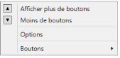

# Localization

Localization involves the customization of the application for a specific language. It translates string values according to the specific culture.  In the following table, the language is English and French

<table>
<tr>
<td>
Property</td><td>
Description</td></tr>
<tr>
<td>
Options </td><td>
Sets the string for the Options property Menu Item In GroupBar.</td></tr>
<tr>
<td colspan = "2">
Options(en-US)                                                                          Options de(fr-FR)</td></tr>
<tr>
<td>
GroupbarMItemCutGroupbarMItemCopyGroupbarMItemPasteGroupbarMItemListViewGroupbarMItemSortAscGroupbarMItemSortDscGroupbarMItemAddTabGroupbarMItemDeleteTabGroupbarMItemRenameTabGroupbarMItemAddItemGroupbarMItemRenameItemGroupbarMItemDeleteItemGroupbarMItemMoveUpGroupbarMItemMoveDown</td><td>
Sets the string for the context menu item in GroupBar.</td></tr>
<tr>
<td colspan = "2">

{:.image }

{:.image }
{{ '_ContextMenu(en-US)                                                                                    ContextMenu(en-US)_' | markdownify }}</td></tr>
<tr>
<td>
ShowfewerbuttonsShowmorebuttonsButtons</td><td>
Sets the string for the Dropdown Menu Item in GroupBar.</td></tr>
<tr>
<td colspan = "2">

{:.image }

{:.image }
{{ '_Dropdown Menu Item(en-US)                                                             Dropdown Menu Item(fr-FR)_' | markdownify }}</td></tr>
</table>

