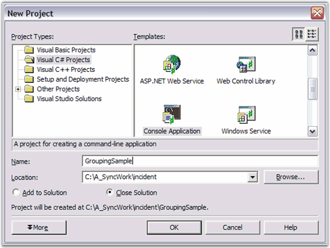
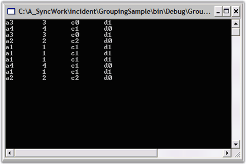
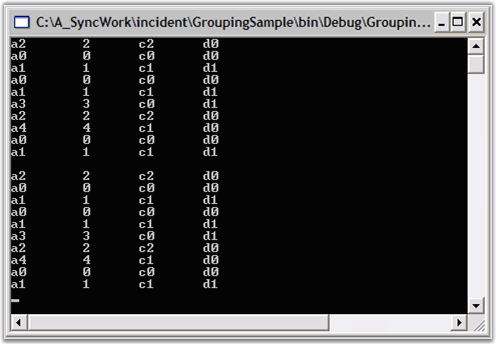

# Data Binding in WPF Grouping

Essential Grouping lets you sort, group and summarize data. The data needs to be an IList object. For this lesson, we will use an ArrayList of custom objects which have four public properties: A, B, C, and D.

The below section illustrates how to access the data that is bound to the grouping engine.

* Iterating Through the Data

This section elaborates on the procedure to setup a datasource for the Grouping engine in the below topics. 

## Creating an ArrayList of Objects

The first thing you need to do is to derive a class that will serve as your custom object. 

1. In Visual Studio .NET, select Files -> New -> Project. Then using either C# or VB.NET, select the Console Application project template to create a new Console Application, and name it GroupingSample.

   

2.Create a custom object class and add it to the 'Class1' file generated by Step 1. Name the class 'MyObject', and let it have four string properties named A, B, C and D. Also add a constructor that accepts an integer argument. Given below is the sample code for this. Note that you are making B a property only to hold digits. You will be using this property later to illustrate summarizing of data.




using System;

namespace GroupingSample

{

		class Class1

		{

			   [STAThread]

				static void Main(string[] args)

				{

				}

		}

		public class MyObject

		{

				private string aValue;

				private string bValue;

				private string cValue;

				private string dValue;

				public MyObject(int i)

				{

						aValue = string.Format("a{0}", i);

						// Use digit only.

						bValue = string.Format("{0}", i); 

						cValue = string.Format("c{0}", i%3);

						dValue = string.Format("d{0}", i%2);

				}

				public string A

				{

						get{return aValue;}

						set{aValue = value;}

				}

				public string B

				{

						get{return bValue;}

						set{bValue = value;}

				}

				public string C

				{

						get{return cValue;}

						set{cValue = value;}

				}

				public string D

				{

						get{return dValue;}

						set{dValue = value;}

				}

				public override string ToString()

				{

						return A + "\t" + B + "\t" + C + "\t" + D;

				}

		}

}



   
Module Module1

Sub Main()

	End Sub

	Public Class MyObject

		Private aValue As String

		Private bValue As String

		Private cValue As String

		Private dValue As String

		Public Sub New(ByVal i As Integer)

			aValue = String.Format("a{0}", i)

		   ' Use digit only.

			bValue = String.Format("{0}", i) 

			cValue = String.Format("c{0}", i Mod 3)

			dValue = String.Format("d{0}", i Mod 2)

		End Sub 'New

		Public Property A() As String

			Get

				Return aValue

			End Get

			Set(ByVal Value As String)

				aValue = Value

			End Set

		End Property

		Public Property B() As String

			Get

				Return bValue

			End Get

			Set(ByVal Value As String)

				bValue = Value

			End Set

		End Property

		Public Property C() As String

			Get

				Return cValue

			End Get

			Set(ByVal Value As String)

				cValue = Value

			End Set

		End Property

		Public Property D() As String

			Get

				Return dValue

			End Get

			Set(ByVal Value As String)

				dValue = Value

			End Set

		End Property

		Public Overrides Function ToString() As String

			Return A + ControlChars.Tab + B + ControlChars.Tab + C + ControlChars.Tab + D

		' ToString

		End Function 

   ' MyObject

	End Class 

End Module




3.Add the code to the Main function as follows. This creates a random list of 'MyObject' and echoes this list to the console.



  
static void Main(string[] args)

{

   // Create an arraylist of random MyObjects.

   ArrayList list = new ArrayList();

   Random r = new Random();

   for(int i = 0; i < 10; i++)

   {

		list.Add(new MyObject(r.Next(5)));

		Console.WriteLine(list[i]);

   }

   // Pause

   Console.ReadLine(); 

}




Sub Main()

		' Create an arraylist of random MyObjects.

		Dim list As New ArrayList()

		Dim r As New Random()

		Dim i As Integer

		For i = 0 To 10

			list.Add(New MyObject(r.Next(5)))

			Console.WriteLine(list(i))

		Next

		' Pause

		Console.ReadLine() 

End Sub



4.An ArrayList of Objects is created.

## Setting a Datasource In the Grouping Engine

Add the following grouping namespace for referring the assemblies deployed in the application.

 Refer Deploying Essential Grouping section to know about deploying Essential Grouping.




using Syncfusion.Grouping;





Imports Syncfusion.Grouping



Then create a Grouping.Engine object and set the ArrayList we created to be its data source. 

For more details on creating array list, refer Creating an ArrayList Of Objects topic.




// Put this code in the Main function after Console.ReadLine().

// Create a Grouping.Engine object.

Engine groupingEngine = new Engine();

// Set its data source.

groupingEngine.SetSourceList(list);





Imports Syncfusion.Grouping

'....

' Put this code in the Main function after Console.ReadLine().

' Create a Grouping.Engine object.

Dim groupingEngine As New Engine()

' Set its data source.

groupingEngine.SetSourceList(list)




ArrayList of Objects is set as the datasource for the Grouping engine.

## Iterating Through the Data

Now, we have set a datasource in the Grouping Engine. Lets see how to iterate through the data.

This section will show you how to access the data through the Grouping.Engine object by using the Engine.Table.Records collection. 

Add the following code to the main function. This code will iterate through the Records collection and will display the output in the Console.

Console is a text-only user interface that allows the user to interact with the operating system or text-based application by entering the text through the keyboard and reading the text output from the computer screen.




// Access the data directly from the Engine.
foreach(Record rec in groupingEngine.Table.Records)
{

         MyObject obj = rec.GetData() as MyObject;

         if(obj != null)

         {

            Console.WriteLine(obj);

         }

}

// Pause
Console.ReadLine(); 





' Access the data directly from the Engine.
Dim rec As Record

For Each rec In groupingEngine.Table.Records

       Dim obj As MyObject = CType(rec.GetData(), MyObject)

       If Not (obj Is Nothing) Then

             Console.WriteLine(obj)

       End If

Next rec

' Pause
Console.ReadLine() 




