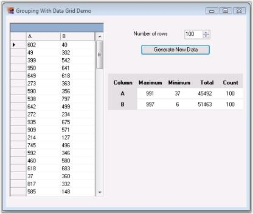

# WPF Grouping Overview

This section covers information on Essential Grouping, its key features, prerequisites to use the control, its compatibility with various OS and browsers, and finally the documentation details complimentary with the product. It comprises the following subsections:

## Introduction to Essential Grouping

Essential Grouping is a 100% Native .NET library that provides you with support for managing and manipulating tabular information without dependencies on any particular UI component. Our Grouping Framework can be used in any .NET environment, including C#, VB.NET, and managed C++.

Syncfusion Essential Grouping is a data technology that allows you to easily access, manipulate, and display your data in a variety of configurations. Your data source can be any IList object whose items have public properties. You can easily sort the items on one or several of these public properties. You can display and retrieve items based on the grouping that is produced through these sorts, you can include caption information and / or summary information on these groups; you can impose filters on the items, retrieving only items that specify your filter conditions and you can also add expression properties to display calculated values depending upon other properties in the item. 

### Key Features

Some of the key features of Essential Grouping are listed below:

* Grouping supports data presentation techniques like sorting, grouping, adding caption and summary information for the groups.
* Grouping also supports nested tables and hierarchies in the form of related tables. 
* The grouping technology uses balanced binary trees as the core data structure instead of arrays. Binary trees have this advantage whereby parent branches can cache information about their children. This allows position information and summary information to be cached in parent branches facilitating quick inserts of new records honoring any sort of criteria that is applied. Inserting, removing, and moving of records takes \ only `Log2(n)` operations. With linear lookup structures such as an ArrayList, each of these operations would take `O(n)` operations.
* Expressions can be any well-formed algebraic combination of property (column) names enclosed with brackets `[]`, numerical constants and literals, and the algebraic and logical operators.
* Grouping is a recursive process whereby a data source may be grouped several times. This leads to the recursive situation of groups having sub-groups and so on.

## Prerequisites and Compatibility

This section covers the requirements mandatory for using Essential Grouping. It also lists operating systems and browsers compatible with the product.

### Prerequisites

The prerequisites details are listed below:

<table>
<tr>
<td>
Development Environments</td><td>
<ul>
<li> Visual Studio 2015 (Ultimate, Premium, Professional, and Express)</li>
<li> Visual Studio 2012 (Ultimate, Premium, Professional, and Express)</li>
<li> Visual Studio 2010 (Ultimate, Premium, Professional, and Express)</li>
<li> Visual Studio 2008 (Team System, Professional, Standard & Express)</li>
<li> Visual Studio 2005 (Professional, Standard & Express)</li></ul></td></tr>
<tr>
<td>
 .NET Framework versions</td><td>
<ul>
<li> .NET 4.6</li>
<li> .NET 4.5.1</li>
<li> .NET 4.5</li>
<li> .NET 4.0</li>
<li> .NET 3.5 </li>
<li> .NET 2.0</li></ul></td></tr>
</table>

### Compatibility

The compatibility details are listed below:

<table>
<tr>
<td>
Operating Systems</td><td>
<ul>
<li> Windows 8.1 (32 bit and 64 bit)</li>
<li> Windows 8 (32 bit and 64 bit)</li>
<li> Windows Server 2013 (32 bit and 64 bit)</li>
<li> Windows Server 2012(32bit and 64 bit</li>
<li> Windows Server 2008 (32 bit and 64 bit)</li>
<li> Windows 7 (32 bit and 64 bit)</li>
<li> Windows Vista (32 bit and 64 bit)</li>
<li> Windows Server 2003 (32 bit and 64 bit)</li>
<li> Windows XP</li></ul></td></tr>
</table>
