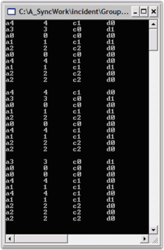
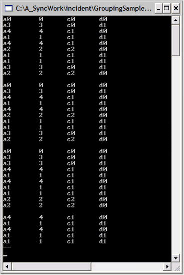
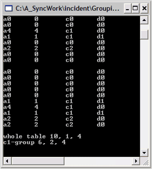

# Using Grouping in WPF Grouping

The Grouping of data is one type of data analysis technique. It is natural to organize data into groups. For example, you may want to group your sales details by months and get the total sales on a month-by-month basis. The following sections elaborates on this:

## Grouping a Table

In this lesson, you will start working with the Grouping.Engine object to see how to apply a grouping to the data as well as summarize the data. In the Data Binding section, you used the grouping.Engine.Table.Records collection to access the data in the Grouping.Engine object. The grouping.Engine.Table property is the property of the Grouping.Engine that holds the actual data needed by Essential Grouping. 

You will now look at the property that holds the schema information that is associated with the data, i.e., the grouping.Engine.TableDescriptor property. For example, the TableDescriptor.Columns property holds a collection of ColumnDescriptor objects that define the schema information on the columns in the data. 

N> Here, the columns correspond to the public properties in our sample MyObject class, A, B, C, and D.

We will now continue using the same sample created in the previous section and add the corresponding code at the bottom of the Main method.

1. To group the 'MyObject' ArrayList by a particular property, say property C, you have to add only the property name ("C") to the grouping.Engine.TableDescriptor.GroupedColumns collections. Add the following code snippet to the bottom of the Main method.




// Group on property C.

groupingEngine.TableDescriptor.GroupedColumns.Add("C");

// Display the records in the engine after grouping.

foreach(Record rec in groupingEngine.Table.Records)

{

	   MyObject obj = rec.GetData() as MyObject;

	   if(obj != null)

	   {

		 Console.WriteLine(obj);

	   }

}




' Group on property C.

groupingEngine.TableDescriptor.GroupedColumns.Add("C")

' Display the records in the engine after grouping.

For Each rec In groupingEngine.Table.Records

	Dim obj As MyObject = CType(rec.GetData(), MyObject)

	If Not (obj Is Nothing) Then

		   Console.WriteLine(obj)

	End If

Next rec




2.After running the code from step 1, a screen similar to the one below will be displayed. Note that the bottom list displayed is now sorted by column C. This is a one side effect of grouping by column C.

### The Grouping.TableDescriptor Class

As noted previously, the grouping.TableDescriptor is the property that maintains the schema information for the data source. Here is a table showing some collections in the TableDescriptor that you will be using as the lessons continue.

<table>
<tr>
<th>
TableDescriptor Property</th><th>
Description</th></tr>
<tr>
<td>
SortedColumns </td><td>
Holds sorted properties. </td></tr>
<tr>
<td>
GroupedColumns </td><td>
Holds grouped properties. </td></tr>
<tr>
<td>
Summaries </td><td>
Holds the columns that have summaries. </td></tr>
<tr>
<td>
RecordFilters </td><td>
Holds information on columns that are part of filters. </td></tr>
<tr>
<td>
SortedColumns </td><td>
Holds sorted properties. </td></tr>
</table>

## Accessing a Particular Group

Grouping is a recursive process whereby a data source may be grouped several times. This leads to the recursive situation of groups having sub-groups and so on. In recursion, there is usually some primary node or initial starting point that you use, to work with the recursive objects. In Grouping, the initial starting point is Engine.Table.TopLevelGroup. This is the 'primary' Group object.

The Grouping.Group class has two properties that are used to recursively access nested groups and the Record objects contained in the terminal group. The properties are:

* Group.Groups and Group.Records. 

1. Group.Groups is a collection of Group objects that are contained in the parent Group, and Group.Records is a collection of Records that are contained in the parent Group. 
2. At most one of these collections will actually hold objects. If the Groups collections is populated, this implies that the Group has sub-groups and there are no records. 
3. If the Records collection is populated then, it implies that this Group is a terminal group with records, but there are no sub-groups. 

   Your first task is to add a recursive method to either display records if the Group has records, or to recursively call itself to display any records of its child groups.

4. Add the following code below the Main method to implement a recursive method to display records in a Group.




private static void ShowRecordsUnderGroup(Group g)

{

	if(g.Records != null && g.Records.Count > 0)

	{

		 // Displaying the data for all the records in each group.

		 foreach(Record rec in g.Records)

		  {

				  MyObject obj = rec.GetData() as MyObject;

				  if(obj != null)

				  {

					  Console.WriteLine(obj);

				  }

		   }

			Console.WriteLine("--");

	}

	else if(g.Groups != null && g.Groups.Count > 0)

	{

			 // Iterating through the groups.

			 foreach(Group g1 in g.Groups)

			 {

				 // Recursive call

				 ShowRecordsUnderGroup(g1); 

			 }

	 }

}



Private Sub ShowRecordsUnderGroup(ByVal g As Group)

		If Not (g.Records Is Nothing) And g.Records.Count > 0 Then

			Dim rec As Record

			' Displaying the data for all the records in each group.

			For Each rec In g.Records

				Dim obj As MyObject = CType(rec.GetData(), MyObject)

				If Not (obj Is Nothing) Then

					Console.WriteLine(obj)

				End If

			Next rec

			Console.WriteLine("--")

		Else

			If Not (g.Groups Is Nothing) And g.Groups.Count > 0 Then

				Dim g1 As Group

				' Iterating through the groups.

				For Each g1 In g.Groups

					' Recursive call

					ShowRecordsUnderGroup(g1) 

				Next g1

			End If

		End If

   ' ShowRecordsUnderGroup

End Sub 




5.Once you have your ShowRecordsUnderGroup method, you only have to retrieve a particular group from the Groups collection and then call the method. So, after grouping on property C, you can view all the records whose Category is "c1" using the code like the one given below the Main method.




// Get the Group associated with the value "c1".

Group g = groupingEngine.Table.TopLevelGroup.Groups["c1"];

ShowRecordsUnderGroup(g);

// Pause

Console.ReadLine(); 



' Get the Group associated with the value "c1".

Dim g As Group = groupingEngine.Table.TopLevelGroup.Groups("c1")

ShowRecordsUnderGroup(g)

' Pause

Console.ReadLine() 




6.Similar code can be used to display all the records by passing the 'primary' group to your ShowRecordsUnderGroup method. To implement this, add the following code to the Main method.




// Show all records under the TopLevelGroup.

ShowRecordsUnderGroup(groupingEngine.Table.TopLevelGroup);

// Pause

Console.ReadLine(); 




' Show all records under the TopLevelGroup.

ShowRecordsUnderGroup(groupingEngine.Table.TopLevelGroup)

' Pause

Console.ReadLine() 
		


   
## Adding a Summary

Essential Grouping lets you summarize your data by adding SummaryDescriptor objects to the schema information that is stored in the Engine.TableDescriptor.Summaries collection. You can have multiple summaries by adding several SummaryDescriptors.

At the bottom of the Main method, add this code to create a summary item for the Engine.




// Create a summary that computes the Int32Aggregate calculations on property B.
SummaryDescriptor sdBInt32Agg = new SummaryDescriptor("BInt32Agg", "B", SummaryType.Int32Aggregate);

// Add this summary to the Summaries collection.
groupingEngine.TableDescriptor.Summaries.Add(sdBInt32Agg);





' Create a summary that computes the Int32Aggregate calculations on property B.
Dim sdBInt32Agg As New SummaryDescriptor("BInt32Agg", "B", SummaryType.Int32Aggregate)

' Add this summary to the Summaries collection.
groupingEngine.TableDescriptor.Summaries.Add(sdBInt32Agg)




 There are several overloads of the constructor for SummaryDescriptor. Here, we are using the overload that accepts a SummaryType enum as the third argument. This SummaryType will allow you to pick out some predefined calculations such as the Int32Aggregate functions like Max, Min, Sum, and Average. There are enums that specify double, boolean, and other aggregate types. Here, we choose Int32 as that is the type of value you will see in the B property in the data.

## Retrieving Summary Values for a Particular Group

After adding the SummaryDescriptor, the GroupingEngine will maintain these summary items in a group by group basis. You can access these summary values for any group. Here we will get the values for the TopLevelGroup and for our c1 group to illustrate how this is done.

To obtain a particular group's summary values, you need to get the group and access the summary through its GetSummary method. Once you have the summary, you can caste it to its Int32AggregateSummary type. 

The following code snippet illustrates this.




// To simplify notation, add this statement at the top of the file.

using ISummary = Syncfusion.Collections.BinaryTree.ITreeTableSummary;

// At the bottom of the Main method, add these lines.

// Now go through the group to get the Summary value for the group.
ISummary groupSummary = groupingEngine.Table.TopLevelGroup.GetSummary("BInt32Agg");

Int32AggregateSummary int32Summary = (Int32AggregateSummary) groupSummary;

Console.WriteLine("whole table {0}, {1}, {2}", int32Summary.Sum, int32Summary.Average, int32Summary.Maximum);

// Value for "c1" group.
groupSummary = groupingEngine.Table.TopLevelGroup.Groups["c1"].GetSummary("BInt32Agg");

int32Summary = (Int32AggregateSummary) groupSummary;

Console.WriteLine("c1-group {0}, {1}, {2}", int32Summary.Sum, int32Summary.Average,int32Summary. Maximum);

// Pause
Console.ReadLine(); 





' At the bottom of the Main method, add these lines.

' Now go through the group to get the Summary value for the group.

Dim groupSummary As Syncfusion.Collections.BinaryTree.ITreeTable = groupingEngine.Table.TopLevelGroup.GetSummary("BInt32Agg")

Dim int32Summary As Int32AggregateSummary = CType(groupSummary, Int32AggregateSummary)

Console.WriteLine("whole table {0}, {1}, {2}", int32Summary.Sum, int32Summary.Average, int32Summary.Maximum)

' Value for "c1" group.
groupSummary = groupingEngine.Table.TopLevelGroup.Groups("c1").GetSummary("BInt32Agg")

int32Summary = CType(groupSummary, Int32AggregateSummary)

Console.WriteLine("c1-group {0}, {1}, {2}", int32Summary.Sum, int32Summary.Average, int32Summary.Maximum)

' Pause
Console.ReadLine() 




