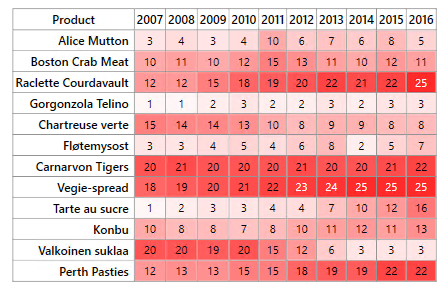

# Color Mapping in WPF HeatMap (SfHeatMap) control
Color mapping is used to indicate values as colors instead of numerical values. For example, if a HeatMap represents a data from 0 to 100. `ColorMapping` is used to specify a color for lower value and higher value. For any value between two values, a medium color will be automatically be chosen. 

In color mapping, when white color is set to value 0 and red color is set for value 30, as shown below.

<syncfusion:ColorMappingCollection x:Key="colorMapping">
	<syncfusion:ColorMapping Value="0" Color="White"/>
	<syncfusion:ColorMapping Value="30" Color="Red"/>
</syncfusion:ColorMappingCollection>


Resultant HeatMap will be as shown below.

