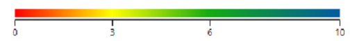
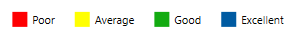
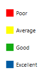

# Legend in WPF HeatMap (SfHeatMap)
Legend is a control used to summarize the range of colors in HeatMap. This gives visual guideline for mapping between value and color.

## Create Legend
Legend can be created with color mapping as shown below,



<syncfusion:ColorMappingCollection x:Key="colorMapping">
    <syncfusion:ColorMapping Value="0" Color="#fe0002" Label="Poor"/>
    <syncfusion:ColorMapping Value="3" Color="#ffff01" Label="Average"/>
    <syncfusion:ColorMapping Value="6" Color="#13ab11" Label="Good"/>
    <syncfusion:ColorMapping Value="10" Color="#005ba2 " Label="Excellent"/>
</syncfusion:ColorMappingCollection>

<syncfusion:SfHeatMapLegend ColorMappingCollection="{StaticResource colorMapping}"/>



Resultant legend will be like following image,

## Legend Mode
There are two modes for Legend

* Gradient
* List

### Gradient:

<syncfusion:SfHeatMapLegend 
	LegendMode="Gradient" 
	ColorMappingCollection="{StaticResource colorMapping}"/>


### List:

<syncfusion:SfHeatMapLegend
	LegendMode="List" 
	ColorMappingCollection="{StaticResource colorMapping}"/>


## Orientation
There are 2 types of Orientation, applicable for Gradient and List Mode
* Horizontal
* Vertical

### Horizontal:

<syncfusion:SfHeatMapLegend 
	LegendMode="List" 
	Orientation="Horizontal" 
	ColorMappingCollection="{StaticResource colorMapping}"/>


### Vertical:

<syncfusion:SfHeatMapLegend 
	LegendMode="List" 
	Orientation="Vertical" 
	ColorMappingCollection="{StaticResource colorMapping}"/>


