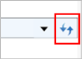

# Refresh Button

The Refresh button enables the HierarchyNavigatorRefreshButtonClick event to initiate in the HierarchyNavigator control.



<locals:HierarchyNavigator HierarchyNavigatorRefreshButtonClick="HierarchyNavigatorRefreshButtonClick" />



HierarchyNavigator hierarchyNavigator = new HierarchyNavigator();
 
hierarchyNavigator.HierarchyNavigatorRefreshButtonClick += new EventHandler(HierarchyNavigatorRefreshButtonClick);

private void HierarchyNavigatorRefreshButtonClick(object sender, EventArgs e)
 
{      //Occurs when Refresh Button Click }




