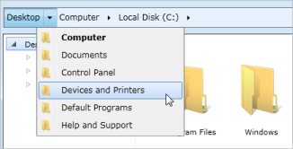
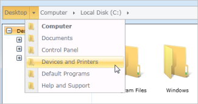

# Skins

Hierarchy Navigator supports different skins such as Windows 7, Office2010Blue, Office2010Black, Office2010Silver, Office2007Blue, Office2007Black, Office2007Silver, and Expression Blend. 

## Built-in skins

The Windows 7 theme is applied to the HierarchyNavigator control by default.

Add the following DLLs to apply the corresponding theme for Hierarchy Navigator control. SkinStorage class is used to apply a different visual style for a control, which is available in Syncfusion.Shared.WPF project.

1. Create HierarchyNavigator instance either in XAML or code behind, as shown below.

   ~~~xaml

      <syncfusion:HierarchyNavigator x:Name="hierarchyNavigator"/>
 
   ~~~

     Or

   ~~~csharp

    HierarchyNavigator hierarchyNavigator = new HierarchyNavigator();

   ~~~

2. Apply Visual Style as shown below in code behind by calling the static method in SkinStorage class in Syncfusion.Shared.WPF.

## Window7



SkinStorage.SetVisualStyle(this, "Default");



## Office2007Blue 



SkinStorage.SetVisualStyle(this, "Office2007Blue");



## Office2007Black



SkinStorage.SetVisualStyle(this, "Office2007Black");



## Office2007Silver



SkinStorage.SetVisualStyle(this, "Office2007Silver");



## Expression Blend



SkinStorage.SetVisualStyle(this, "Blend");



## Metro Theme



SkinStorage.SetVisualStyle(this, “Metro");



## Transparent Theme



SkinStorage.SetVisualStyle(this, “Transparent");



