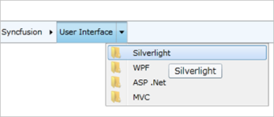

# Tooltip

A ToolTip can be displayed for each HierarchyNavigator item.

Setting the ShowToolTip Boolean property to true in the HierarchyNavigator control will enable the ToolTips for all items.

<table>
<tr>
<td>
XAML<syncfusion:HierarchyNavigator ShowToolTip="True" x:Name="hierarchyNavigator1" /></td></tr>
<tr>
<td>
C#HierarchyNavigator hierarchyNavigatorControl1 = new HierarchyNavigator() { Height = 30 };hierarchyNavigatorControl1.ShowToolTip = true;</td></tr>
</table>

{{ '' | markdownify }}
{:.image }

