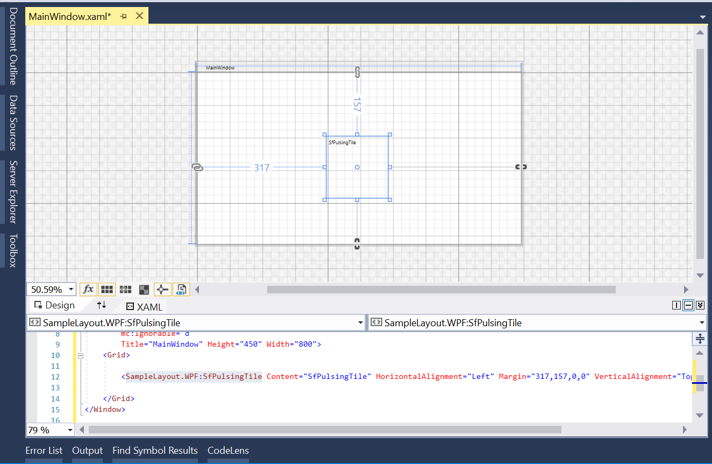
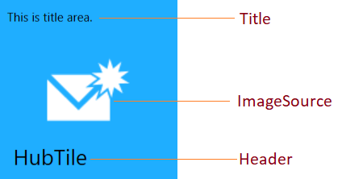
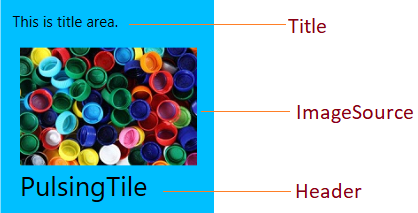

# Getting Started

This section gives an overview for working with the HubTile and PulsingTile control.

## Assembly deployment

Refer [SfHubTile](https://help.syncfusion.com/wpf/control-dependencies#sfhubtile) and [SfPulsingTile](https://help.syncfusion.com/wpf/control-dependencies#sfpulsingtile) control dependencies section to get the list of assemblies or NuGet package needs to be added as reference to use the SfHubTile and SfPulsingTile control in any application.

## Creating simple application with HubTile and PulsingTile

In this walk through, you will create WPF application that contains SfHubTile and SfPulsingTile control. Create a new WPF Project in Visual Studio to display HubTile and PulsingTile with data objects. By the following ways, you can add the controls: 

1. [Adding control via Designer](#adding-control-via-designer)
2. [Adding control manually in XAML](#adding-control-manually-in-xaml)
3. [Adding control manually in C#](#adding-control-manually-in-c)

### Adding control via Designer

HubTile and PulsingTile controls can be added to the application by dragging  SfHubTile and SfPulsingTile from Toolbox and dropping it in Designer view. 

### Adding control manually in XAML

In order to add control manually in XAML, do the below steps,

1. Add the below required assembly references to the project,
	* Syncfusion.SfHubTile.WPF
	* Syncfusion.SfShared.WPF
2. Import Syncfusion WPF schema **http://schemas.syncfusion.com/wpf** or SfHubTile control namespace **Syncfusion.Windows.Controls.Notification** in XAML page.
3. Declare SfHubTile and SfPulsingTile controls in XAML page.



<Window xmlns="http://schemas.microsoft.com/winfx/2006/xaml/presentation"
        xmlns:x="http://schemas.microsoft.com/winfx/2006/xaml"
        xmlns:syncfusion="http://schemas.syncfusion.com/wpf" 
        x:Class="WpfApplication1.MainWindow"
        Title="MainWindow" Height="350" Width="525">
    <Grid>
<!--HubTile-->
 <syncfusion:SfHubTile Grid.Column="0" Content="This is a HubTile"/>

<!--PulsingTile-->
<syncfusion:SfPulsingTile Grid.Column="1" Content="This is a PulsingTile" />
</Grid>
</Window>



### Adding control manually in C#

In order to add control manually in C#, do the below steps,

1. Add the below required assembly references to the project,
	* Syncfusion.SfHubTile.WPF
	* Syncfusion.SfShared.WPF
2. Import SfHubTile namespace **using Syncfusion.Windows.Controls.Notification;**.
3. Create SfHubTile and SfPulsingTile controls instance and add it to the window.



using Syncfusion.Windows.Controls.Notification;
namespace SfHubTileSample
{

	public partial class MainWindow : Window
	{
		public MainWindow()
		{
			InitializeComponent();

			// HubTile
			SfHubTile hubTile = new SfHubTile();
			grid.Children.Add(hubTile);			

			//PulsingTile
			SfPulsingTile pulseTile = new SfPulsingTile();
			grid.Children.Add(pulseTile);
		}
	}
	}




## Setting Title, Header and Image in tile
You can set the title, header and image for the tile by setting [Title](https://help.syncfusion.com/cr/wpf/Syncfusion.SfHubTile.Wpf~Syncfusion.Windows.Controls.Notification.HubTileBase~Title.html), [Header](https://help.syncfusion.com/cr/wpf/Syncfusion.SfShared.Wpf~Syncfusion.Windows.Primitives.HeaderedContentControl~Header.html) and [ImageSource](https://help.syncfusion.com/cr/wpf/Syncfusion.SfHubTile.Wpf~Syncfusion.Windows.Controls.Notification.HubTileBase~ImageSource.html) properties.

N> The title will be displayed at the top of the tile. The header will be displayed at the bottom of the tile. An image will be displayed at the center of the tile.

