# HubTile

 The HubTile control supports a tile feature similar to the live tile feature of Windows Desktop and Windows Phone. This section explains about the features of HubTile control.

## Setting Header content

Header is a name given to the tile that describes the functionality of the tile.The  content of the header can be an image, a text or a control, etc. You can set header to the tile by setting [Header](https://help.syncfusion.com/cr/wpf/Syncfusion.SfShared.Wpf~Syncfusion.Windows.Primitives.HeaderedContentControl~Header.html) property.
The below example defines a tile that represents mail application.



<!-- SfHubTile -->
<syncfusion:SfHubTile x:Name="hubTile" Header="Mail"/>
<!--setting header as an image-->
<syncfusion:SfHubTile x:Name="hubTile">
   <syncfusion:SfHubTile.Header>
        <Image Source="Assets/syncfusion.png" Stretch="None"/>
        </syncfusion:SfHubTile.Header>
  </syncfusion:SfHubTile> 
<!--setting header as a control-->
<syncfusion:SfHubTile x:Name="hubTile" Width="200">
   <syncfusion:SfHubTile.Header>
          <TextBlock Text="SYNCFUSION" Foreground="White" FontSize="13"/>
        </syncfusion:SfHubTile.Header>
  </syncfusion:SfHubTile>      



	//Setting header on HubTile
	SfHubTile hubTile = new SfHubTile();
	hubTile.Header = "Mail";




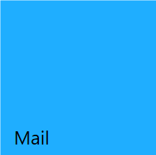

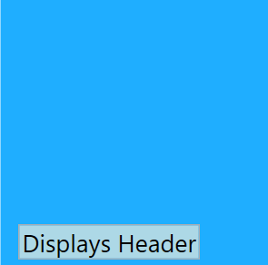

## Setting Title content 

 Title is used to display the notifications and updates in the tile. You can set title to the tile by setting [Title](https://help.syncfusion.com/cr/wpf/Syncfusion.SfHubTile.Wpf~Syncfusion.Windows.Controls.Notification.HubTileBase~Title.html) property.



<!-- SfHubTile -->
<syncfusion:SfHubTile x:Name="hubTile" Title="New mail from Syncfusion"/>
<!--setting title as  an image-->
<syncfusion:SfHubTile x:Name="hubTile">
   <syncfusion:SfHubTile.Title>
        <Image Source="Assets/syncfusion.png" Stretch="None" Horizontal Alignment="Left"/>
        </syncfusion:SfHubTile.Title>
  </syncfusion:SfHubTile> 
<!--setting title as a control-->
<syncfusion:SfHubTile x:Name="hubTile" Width="300">
   <syncfusion:SfHubTile.Title>
        <TextBox Text="This is title area."/>
        </syncfusion:SfHubTile.Title>
  </syncfusion:SfHubTile>      



	//Setting title on HubTile
	SfHubTile hubTile = new SfHubTile();
	hubTile.Title = "This is title area in hubtile.";




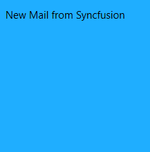

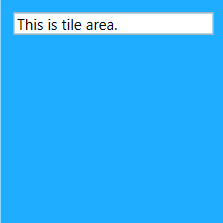

## Setting Image 

 ImageSource is used to display the image at the center of the tile. You can set the image to the tile by setting the image path to the [ImageSource](https://help.syncfusion.com/cr/wpf/Syncfusion.SfHubTile.Wpf~Syncfusion.Windows.Controls.Notification.HubTileBase~ImageSource.html) property.



<!--SfHubTile--> 
<syncfusion:SfHubTile x:Name="hubTile" ImageSource="Assets\New Mail.png"/>


{% highlight C# % }

    //Setting title for HubTile
    SfHubTile hubTile = new SfHubTile();
    hubTile.ImageSource = new BitmapImage(new Uri(@"Assets/New Mail.png",UriKind.RelativeorAbsolute));




## Transitions

The HubTile control supports various transitions which causes the tile to change from primary tile content to secondary tile content. You can set transitions to the HubTile by setting [HubTileTransitions](https://help.syncfusion.com/cr/wpf/Syncfusion.SfHubTile.Wpf~Syncfusion.Windows.Controls.Notification.SfHubTile~HubTileTransitions.html) property. These transitions are based on the specified interval set by the [Interval](https://help.syncfusion.com/cr/wpf/Syncfusion.SfHubTile.Wpf~Syncfusion.Windows.Controls.Notification.SfHubTile~Interval.html) property of HubTile. The HubTile control provides the following built-in transitions:
   1. Slide transition
   2. Fade transition




<Window xmlns="http://schemas.microsoft.com/winfx/2006/xaml/presentation"
        xmlns:x="http://schemas.microsoft.com/winfx/2006/xaml"
        xmlns:syncfusion="http://schemas.syncfusion.com/wpf" 
		xmlns:shared="clr-namespace:Syncfusion.Windows.Controls;assembly=Syncfusion.SfShared.Wpf"
        x:Class="WpfApplication1.MainWindow"
        Title="MainWindow" Height="350" Width="525">
    <Grid>
<!-- SfHubTile -->
<syncfusion:SfHubTile x:Name="hubTile" ImageSource="Assets/New Mail.png" Title="Title area." Header="HubTile" Interval="0:0:3">
	<syncfusion:SfHubTile.HubTileTransitions>
	<!-- SlideTransition-->
		<shared:SlideTransition/>
		<!--FadeTransition-->
	    <shared:FadeTransition/>
	</syncfusion:SfHubTile.HubTileTransitions>
	<!-- For setting secondary content -->
	<syncfusion:SfHubTile.SecondaryContent>
		<Image Source="/Assets/HubTile.png" Stretch="UniformToFill" Margin="-1"/>
	</syncfusion:SfHubTile.SecondaryContent>
</syncfusion:SfHubTile>
</Grid>
</Window>



    //For Slide transition
    hubTile.HubTileTransitions.Add(new SlideTransition());

    //For Fade transition
    hubTile.HubTileTransitions.Add(new FadeTransition());

    //Setting transition interval
    hubTile.Interval = TimeSpan.FromSeconds(3.0);



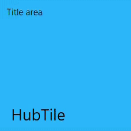

N> **Syncfusion.SfShared.Wpf** assembly should be included in Xaml or import **using Syncfusion.Windows.Controls;** namespace  to support built-in transitions.

### Notifications on transitions

As long as the tile is frozen, transitions occur repeatedly in hubtile for each specified interval. [HubTileTransitionCompleted](https://help.syncfusion.com/cr/wpf/Syncfusion.SfHubTile.Wpf~Syncfusion.Windows.Controls.Notification.SfHubTile~HubTileTransitionCompleted_EV.html) event rises on each transition completion. Below example demonstrates the working of HubTileTransitionCompleted event in HubTile.



<syncfusion:SfHubTile x:Name="hubtile" Header="HubTile" Title="TitleArea." ImageSource="Assets/New mail.png" Interval="00:00:003" >
		<syncfusion:SfHubTile.HubTileTransitions>
		<shared:SlideTransition/>
		<syncfusion:SfHubTile.HubTileTransitions>
		<syncfusion:SfHubTile.SecondaryContent>
		<Image Source="Assets/HubTile.png" Stretch="UniformToFill">
		</syncfusion:SfHubTile.SecondaryContent>
		  <i:Interaction.Triggers>
                    <i:EventTrigger EventName="HubTileTransitionCompleted">
                        <local:TransitionCompleted />
                    </i:EventTrigger>
                </i:Interaction.Triggers>
</syncfusion:SfHubTile>


      
	   public class TransitionCompleted : TargetedTriggerAction<SfHubTile>
    {
        protected override void Invoke(object parameter)
        {
            var hubtile = this.AssociatedObject as SfHubTile;
            MainWindow window = VisualUtils.FindAncestor(hubtile, typeof(MainWindow)) as MainWindow;
            if ((window != null) && (hubtile != null))
            {
                window.hubtile.Background=Brushes.Green;
            }
        }

        
    }
    



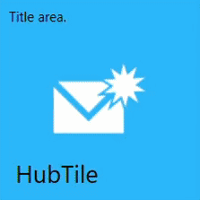

## Grouping

 Several tiles can be grouped using the [GroupName](https://help.syncfusion.com/cr/wpf/Syncfusion.SfHubTile.Wpf~Syncfusion.Windows.Controls.Notification.HubTileBase~GroupName.html) property of hubtile. The group name will be used when the entire group of tiles needs to be freezed.



<!-- SfHubTile 1-->
<syncfusion:SfHubTile x:Name="hubTileOne" GroupName="Applications" ImageSource="Assets/New Mail.png" Title="Title area." Header="HubTile">
	<syncfusion:SfHubTile.SecondaryContent>
		<Image Source="Assets/HubTile.png" Stretch="UniformToFill" Margin="-1"/>
	</syncfusion:SfHubTile.SecondaryContent>
 	<syncfusion:SfHubTile.Transitions>
	<shared:SlideTransiton/>
	</syncfusion:SfHubTile.Transitions>
</syncfusion:SfHubTile>
<!-- SfHubTile 2-->
<syncfusion:SfHubTile x:Name="hubTileTwo" GroupName="Applications" ImageSource="Assets/New Mail.png" Title="Title area." Header="HubTile">
	<syncfusion:SfHubTile.SecondaryContent>
		<Image Source="Assets/HubTile.png" Stretch="UniformToFill" Margin="-1"/>
	</syncfusion:SfHubTile.SecondaryContent>
	<syncfusion:SfHubTile.Transitions>
	<shared:SlideTransiton/>
	</syncfusion:SfHubTile.Transitions>
</syncfusion:SfHubTile>
<!-- SfHubTile 3-->
<syncfusion:SfHubTile x:Name="hubTileThree" GroupName="Applications" ImageSource="Assets/New Mail.png" Title="Title area." Header="HubTile">
	<syncfusion:SfHubTile.SecondaryContent>
		<Image Source="Assets/HubTile.png" Stretch="UniformToFill" Margin="-1"/>
	</syncfusion:SfHubTile.SecondaryContent>
 	<syncfusion:SfHubTile.Transitions>
	<shared:SlideTransiton/>
	</syncfusion:SfHubTile.Transitions>
</syncfusion:SfHubTile>



    //Setting group name
    hubTileOne.GroupName = "Applications";
    hubTileTwo.GroupName = "Applications";
	hubTileThree.GroupName = "Applications";



## Freezing/UnFreezing 

Freezing provides support to stop animating the tile contents. UnFreezing provides support to keep the tile content animated. By the following two ways you can set freezing/unfreezing to the HubTile:
 1. [Freezing/UnFreezing via Property](#freezing/unfreezing-via-property)                          
 2. [Freezing/UnFreezing via HubTileService Class](#Freezing/UnFreezing-via-hubtileservice-class)

### Freezing/UnFreezing via Property

You can freeze the tile by setting [IsFrozen](https://help.syncfusion.com/cr/wpf/Syncfusion.SfHubTile.Wpf~Syncfusion.Windows.Controls.Notification.HubTileBase~IsFrozen.html) property to be true.



<!-- SfHubTile -->
<syncfusion:SfHubTile x:Name="hubTile" Header=Hubtile" IsFrozen="True" Title="Title area." ImageSource="Assets/New Mail.png" HorizontalAlignment="Center" VerticalAlignment="Center"  Width="216">
    <!-- For setting secondary content -->
	<syncfusion:SfHubTile.SecondaryContent>
		<Image Source="Assets/HubTile.png" Stretch="UniformToFill" Margin="-1"/>
	</syncfusion:SfHubTile.SecondaryContent>
	<syncfusion:SfHubTile.HubTileTransitions>
	<!--For SlideTransition-->
        <shared:SlideTransition/>
		</syncfusion:SfHubTile.HubTileTransitions>
</syncfusion:SfHubTile>



     //Setting freeze property
      hubTile.IsFrozen = true;


 
 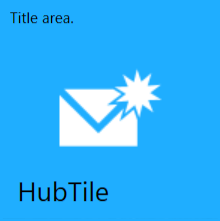

You can unfreeze the tile by setting [IsFrozen](https://help.syncfusion.com/cr/wpf/Syncfusion.SfHubTile.Wpf~Syncfusion.Windows.Controls.Notification.HubTileBase~IsFrozen.html) property to be false.



<!-- SfHubTile -->
<syncfusion:SfHubTile x:Name="hubTile" Header="HubTile" IsFrozen="False" Title="Title area" ImageSource="Assests/New Mail.png" HorizontalAlignment="Center" VerticalAlignment="Center"  Width="216">
    <!-- For setting secondary content -->
	<syncfusion:SfHubTile.SecondaryContent>
		<Image Source="Assets/HubTile.png" Stretch="UniformToFill" Margin="-1"/>
	</syncfusion:SfHubTile.SecondaryContent>
	<syncfusion:SfHubTile.HubTileTransitions>
        <shared:SlideTransition/>
	</syncfusion:SfHubTile.HubTileTransitions>
</syncfusion:SfHubTile>



     //Setting Unfreeze property
     hubTile.IsFrozen = false;



### Freezing/UnFreezing via HubTileService class

 The [HubTileService](https://help.syncfusion.com/cr/wpf/Syncfusion.SfHubTile.Wpf~Syncfusion.Windows.Controls.Notification.HubTileService.html) class provides helper methods such as Freeze() and UnFreeze() to freeze and unfreeze the animation by passing a HubTile instance or GroupName as an argument. Add required **System.Windows.Interactivity** assembly reference in Xaml. Import schema for interactivity **http://schemas.microsoft.com/expression/2010/interactivity** in Xaml and **using System.Windows.Interactivity** in C#.

N> The HubTileService class allows to set the freeze/unfreeze state of the tile after the tiles are loaded.

You can freeze a single tile or a group of tiles using [Freeze](https://help.syncfusion.com/cr/wpf/Syncfusion.SfHubTile.Wpf~Syncfusion.Windows.Controls.Notification.HubTileService~Freeze.html) method.




<Window x:Class="HubTile_Grouping.MainWindow"
        xmlns="http://schemas.microsoft.com/winfx/2006/xaml/presentation"
        xmlns:x="http://schemas.microsoft.com/winfx/2006/xaml"
        xmlns:d="http://schemas.microsoft.com/expression/blend/2008"
        xmlns:mc="http://schemas.openxmlformats.org/markup-compatibility/2006"
        xmlns:local="clr-namespace:HubTile_Grouping"
        xmlns:syncfusion="http://schemas.syncfusion.com/wpf"
        xmlns:shared="clr-namespace:Syncfusion.Windows.Controls;assembly=Syncfusion.SfShared.Wpf"
        xmlns:i="http://schemas.microsoft.com/expression/2010/interactivity"
        mc:Ignorable="d"
        Title="MainWindow" Height="450" Width="800">
    <Grid>
        <WrapPanel>
<!-- SfHubTile 1-->
<syncfusion:SfHubTile x:Name="hubTileOne" GroupName="Applications" ImageSource="Assets/New Mail.png" Title="TitleArea."  Header="HubTile">
	<syncfusion:SfHubTile.SecondaryContent>
		<Image Source="Assets/HubTile.png" Stretch="UniformToFill" Margin="-1"/>
	</syncfusion:SfHubTile.SecondaryContent>
	<syncfusion:SfHubTile.Transitions>
	<shared:SlideTransiton/>
	</syncfusion:SfHubTile.Transitions>
</syncfusion:SfHubTile>
<!-- SfHubTile 2-->
<syncfusion:SfHubTile x:Name="hubTileTwo" GroupName="Application" ImageSource="Assets/New Mail.png" Title="TitleArea."  Header="HubTile">
	<syncfusion:SfHubTile.SecondaryContent>
		<Image Source="Assets/HubTile.png" Stretch="UniformToFill" Margin="-1"/>
	</syncfusion:SfHubTile.SecondaryContent>
	<syncfusion:SfHubTile.Transitions>
	<shared:SlideTransiton/>
	</syncfusion:SfHubTile.Transitions>
</syncfusion:SfHubTile>
<!--SfHubTile 3-->
<syncfusion:SfHubTile x:Name="hubTileThree" GroupName="Applications" ImageSource="Assets/New Mail.png" Title="TitleArea." Header="HubTile">
	<syncfusion:SfHubTile.SecondaryContent>
		<Image Source="Assets/HubTile.png" Stretch="UniformToFill" Margin="-1"/>
	</syncfusion:SfHubTile.SecondaryContent>
 	<syncfusion:SfHubTile.Transitions>
	<shared:SlideTransiton/>
	</syncfusion:SfHubTile.Transitions>
    <i:Interaction.Triggers>
	<i:EventTriggers EventName="Loaded">
	<local:FreezeTiles/>
	</i:EventTriggers>
	</i:Interaction.Triggers>
</syncfusion:SfHubTile>
  </WrapPanel>   
   </Grid>
</Window>


  
	 using Syncfusion.Windows.Controls.Notification;
     using Syncfusion.Windows.Shared;
     using System.Windows.Interactivity;
     namespace HubTile_Grouping
	 {
	  public class FreezeTiles : TargetedTriggerAction<SfHubTile>
      {
        protected override void Invoke(object parameter)
        {
         var hubtile = this.AssociatedObject as SfHubTile;
         MainWindow window = VisualUtils.FindAncestor(hubtile, typeof(MainWindow)) as MainWindow;
         if (window != null && hubtile != null)
         {
		   //For a single tile
		   HubTileService.Freeze(window.hubTileOne); 
		
		   //For  group of tiles
		   HubTileService.Freeze("Applications");
          }
        }
       }
	 }
      



 
 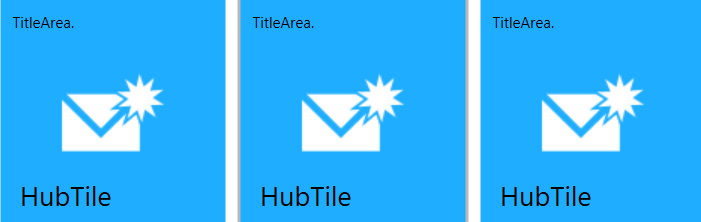

You can unfreeze a single tile or a group of tiles using [UnFreeze](https://help.syncfusion.com/cr/wpf/Syncfusion.SfHubTile.Wpf~Syncfusion.Windows.Controls.Notification.HubTileService~UnFreeze.html) method.
 


<Window x:Class="HubTile_Grouping.MainWindow"
        xmlns="http://schemas.microsoft.com/winfx/2006/xaml/presentation"
        xmlns:x="http://schemas.microsoft.com/winfx/2006/xaml"
        xmlns:d="http://schemas.microsoft.com/expression/blend/2008"
        xmlns:mc="http://schemas.openxmlformats.org/markup-compatibility/2006"
        xmlns:local="clr-namespace:HubTile_Grouping"
        xmlns:syncfusion="http://schemas.syncfusion.com/wpf"
        xmlns:shared="clr-namespace:Syncfusion.Windows.Controls;assembly=Syncfusion.SfShared.Wpf"
        xmlns:i="http://schemas.microsoft.com/expression/2010/interactivity"
        mc:Ignorable="d"
        Title="MainWindow" Height="450" Width="800">
    <Grid>
        <WrapPanel>
<!-- SfHubTile 1-->
<syncfusion:SfHubTile x:Name="hubTileOne" GroupName="Applications" ImageSource="Assets/New Mail.png" Title="Title area." Header="HubTile">
	<syncfusion:SfHubTile.SecondaryContent>
		<Image Source="Assets/HubTile.png" Stretch="UniformToFill" Margin="-1"/>
	</syncfusion:SfHubTile.SecondaryContent>
	<syncfusion:SfHubTile.Transitions>
	<shared:SlideTransiton/>
	</syncfusion:SfHubTile.Transitions>
</syncfusion:SfHubTile>
<!-- SfHubTile 2-->
<syncfusion:SfHubTile x:Name="hubTileTwo" GroupName="Applications" ImageSource="Assets/New Mail.png" Title="Title area."  Header="HubTile">
	<syncfusion:SfHubTile.SecondaryContent>
		<Image Source="Assets/HubTile.png" Stretch="UniformToFill" Margin="-1"/>
	</syncfusion:SfHubTile.SecondaryContent>
	<syncfusion:SfHubTile.Transitions>
	<shared:SlideTransiton/>
	</syncfusion:SfHubTile.Transitions>
</syncfusion:SfHubTile>
<!--SfHubTile 3-->
<syncfusion:SfHubTile x:Name="hubTileThree" GroupName="Applications" ImageSource="Assets/New Mail.png" Title="Title area." Header="HubTile">
	<syncfusion:SfHubTile.SecondaryContent>
		<Image Source="Assets/HubTile.png" Stretch="UniformToFill" Margin="-1"/>
	</syncfusion:SfHubTile.SecondaryContent>
	<syncfusion:SfHubTile.Transitions>
	<shared:SlideTransiton/>
	</syncfusion:SfHubTile.Transitions>
	<i:Interaction.Triggers>
	<i:EventTriggers EventName="Loaded">
	<local:UnfreezeTiles/>
	</i:Interaction.Triggers>
</syncfusion:SfHubTile>
</WrapPanel>
</Grid>
</Window>


    
	using Syncfusion.Windows.Controls.Notification;
    using Syncfusion.Windows.Shared;
    using System.Windows.Interactivity;  
	namespace HubTile_Grouping
	 { 
	  public class UnfreezeTiles : TargetedTriggerAction<SfHubTile>
      {
       protected override void Invoke(object parameter)
        {
         var hubtile = this.AssociatedObject as SfHubTile;
         MainWindow window = VisualUtils.FindAncestor(hubtile, typeof(MainWindow)) as MainWindow;
         if (window != null && hubtile != null)
          {
		     //For a single tile
		      HubTileService.UnFreeze(window.hubTileOne);
		  
		     //For group of tiles
		     HubTileService.UnFreeze("Applications");
           }
        }
       }
	 }




 
 ## Notifications and Animations

  Certain changes occurs when the tile is pressed and is notified by the click event and the command property of the HubTile. 
  
  The [Click](https://help.syncfusion.com/cr/wpf/Syncfusion.SfHubTile.Wpf~Syncfusion.Windows.Controls.Notification.HubTileBase~Click_EV.html) event rises whenever the tile is pressed.

   
    
    <syncfusion:SfHubTile x:Name="hubtile"  GroupName="HubTiles" Interval="0:0:3"  Header="Hubtile" Title="This is title area." ImageSource="Assets/New Mail.png">
	<i:Interaction.Triggers>
                    <i:EventTrigger EventName="Click">
                        <local:HubTileClicked />
                    </i:EventTrigger>
                </i:Interaction.Triggers>
   </syncfusion:SfHubTile>
    
	
      
	   public class HubTileClicked : TargetedTriggerAction<SfHubTile>
    {
        protected override void Invoke(object parameter)
        {
            var hubtile = this.AssociatedObject as SfHubTile;
            MainWindow window = VisualUtils.FindAncestor(hubtile, typeof(MainWindow)) as MainWindow;
            if ((window != null) && (hubtile != null))
            {
                MessageBox.Show("HubTile is Clicked");
            }
        }

    }
     
	  

   ### Command binding

   Command specifies the operation to be performed when the tile is pressed. [Command](https://help.syncfusion.com/cr/wpf/Syncfusion.SfHubTile.Wpf~Syncfusion.Windows.Controls.Notification.HubTileBase~Command.html) and [CommandParameter](https://help.syncfusion.com/cr/wpf/Syncfusion.SfHubTile.Wpf~Syncfusion.Windows.Controls.Notification.HubTileBase~CommandParameter.html) are used instead of click event in MVVM pattern. 

   
    
    <syncfusion:SfHubTile x:Name="hubtile" Command="{Binding HubTileCommand}" CommandParameter="{Binding ElementName=hubtile}" GroupName="HubTiles" Interval="0:0:3" Header="Hubtile" Title="This is title area." ImageSource="Assets/New Mail.png"/>
    
	
           
	    public partial class MainWindow : Window
         {
           public MainWindow()
           {
            InitializeComponent();
           
           }

        private ICommand hubtilecommand;

        public ICommand HubTileCommand
        {
            get { return hubtilecommand ?? (hubtilecommand = new Command(true, ()=>MyAction("HubTileCommand"))); }

        }

        private void MyAction(string parameter)
        {
            if (parameter.Equals("HubTileCommand"))
            {
                string msg = string.Format("HubTile Command executed");
                MessageBox.Show(msg);
            }
        }
    }
	 public class Command : ICommand
        {
            private bool _canexecute;
            private Action _execute;
            public Command(bool Canexecute, Action Execute)
            {
                _canexecute = Canexecute;
                _execute = Execute;
            }

            public event EventHandler CanExecuteChanged;

            public bool CanExecute(object parameter)
            {
                return _canexecute;
            }

            public void Execute(object parameter)
            {
                _execute();
            }
        }

	   
	

### Animations

The tile press animation causes the entire tile to be zoomed in/out at specified interval. You can set tile press animation by setting properties such as [ScaleDepth](https://help.syncfusion.com/cr/wpf/Syncfusion.SfHubTile.Wpf~Syncfusion.Windows.Controls.Notification.HubTileBase~ScaleDepth.html)  and [TilePressDuration](https://help.syncfusion.com/cr/wpf/Syncfusion.SfHubTile.Wpf~Syncfusion.Windows.Controls.Notification.HubTileBase~TilePressDuration.html) in the HubTile. The ScaleDepth is used to customize the depth of scaling effect while pressing the center of the tile. The TilePressDuration is used to determine the time taken for the single tile press animation.

   
   
     <syncfusion:SfHubTile x:Name="hubtwo"  Margin="10"  TilePressDuration="00:00:002" ScaleDepth="2" Interval="00:00:003" Title="TitleArea" Header="Hubtile"  ImageSource="Assets/New Mail.png">                              <syncfusion:SfHubTile.HubTileTransitions>
          <shared1:SlideTransition/>
    </syncfusion:SfHubTile.HubTileTransitions>
     <syncfusion:SfHubTile.SecondaryContent>
             <Image Source="Assets/HubTile.png" Stretch="UniformToFill"/>
        </syncfusion:SfHubTile.SecondaryContent>
     </syncfusion:SfHubTile>
   
   

N> The tile press animation occurs only if the [OverrideDefualtStates](https://help.syncfusion.com/cr/wpf/Syncfusion.SfHubTile.Wpf~Syncfusion.Windows.Controls.Notification.HubTileBase~OverrideDefaultStates.html) property is said to be false. 

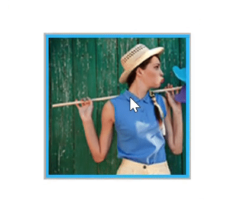

 ## Appearance and Styling

 ### Customizing Header

 Header of the  tile is customized by setting the properties such as [HeaderStyle](https://help.syncfusion.com/cr/wpf/Syncfusion.SfShared.Wpf~Syncfusion.Windows.Primitives.HeaderedContentControl~HeaderStyle.html) and [HeaderTemplate](https://help.syncfusion.com/cr/wpf/Syncfusion.SfShared.Wpf~Syncfusion.Windows.Primitives.HeaderedContentControl~HeaderTemplate.html) as below.

HeaderStyle is used to customize the header of the tile by setting the required properties .



<syncfusion:SfHubTile x:Name="hubTile" ImageSource="Assets/New Mail.png"  Title="This is title area." Header="HubTile">
<!--For setting Header Style-->
 <syncfuison:SfHubTile.HeaderStyle>
    
    </syncfusion:SfHubTile.HeaderStyle>
  </syncfusion:SfHubTile>  



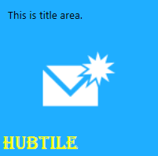

 HeaderTemplate is used to customize the header of the tile by adding required controls into the template.



   
   <syncfusion:SfHubTile x:Name="hubTile" ImageSource="Assets/New Mail.png"  Title="This is a title area." Header="HubTile">
    <syncfusion:SfHubTile.HeaderTemplate>
        <DataTemplate>
        <Grid>
         <Grid.ColumnDefinitions>
          <ColumnDefinition Width="Auto"/>
           <ColumnDefinition/>
         </Grid.ColumnDefinitions>
           <Image Source="Assets/syncfusion.png" HorizontalAlignment="Left" Stretch="None"/>          <TextBlock Text="SYNCFUSION" Foreground="White" Grid.Column="1" FontSize="11"  />
        </Grid>
        </DataTemplate>
   </syncfusion:SfHubTile.HeaderTemplate>
   </syncfusion:SfHubTile>



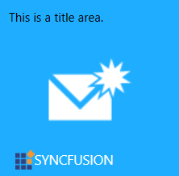

### Customizing Title

 Title of the tile is customized by setting [TitleStyle](https://help.syncfusion.com/cr/wpf/Syncfusion.SfHubTile.Wpf~Syncfusion.Windows.Controls.Notification.HubTileBase~TitleStyle.html) property as below.



<!-- SfHubTile -->
<syncfusion:SfHubTile x:Name="hubTile" ImageSource="Assets/New Mail.png"  Title="This is a title area." Header="HubTile">
    <!-- For setting title style -->
	 <syncfusion:SfHubTile.TitleStyle>
        
     </syncfusion:SfHubTile.TitleStyle>
</syncfusion:SfHubTile>



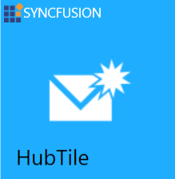

### Customizing SecondaryContent

 You can customize the secondary content by the following two ways:
 1. [Customizing SecondaryContent via property](#customizing-secondarycontent-via-property)      
 2. [Customzing SecondaryContent via template](#customizing-secondarycontent-via-template)

 #### Customizing SecondaryContent via property
 
 The secondary content of the tile is customized by setting [SecondaryContent](https://help.syncfusion.com/cr/wpf/Syncfusion.SfHubTile.Wpf~Syncfusion.Windows.Controls.Notification.SfHubTile~SecondaryContent.html) property as below.


<!-- SfHubTile -->
<syncfusion:SfHubTile x:Name="hubTile" Width="200" ImageSource="Assets/New Mail.png" Title="This is title area." Interval="00:00:003" Header="Hubtile">
	<syncfusion:SfHubTile.HubTileTransitions>
    	<!--SlideTransition-->
		<shared:SlideTransition/>
	</syncfusion:SfHubTile.HubTileTransitions>
    <!-- setting secondary content -->
	<syncfusion:SfHubTile.SecondaryContent>
	  <Image Source="/Assets/HubTile.png" Stretch="Fill" ToolTip="Secondarycontent" Margin="-1"/>
	</syncfusion:SfHubTile.SecondaryContent>
</syncfusion:SfHubTile>



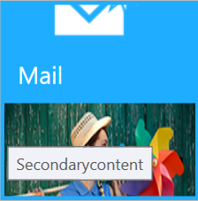

#### Customzing SecondaryContent via template
 
 You can also customize the secondary content of the hubtile by using [SecondaryContentTemplate](https://help.syncfusion.com/cr/wpf/Syncfusion.SfHubTile.Wpf~Syncfusion.Windows.Controls.Notification.SfHubTile~SecondaryContentTemplate.html) property.



<!-- SfHubTile -->
<syncfusion:SfHubTile x:Name="hubTile" IsFrozen="{Binding ElementName=checkbox1,Path=IsChecked}"  ImageSource="Assets/New Mail.png" Title="This is title area." Interval="00:00:003" Header="Hubtile">
	<syncfusion:SfHubTile.HubTileTransitions>
		<shared:SlideTransition/>
	</syncfusion:SfHubTile.HubTileTransitions>
    <!--setting Secondary content template-->
	<syncfusion:SfHubTile.SecondaryContentTemplate>
		<DataTemplate>
		<StackPanel Orientation="Vertical">
		<Image Source="/Assets/HubTile.png" Margin="-1"/>
		<CheckBox x:Name="checkbox1" Margin="10" Content="Freeze" IsChecked="{Binding ElementName=hubtile,Path=IsFrozen}" Width="100"/>
	    <TextBlock Margin="10" Text="This is the secondary content of the tile displayed at each transition" Foreground="Yellow" FontSize="12" TextWrapping="Wrap" FontStyle="Italic"/> 
			</StackPanel>
		</DataTemplate>
	</syncfusion:SfHubTile.SecondaryContentTemplate>
</syncfusion:SfHubTile>



