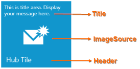
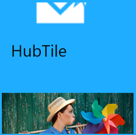

# Hub Tile Control

## Setting Title, Header and Image on Hub Tile

You can set the title, header and image on SfHubTile by setting [Title](https://help.syncfusion.com/cr/wpf/Syncfusion.SfHubTile.Wpf~Syncfusion.Windows.Controls.Notification.HubTileBase~Title.html), [Header](https://help.syncfusion.com/cr/wpf/Syncfusion.SfShared.Wpf~Syncfusion.Windows.Primitives.HeaderedContentControl~Header.html) and [ImageSource](https://help.syncfusion.com/cr/wpf/Syncfusion.SfHubTile.Wpf~Syncfusion.Windows.Controls.Notification.HubTileBase~ImageSource.html) properties.



<syncfusion:SfHubTile x:Name="hubTile" Header="HubTile" Title="This is title area. Display your message here." ImageSource="New Mail.png" HorizontalAlignment="Center" VerticalAlignment="Center"  Width="216"/>



N> The title will be displayed at the top of the hub tile. The header will be displayed at the bottom of the hub tile. An image will be displayed at the center of the hub tile.

## Animation and Transitions

SfHubTile control provided the following built-in transitions

1. Slide transition
2. Fade transition



<!-- SfHubTile -->
<syncfusion:SfHubTile x:Name="hubTile" ImageSource="Assets/New Mail.png"  Title="This is title area." Header="HubTile" Interval="0:0:3">
	<syncfusion:SfHubTile.HubTileTransitions>
		<shared:SlideTransition/>
	    <shared:FadeTransition/>
	</syncfusion:SfHubTile.HubTileTransitions>
	<!-- For setting secondary content -->
	<syncfusion:SfHubTile.SecondaryContent>
		<Image Source="/Assets/HubTile.png" Stretch="UniformToFill" Margin="-1"/>
	</syncfusion:SfHubTile.SecondaryContent>
</syncfusion:SfHubTile>


//For Slide transition
hubTile.HubTileTransitions.Add(new SlideTransition());
//For Fade transition
hubTile.HubTileTransitions.Add(new FadeTransition());
//Set transition time
hubTile.Interval = TimeSpan.FromSeconds(3.0);

 

N> Secondary content will be animated in the hub tile based on a specified interval.

## Freezing/Unfreezing

### Freezing/Unfreezing the Tile

The hub tiles can be frozen and unfrozen using [IsFrozen](https://help.syncfusion.com/cr/wpf/Syncfusion.SfHubTile.Wpf~Syncfusion.Windows.Controls.Notification.HubTileBase~IsFrozen.html) property.



<!-- SfHubTile -->
<syncfusion:SfHubTile x:Name="hubTile" Header="SfHubTile" IsFrozen="False" Title="SfHubTile animation" ImageSource="New Mail.png" HorizontalAlignment="Center" VerticalAlignment="Center"  Width="216">
    <!-- For setting secondary content -->
	<syncfusion:SfHubTile.SecondaryContent>
		<Image Source="/Assets/HubTile.png" Stretch="UniformToFill" Margin="-1"/>
	</syncfusion:SfHubTile.SecondaryContent>
	<syncfusion:HubTileTransitionCollection>
        <shared:SlideTransition/>
		<shared:FadeTransition/>
	</syncfusion:HubTileTransitionCollection>
</syncfusion:SfHubTile>


//Setting freeze property
hubTile.IsFrozen = true;



### Freezing/Unfreezing the Tile using HubTileService Class

The [HubTileService](https://help.syncfusion.com/cr/wpf/Syncfusion.SfHubTile.Wpf~Syncfusion.Windows.Controls.Notification.HubTileService.html) class provides the helper methods to freeze and unfreeze the animation by passing a HubTile instance or GroupName as an argument.

### GroupName

Several hub tiles can be grouped using the [GroupName](https://help.syncfusion.com/cr/wpf/Syncfusion.SfHubTile.Wpf~Syncfusion.Windows.Controls.Notification.HubTileBase~GroupName.html) property of hub tile. The group name will be used when we need to freeze the entire group of hub tiles.



<!-- SfHubTile 1-->
<syncfusion:SfHubTile x:Name="hubTileOne" GroupName="Applications" ImageSource="Assets/New Mail.png" Title="This is title area." Header="HubTile"/>
<!-- SfHubTile 2-->
<syncfusion:SfHubTile x:Name="hubTileTwo" GroupName="Applications" ImageSource="Assets/New Mail.png" Title="This is title area." Header="HubTile"/>


//Setting group name
hubTileOne.GroupName = "Applications";
hubTileTwo.GroupName = "Applications";



### Freezing the Tile

You can freeze a single or a group of tiles using [Freeze](https://help.syncfusion.com/cr/wpf/Syncfusion.SfHubTile.Wpf~Syncfusion.Windows.Controls.Notification.HubTileService~Freeze.html) method.



//Freeze the single tile
HubTileService.Freeze(hubTile);
//Freeze the single group of tile
HubTileService.Freeze("Application");



### Unfreezing the Tile

You can freeze a single or a group of tiles using [UnFreeze](https://help.syncfusion.com/cr/wpf/Syncfusion.SfHubTile.Wpf~Syncfusion.Windows.Controls.Notification.HubTileService~UnFreeze(SfHubTile).html) method.



//Freeze the single tile
HubTileService.UnFreeze(hubTile);
//Freeze the single group of tile
HubTileService.UnFreeze("Application");



## Appearance and Styling

### Customizing the Title

You can customize the appearance of title by using [TitleStyle](https://help.syncfusion.com/cr/wpf/Syncfusion.SfHubTile.Wpf~Syncfusion.Windows.Controls.Notification.HubTileBase~TitleStyle.html) property.



<!-- SfHubTile -->
<syncfusion:SfHubTile x:Name="hubTile" Width="300" ImageSource="Assets/New Mail.png"  Title="This is title area." Header="HubTile">
    <!-- For setting title style -->
	<syncfusion:SfHubTile.TitleStyle>
    	
	</syncfusion:SfHubTile.TitleStyle>
</syncfusion:SfHubTile>



### Customizing the Secondary Content

You can customize the secondary content appearance by using [SecondaryContentTemplate](https://help.syncfusion.com/cr/wpf/Syncfusion.SfHubTile.Wpf~Syncfusion.Windows.Controls.Notification.SfHubTile~SecondaryContentTemplate.html) property of SfHubTile.



<!-- SfHubTile -->
<syncfusion:SfHubTile x:Name="hubTile" SecondaryContent="This is SecondaryContent" ImageSource="Assets/New Mail.png" Title="This is title area." Header="HubTile">
	<syncfusion:SfHubTile.HubTileTransitions>
		<shared:SlideTransition/>
		<shared:FadeTransition/>
	</syncfusion:SfHubTile.HubTileTransitions>
    <!-- For setting secondary content -->
	<syncfusion:SfHubTile.SecondaryContentTemplate>
		<DataTemplate>
			<Image Source="/Assets/HubTile.png" Stretch="Fill" ToolTip="Secondary Content" Margin="-1"/>
		</DataTemplate>
	</syncfusion:SfHubTile.SecondaryContentTemplate>
</syncfusion:SfHubTile>



