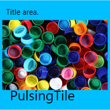

# Overview

 Tile provides live update and notification similar to the tile functionality in Windows Desktop and Windows Phone. The tile can have an image, title and header to update on the tile.

## Key Features

* HubTile –Supports tile feature similar to the tile feature of Windows Desktop and Windows Phone. It also supports various transition effects. It also provides support for displaying secondary content.

* PulsingTile – Supports tile feature similar to music and video tile in Windows Phone. The control allows the content to be zoomed in/out and translates the content across the x-axis and y-axis.
  
* Grouping - Support for grouping multiple tiles together.

* Freezing/Unfreezing – Support for freezing and unfreezing the tile.

* Themes -  Support for customizing the tile using different themes.

