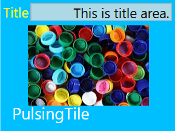

# PulsingTile control

 The PulsingTile control allows to create a tile similar to music and video hubtile in Windows Phone. The content zooms in/out randomly with random translation in X-axis and Y- axis. This section explains about the features of SfPulsingTile control.

## Setting Header on PulsingTile

You can set header to the tile by setting [Header](https://help.syncfusion.com/cr/wpf/Syncfusion.SfShared.Wpf~Syncfusion.Windows.Primitives.HeaderedContentControl~Header.html) property.




<!-- SfPulsingTile -->
<syncfusion:SfPulsingTile x:Name="pulsingTile" Header="PulsingTile"/>



    //Setting header for PulsingTile
    SfPulsingTile pulsingTile = new SfPulsingTile();
    pulsingTile.Header = "PulsingTile";



## Setting Title on PulsingTile

You can set title to the tile by setting [Title](https://help.syncfusion.com/cr/wpf/Syncfusion.SfHubTile.Wpf~Syncfusion.Windows.Controls.Notification.HubTileBase~Title.html) property.




<!--SfPulsingTile-->
<syncfusion:SfPulsingTile x:Name="pulsingTile" Title="This is title area in pulsingtile"/>



    //Setting title for PulsingTile
    SfPulsingTile pulsingTile = new SfPulsingTile();
    pulsingTile.Title = "This is title area in pulsingtile.";



## Setting Image on PulsingTile

You can set the image to the tile by setting image path to the [ImageSource](https://help.syncfusion.com/cr/wpf/Syncfusion.SfHubTile.Wpf~Syncfusion.Windows.Controls.Notification.HubTileBase~ImageSource.html) property.



<!--SfPulsingTile-->
 <syncfusion:SfPulsingTile x:Name="pulsingtile" ImageSource="Assets/PulsingTile.jpg"/>

{% highlight C# % }

    //Setting image for PulsingTile
    SfPulsingTile pulsingTile = new SfPulsingTile();
    pulsingTile.ImageSource = new BitmapImage(new Uri(@"Assets/PulsingTile.jpg",UriKind.RelativeorAbsolute));



## Customizing Animation

You can change animation of the pulsing tile by using PulseScale, RadiusX and RadiusY properties.

### Scaling animation
 
 * The scaling animation is done by setting the [PulseScale](https://help.syncfusion.com/cr/wpf/Syncfusion.SfHubTile.Wpf~Syncfusion.Windows.Controls.Notification.SfPulsingTile~PulseScale.html) property.
* The PulseScale property specifies the translation range in the x-axis and y-axis while pulsing the content.



<!-- SfPulsingTile-->
<syncfusion:SfPulsingTile x:Name="pulsingTile" Width="200" Height="200" PulseScale="2" Header="PulsingTile" >
 <Image Source="Assets/PulsingTile.jpg" Stretch="UniformToFill" VerticalAlignment="Center" HorizontalAlignment="Center" Height="200" />
</syncfusion:SfPulsingTile>



	// Setting PulseScale
	pulsingTile.PulseScale = 3;




### Duration of scaling animation

The time required to complete a single scaling animation in the pulsingtile is set by [PulseDuration](https://help.syncfusion.com/cr/wpf/Syncfusion.SfHubTile.Wpf~Syncfusion.Windows.Controls.Notification.SfPulsingTile~PulseDuration.html) property.  



<!-- SfPulsingTile -->
<syncfusion:SfPulsingTile x:Name="pulsingTile" Width="200" Height="200" PulseDuration="00:00:00.5" Header="PulsingTile" >
	<Image Source="Assets/PulsingTile.jpg" Stretch="UniformToFill" VerticalAlignment="Center" HorizontalAlignment="Center" Height="200" />
</syncfusion:SfPulsingTile>



	//Setting pulseduration
	pulsingTile.PulseDuration = TimeSpan.FromSeconds(3.0);




### Horizontal translation

 The SfPulsingTile control supports translation of the content along the x-axis by setting [RadiusX](https://help.syncfusion.com/cr/wpf/Syncfusion.SfHubTile.Wpf~Syncfusion.Windows.Controls.Notification.SfPulsingTile~RadiusX.html) property.



<!-- SfPulsingTile -->
<syncfusion:SfPulsingTile x:Name="pulsingTile" Width="200" Height="200" RadiusX="100" Header="PulsingTile" >
	<Image Source="Assets/PulsingTile.jpg" Stretch="UniformToFill" VerticalAlignment="Center" HorizontalAlignment="Center" Height="200" />
</syncfusion:SfPulsingTile>



	//Setting radiusX
	pulsingTile.RadiusX = 100;




### Vertical translation
 
 The SfPulsingTile control supports translation of the content along the y-axis by setting [RadiusY](https://help.syncfusion.com/cr/wpf/Syncfusion.SfHubTile.Wpf~Syncfusion.Windows.Controls.Notification.SfPulsingTile~RadiusY.html) property. 



<!-- SfPulsingTile  -->
<syncfusion:SfPulsingTile x:Name="pulsingTile" Width="200" Height="200"  RadiusY="100" Header="PulsingTile" >
	<Image Source="Assets/PulsingTile.jpg" Stretch="UniformToFill" VerticalAlignment="Center" HorizontalAlignment="Center" Height="200" />
</syncfusion:SfPulsingTile>



	//Setting radiusY
	pulsingTile.RadiusY = 100;




### Duration of translation

The time taken for translating the content along the x-axis and y-axis is set by [TranslateDuration](https://help.syncfusion.com/cr/wpf/Syncfusion.SfHubTile.Wpf~Syncfusion.Windows.Controls.Notification.SfPulsingTile~TranslateDuration.html) property of SfPulsingTile.



<syncfusion:SfPulsingTile x:Name="pulsingTile" RadiusX=100 RadiusY=100 TranslateDuration="00:00:003" Header="PulsingTile">
 <Image Source="Assets/PulsingTile.jpg" Stretch="UniformToFill" HorizontalAlignment="Center" VerticalAlignment="Center">
</syncfusion:SfPulsingTile> 


	
    //Setting TranslateDuration
	pulsingTile.TranslateDuration = TimeSpan.FromSeconds(3.0);




## Grouping

Several tiles can be grouped using the [GroupName](https://help.syncfusion.com/cr/wpf/Syncfusion.SfHubTile.Wpf~Syncfusion.Windows.Controls.Notification.HubTileBase~GroupName.html) property of pulsingtile control. The group name will be used when the entire group of tiles needs to be freezed.



<!-- SfPulsingTile 1-->
<syncfusion:SfPulsingTile x:Name="pulsingTileOne" GroupName="Applications" Header="PulsingTile" PulseScale="3" PulseDuration="00:00:003" >
 <Image Source="Assets/PulsingTile.jpg" HorizontalAlignment="Center" VerticalAlignment="Center"> 
</syncfusion:SfPulsingTile>
<!-- SfPulsingTile 2-->
<syncfusion:SfPulsingTile x:Name="pulsingTileTwo" GroupName="Applications" PulseScale="3" PulseDuration="00:00:003" Header="PulsingTile">
 <Image Source="Assets/PulsingTile.jpg"  HorizontalAlignment="Center" VerticalAlignment="Center"> 
</syncfusion:SfPulsingTile>
<!-- SfPulsingTile 3-->
<syncfusion:SfPulsingTile x:Name="pulsingTileThree" GroupName="Applications"  PulseScale="3" PulseDuration="00:00:003" Header="PulsingTile">
 <Image Source="Assets/PulsingTile.jpg"  HorizontalAlignment="Center" VerticalAlignment="Center"> 
</syncfusion:SfPulsingTile>



     //Setting group name
     pulsingTileOne.GroupName = "Applications";
     pulsingTileTwo.GroupName = "Applications";
     pulsingTileThree.GroupName = "Applications";



## Freezing/Unfreezing

 By the following two ways you can set freezing/unfreezing to the PulsingTile:                                                             
 1. [Using Property](#using-property)                                             
 2. [Using HubTileService Class](#using-hubtileservice-class)

### Using Property

You can freeze and unfreeze the tile by setting [IsFrozen](https://help.syncfusion.com/cr/wpf/Syncfusion.SfHubTile.Wpf~Syncfusion.Windows.Controls.Notification.HubTileBase~IsFrozen.html) property to be true or false.

#### Freezing the tile

You can freeze the tile by setting [IsFrozen](https://help.syncfusion.com/cr/wpf/Syncfusion.SfHubTile.Wpf~Syncfusion.Windows.Controls.Notification.HubTileBase~IsFrozen.html) property to be true.



<!-- SfPulsingTile -->
<syncfusion:SfPulsingTile x:Name="pulsingTile" Header="PulsingTile" IsFrozen="True" Title="This is title area." PulseScale="3" PulseDuration="00:00:003" >
    <Image Source="Assets/PulsingTile.jpg"
	HorizontalAlignment="Center" VerticalAlignment="Center"> 
</syncfusion:SfPulsingTile>



	//Setting freeze property
	pulsingTile.IsFrozen = true;


 
 

#### Unfreezing the tile

You can unfreeze the tile by setting [IsFrozen](https://help.syncfusion.com/cr/wpf/Syncfusion.SfHubTile.Wpf~Syncfusion.Windows.Controls.Notification.HubTileBase~IsFrozen.html) property to be false.



<!-- SfPulsingTile -->
<syncfusion:SfPulsingTile x:Name="pulsingTile" Header="PulsingTile" IsFrozen="False"  PulseScale="3" PulseDuration="00:00:003"  >
    <Image Source="Assets/PulsingTile.jpg" HorizontalAlignment="Center" VerticalAlignment="Center"> 
</syncfusion:SfPulsingTile>



    //Setting unfreeze property
     pulsingTile.IsFrozen = false;



### Freezing/Unfreezing the tile using HubTileService Class

* The [HubTileService](https://help.syncfusion.com/cr/wpf/Syncfusion.SfHubTile.Wpf~Syncfusion.Windows.Controls.Notification.HubTileService.html) class provides helper methods such as Freeze() and UnFreeze() to freeze and unfreeze the animation by passing a HubTile instance or GroupName as an argument.
* Add required **System.Windows.Interactivity** assembly reference in Xaml.
* Import schema for interactivity **http://schemas.microsoft.com/expression/2010/interactivity** in Xaml and **using System.Windows.Interactivity** in C#.

N> The HubTileService class allows to set the freeze/unfreeze state of the tile after the tiles are loaded.

#### Freeze tiles

You can freeze a single tile or a group of tiles using [Freeze](https://help.syncfusion.com/cr/wpf/Syncfusion.SfHubTile.Wpf~Syncfusion.Windows.Controls.Notification.HubTileService~Freeze.html) method.



<Window x:Class="HubTile_Grouping.MainWindow"
        xmlns="http://schemas.microsoft.com/winfx/2006/xaml/presentation"
        xmlns:x="http://schemas.microsoft.com/winfx/2006/xaml"
        xmlns:d="http://schemas.microsoft.com/expression/blend/2008"
        xmlns:mc="http://schemas.openxmlformats.org/markup-compatibility/2006"
        xmlns:local="clr-namespace:HubTile_Grouping"
        xmlns:sync="http://schemas.syncfusion.com/wpf"
        xmlns:shared="clr-namespace:Syncfusion.Windows.Controls;assembly=Syncfusion.SfShared.Wpf"
        xmlns:i="http://schemas.microsoft.com/expression/2010/interactivity"
        mc:Ignorable="d"
        Title="MainWindow" Height="450" Width="800">
    <Grid>
        <WrapPanel>
        <!--SfPulsingTile 1-->
<syncfusion:SfPulsingTile x:Name="pulsingTileOne" GroupName="Applications" Header="PulsingTile" PulseScale="3" PulseDuration="00:00:003" >
 <Image Source="Assets/PulsingTile.jpg" HorizontalAlignment="Center" VerticalAlignment="Center"> 
</syncfusion:SfPulsingTile>
<!-- SfPulsingTile 2-->
<syncfusion:SfPulsingTile x:Name="pulsingTileTwo" GroupName="Applications" PulseScale="3" PulseDuration="00:00:003" Header="PulsingTile">
 <Image Source="Assets/PulsingTile.jpg" HorizontalAlignment="Center" VerticalAlignment="Center"> 
</syncfusion:SfPulsingTile>
<!-- SfPulsingTile 3-->
<syncfusion:SfPulsingTile x:Name="pulsingTileThree" GroupName="Applications"  PulseScale="3" PulseDuration="00:00:003" Header="PulsingTile">
   <Image Source="Assets/PulsingTile.jpg" HorizontalAlignment="Center" VerticalAlignment="Center">
    <i:Interaction.Triggers>
	<i:EventTriggers EventName="Loaded">
	<local:FreezeTiles/>
	</i:Interaction.Triggers> 
</syncfusion:SfPulsingTile>
</WrapPanel>
</Grid>
</Window>



    using Syncfusion.Windows.Controls.Notification;
    using Syncfusion.Windows.Shared;
    using System.Windows.Interactivity;
    namespace HubTile_Grouping
    {
     public class FreezeTiles : TargetedTriggerAction<SfPulsingTile>
     {
      protected override void Invoke(object parameter)
     {
        var pulsingtile = this.AssociatedObject as SfPulsingTile;
        MainWindow window = VisualUtils.FindAncestor(pulsingtile, typeof(MainWindow)) as MainWindow;
        if (window != null && pulsingtile != null)
        { 
            //For a single tile
             HubTileService.Freeze(window.pulsingTileOne);
            
            //For Group of Tiles
             HubTileService.Freeze("Applications");
         }
       }
      }
    }



 

#### Unfreeze tiles 

You can unfreeze a single tile or a group of tiles using [UnFreeze](https://help.syncfusion.com/cr/wpf/Syncfusion.SfHubTile.Wpf~Syncfusion.Windows.Controls.Notification.HubTileService~UnFreeze.html) method.



<Window x:Class="HubTile_Grouping.MainWindow"
        xmlns="http://schemas.microsoft.com/winfx/2006/xaml/presentation"
        xmlns:x="http://schemas.microsoft.com/winfx/2006/xaml"
        xmlns:d="http://schemas.microsoft.com/expression/blend/2008"
        xmlns:mc="http://schemas.openxmlformats.org/markup-compatibility/2006"
        xmlns:local="clr-namespace:HubTile_Grouping"
        xmlns:sync="http://schemas.syncfusion.com/wpf"
        xmlns:shared="clr-namespace:Syncfusion.Windows.Controls;assembly=Syncfusion.SfShared.Wpf"
        xmlns:i="http://schemas.microsoft.com/expression/2010/interactivity"
        mc:Ignorable="d"
        Title="MainWindow" Height="450" Width="800">
    <Grid>
        <WrapPanel>
  <!--SfPulsingTile1-->      
<syncfusion:SfPulsingTile x:Name="pulsingTileOne" GroupName="Applications" Header="PulsingTile" PulseScale="3" PulseDuration="00:00:003" >
 <Image Source="Assets/PulsingTile.jpg" HorizontalAlignment="Center" VerticalAlignment="Center"> 
</syncfusion:SfPulsingTile>
<!-- SfPulsingTile 2-->
<syncfusion:SfPulsingTile x:Name="pulsingTileTwo" GroupName="Applications" PulseScale="3" PulseDuration="00:00:003" Header="PulsingTile">
 <Image Source="Assets/PulsingTile.jpg" HorizontalAlignment="Center" VerticalAlignment="Center"> 
</syncfusion:SfPulsingTile>
<!-- SfPulsingTile 3-->
<syncfusion:SfPulsingTile x:Name="pulsingTileThree" GroupName="Applications" PulseScale="3" PulseDuration="00:00:003" Header="PulsingTile">
 <Image Source="Assets/PulsingTile.jpg" HorizontalAlignment="Center" VerticalAlignment="Center"> 
    <i:Interaction.Triggers>
	   <i:EventTriggers EventName="Loaded">
	   <local:UnfreezeTiles/>
    </i:Interaction.Triggers>
</syncfusion:SfPulsingTile>
</WrapPanel>
</Grid>
</Window>



    using Syncfusion.Windows.Controls.Notification;
    using Syncfusion.Windows.Shared;
    using System.Windows.Interactivity;

    namespace HubTile_Grouping
    {
        public class UnfreezeTiles : TargetedTriggerAction<SfPulsingTile>
        {
            protected override void Invoke(object parameter)
            {
                var pulsingtile = this.AssociatedObject as SfPulsingTile;
                MainWindow window = VisualUtils.FindAncestor(pulsingtile, typeof(MainWindow)) as MainWindow;
                if (window != null && pulsingtile != null)
                { 
                    //For a single tile
                     HubTileService.UnFreeze(window.pulsingTileOne);
                   
                    //For group of tiles
                     HubTileService.UnFreeze("Applications");
                }
            }
        }
    }




## Press Notifications and Animations

  * When a tile is pressed, it performs certain animations and it is notified by [Click](https://help.syncfusion.com/cr/wpf/Syncfusion.SfHubTile.Wpf~Syncfusion.Windows.Controls.Notification.HubTileBase~Click_EV.html) event.

  * It also supports Command-Binding.  
  
### Click event

  The [Click](https://help.syncfusion.com/cr/wpf/Syncfusion.SfHubTile.Wpf~Syncfusion.Windows.Controls.Notification.HubTileBase~Click_EV.html) event rises whenever the tile is pressed.

   
    
 <syncfusion:SfPulsingTile Header="PulsingTile" Title="TitleArea." PulseScale="3" PulseDuration="00:00:003" >
         <Image Source="Assets/PulsingTile.jpg">
    	<i:Interaction.Triggers>
                    <i:EventTrigger EventName="Click">
                        <local:PulsingTileClicked />
                    </i:EventTrigger>
                </i:Interaction.Triggers>
   </syncfusion:SfPulsingTile>
    
	
      
	   public class PulsingTileClicked : TargetedTriggerAction<SfPulsingTile>
    {
        protected override void Invoke(object parameter)
        {
            var Pulsingtile = this.AssociatedObject as SfPulsingTile;
            MainWindow window = VisualUtils.FindAncestor(Pulsingtile, typeof(MainWindow)) as MainWindow;
            if ((window != null) && (Pulsingtile != null))
            {
                MessageBox.Show("PulsingTile is Clicked");
            }
        }

    }
     
	  

 ### Command-Binding

   [Command](https://help.syncfusion.com/cr/wpf/Syncfusion.SfHubTile.Wpf~Syncfusion.Windows.Controls.Notification.HubTileBase~Command.html) and [CommandParameter](https://help.syncfusion.com/cr/wpf/Syncfusion.SfHubTile.Wpf~Syncfusion.Windows.Controls.Notification.HubTileBase~CommandParameter.html) are used instead of Click event in MVVM pattern. 

   
    
   <syncfusion:SfPulsingTile Header="PulsingTile" Title="TitleArea." PulseScale="3" PulseDuration="00:00:003" Command="{Binding PulsingTileCommand}" CommandParameter="{Binding ElementName=PulsingTile}">
         <Image Source="Assets/PulsingTile.jpg">
      </syncfusion:SfPulsingTile>
    
	
           
	    public partial class MainWindow : Window
    {
        public MainWindow()
        {
            InitializeComponent();
           
        }

        private ICommand  pulsingtilecommand;

        public ICommand PulsingTileCommand
        {
            get { return pulsingtilecommand ?? (pulsingtilecommand = new Command(true, ()=>MyAction("PulsingTileCommand"))); }

        }

        private void MyAction(string parameter)
        {
            if (parameter.Equals("PulsingTileCommand"))
            {
                string msg = string.Format("PulsingTile Command executed");
                MessageBox.Show(msg);
            }
        }
    }
	 public class Command : ICommand
        {
            private bool _canexecute;
            private Action _execute;
            public Command(bool Canexecute, Action Execute)
            {
                _canexecute = Canexecute;
                _execute = Execute;
            }

            public event EventHandler CanExecuteChanged;

            public bool CanExecute(object parameter)
            {
                return _canexecute;
            }

            public void Execute(object parameter)
            {
                _execute();
            }
        }

	   
	

### Animations

  While pressing the center of the tile, the tile press animation occurs by setting  the following properties:

  * [ScaleDepth](https://help.syncfusion.com/cr/wpf/Syncfusion.SfHubTile.Wpf~Syncfusion.Windows.Controls.Notification.HubTileBase~ScaleDepth.html) determines the depth of scaling effect while pressing the  center of the tile.

  * [TilePressDuration](https://help.syncfusion.com/cr/wpf/Syncfusion.SfHubTile.Wpf~Syncfusion.Windows.Controls.Notification.HubTileBase~TilePressDuration.html) specifies the time taken for the single tile press animation.

   
   
     <syncfusion:SfPulsingTile Header="PulsingTile" Title="TitleArea." PulseScale="3" PulseDuration="00:00:003" TilePressDuration="00:00:003" ScaleDepth="2">
         <Image Source="Assets/PulsingTile.jpg">
      </syncfusion:SfPulsingTile>
   
   

N> The tile press animation occurs only if the [OverrideDefualtStates](https://help.syncfusion.com/cr/wpf/Syncfusion.SfHubTile.Wpf~Syncfusion.Windows.Controls.Notification.HubTileBase~OverrideDefaultStates.html) property is said to be false.

## Appearance and Styling

### Customizing  Title

You can customize the appearance of title by setting [TitleStyle](https://help.syncfusion.com/cr/wpf/Syncfusion.SfHubTile.Wpf~Syncfusion.Windows.Controls.Notification.HubTileBase~TitleStyle.html) property.



<!--SfPulsingTile-->
<syncfusion:SfPulsingTile x:Name="pulsingtile" Title="Title" Header="PulsingTile">
    <Image Source="Assets/PulsingTile.jpg" HorizontalAlignment="Center" VerticalAlignment="Center">
    <!-- For setting title style -->
	<sync:SfPulsingTile.TitleStyle>
       
    </sync:SfPulsingTile.TitleStyle>
</syncfusion:SfPulsingTile>



