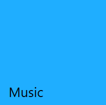
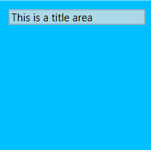
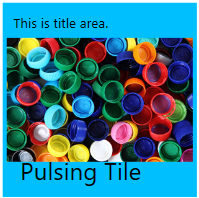
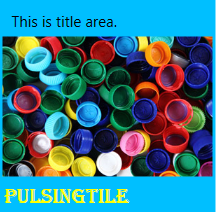
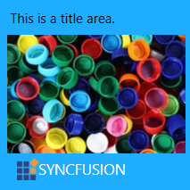

# Pulsing Tile 

The Pulsing Tile control allows to create a tile similar to music and video tiles in Windows Phone. The content zooms in/out randomly with random movement along the X-axis and Y- axis. This section explains about the features of Pulsing Tile.

## Setting Header content

Header can act as the name of the tile, that is placed at the bottom explaining its purpose. The content of the header can be an image, a text or a control, etc. The header can be set to the tile by using the [Header](https://help.syncfusion.com/cr/wpf/Syncfusion.SfShared.Wpf~Syncfusion.Windows.Primitives.HeaderedContentControl~Header.html) property. The below example demonstrates a music tile with header as music.




<!-- SfPulsingTile -->
<syncfusion:SfPulsingTile x:Name="pulsingTile" Header="Music"/>
<!--setting header as image-->
<syncfusion:SfPulsingTile x:Name="pulsingTile" >
     <syncfusion:SfPulsingTile.Header>
     <Image Source="//Assets/syncfusion.png" Stretch="None" >
     </syncfusion:SfPulsingTile.Header>
</syncfusion:SfPulsingTile>
<!--setting header as control-->
<syncfusion:SfPulsingTile x:Name="pulsingTile" >
     <syncfusion:SfPulsingTile.Header>
     <TextBlock Text="SYNCFUSION" Foreground="White" FontSize="13" >
     </syncfusion:SfPulsingTile.Header>
</syncfusion:SfPulsingTile>



    //Setting header for PulsingTile
    SfPulsingTile pulsingTile = new SfPulsingTile();
    pulsingTile.Header = "PulsingTile";

    //Setting header as image 
    Image image = new Image(){Source = new BitmapImage(new Uri(@"/Assets/syncfusion.png",UriKind.RelativeOrAbsolute))};
    hubtile.Header = image;
   
   //Setting header as control
   Textblock textblock = new TextBlock(){Text = "SYNCFUSION", Foreground = Brushes.White, FontSize = 13} ; 



## Setting Title content

 Title is used to display updates and notifications in the tile. The content can be an image, a text or a control, etc. You can set title to the tile by setting [Title](https://help.syncfusion.com/cr/wpf/Syncfusion.SfHubTile.Wpf~Syncfusion.Windows.Controls.Notification.HubTileBase~Title.html) property. The below example demonstrates the music tile with specific notifications.



<Grid x:Name="grid">
<!--SfPulsingTile-->
<syncfusion:SfPulsingTile x:Name="pulsingTile" Title="Now Playing-Song Name"/>
<!--setting title as image-->
<syncfusion:SfPulsingTile x:Name="pulsingTile">
    <syncfusion:SfPulsingTile.Title>
        <Image Source="//Assets/syncfusion.png" Stretch="None"/>
    </syncfusion:SfPulsingTile.Title>
</syncfusion:SfPulsingTile>
 <!--setting title as control--> 
<syncfusion:SfPulsingTile x:Name="pulsingTile">
    <syncfusion:SfPulsingTile.Title>
        <TextBlock Text="SYNCFUSION" Foreground="White" />
    </syncfusion:SfPulsingTile.Title>
</syncfusion:SfPulsingTile>
</Grid>



    //Setting title for PulsingTile
    SfPulsingTile pulsingTile = new SfPulsingTile();
    pulsingTile.Title = "Now Playing-Song Name";

    //For setting title as image use this code.
    Image image = new Image(){Source = new BitmapImage(new Uri(@"/Assets/syncfusion.png",UriKind.RelativeOrAbsolute))};
    pulsingTile.Title = image;
   
   // For setting title as control use this code.
   Textblock textblock = new TextBlock(){Text = "SYNCFUSION", Foreground = Brushes.White, FontSize = 13} ; 
   pulsingTile.Title = textblock;
   grid.Children.Add(hubtile);




## Setting Image content

The image can be set to the tile by setting image path to the [ImageSource](https://help.syncfusion.com/cr/wpf/Syncfusion.SfHubTile.Wpf~Syncfusion.Windows.Controls.Notification.HubTileBase~ImageSource.html) property.



<Grid x:Name="grid">
<!--SfPulsingTile-->
<syncfusion:SfPulsingTile x:Name="pulsingtile" ImageSource="//Assets/PulsingTile.jpg"/>
</Grid>

{% highlight C# % }

    //Setting image for PulsingTile
    SfPulsingTile pulsingTile = new SfPulsingTile();
    pulsingTile.ImageSource = new BitmapImage(new Uri(@"/Assets/PulsingTile.jpg",UriKind.RelativeorAbsolute));



## Customizing Animation

Animations in the pulsing tile can be customized  by using [PulseScale](https://help.syncfusion.com/cr/wpf/Syncfusion.SfHubTile.Wpf~Syncfusion.Windows.Controls.Notification.SfPulsingTile~PulseScale.html), [RadiusX](https://help.syncfusion.com/cr/wpf/Syncfusion.SfHubTile.Wpf~Syncfusion.Windows.Controls.Notification.SfPulsingTile~RadiusX.html) and [RadiusY](https://help.syncfusion.com/cr/wpf/Syncfusion.SfHubTile.Wpf~Syncfusion.Windows.Controls.Notification.SfPulsingTile~RadiusY.html) properties.

### Scaling animation

Scaling animation causes the content of the tile to zoom in/out and is achieved by setting the [PulseScale](https://help.syncfusion.com/cr/wpf/Syncfusion.SfHubTile.Wpf~Syncfusion.Windows.Controls.Notification.SfPulsingTile~PulseScale.html) property. The PulseScale property specifies the translation range in the x-axis and y-axis while scaling the content.



<!-- SfPulsingTile-->
<Grid x:Name="grid">
<syncfusion:SfPulsingTile x:Name="pulsingTile" Width="200" Height="200" PulseScale="2" Header="PulsingTile" >
    <Image Source="/Assets/PulsingTile.jpg" Stretch="None" VerticalAlignment="Center" HorizontalAlignment="Center"  />
</syncfusion:SfPulsingTile>
</Grid>


    
    SfPulsingTile pulsingtile = new SfPulsingTile();
    pulsingtile.Header = "PulsingTile";
    Image image = new Image(){Source = new BitmapImage(new Uri(@"/Assets/PulsingTile.jpg",UriKind.RelativeorAbsolute))};
    pulsingtile.Content = image; 

	// Setting PulseScale
	pulsingtile.PulseScale = 2;
    grid.Children.Add(pulsingtile);




### Duration of scaling animation

The time required to complete a single scaling animation is achieved by setting the [PulseDuration](https://help.syncfusion.com/cr/wpf/Syncfusion.SfHubTile.Wpf~Syncfusion.Windows.Controls.Notification.SfPulsingTile~PulseDuration.html) property.  



<Grid x:Name="grid">
<!-- SfPulsingTile -->
<syncfusion:SfPulsingTile x:Name="pulsingTile" Width="200" Height="200" PulseDuration="00:00:00.5" Header="PulsingTile" >
    <Image Source="/Assets/PulsingTile.jpg" Stretch="None" VerticalAlignment="Center" HorizontalAlignment="Center" />
</syncfusion:SfPulsingTile>
</Grid>



    SfPulsingTile pulsingtile = new SfPulsingTile();
    pulsingtile.Header = "PulsingTile";
    Image image = new Image(){Source = new BitmapImage(new Uri(@"/Assets/PulsingTile.jpg",UriKind.RelativeOrAbsolute))};
    pulsingtile.Content = image; 

	//Setting pulseduration
	pulsingtile.PulseDuration = TimeSpan.FromSeconds(3.0);
    grid.Children.Add(pulsingtile);




### Horizontal translation

Horizontal translation allows the content of the tile to move from left to right along x-axis. The Pulsing Tile provides support for horizontal translation by using [RadiusX](https://help.syncfusion.com/cr/wpf/Syncfusion.SfHubTile.Wpf~Syncfusion.Windows.Controls.Notification.SfPulsingTile~RadiusX.html) property. The RadiusX specifies the translation range of the content along the x-axis.



<Grid x:Name="grid">
<!-- SfPulsingTile -->
<syncfusion:SfPulsingTile x:Name="pulsingTile" Width="200" Height="200" RadiusX="100" Header="PulsingTile" >
	<Image Source="/Assets/PulsingTile.jpg" VerticalAlignment="Center" HorizontalAlignment="Center" />
</syncfusion:SfPulsingTile>
</Grid>


    
    SfPulsingTile pulsingtile = new SfPulsingTile();
    pulsingtile.Header = "PulsingTile";
    Image image = new Image(){Source = new BitmapImage(new Uri(@"/Assets/PulsingTile.jpg",UriKind.RelativeOrAbsolute))};
    pulsingtile.Content = image; 

	//Setting radiusX
	pulsingtile.RadiusX = 100;
    grid.Children.Add(pulsingtile);




### Vertical translation
 
  Vertical translation allows the content of the tile to move up and down along the y-axis. The Pulsing Tile provides support for vertical translation by using [RadiusY](https://help.syncfusion.com/cr/wpf/Syncfusion.SfHubTile.Wpf~Syncfusion.Windows.Controls.Notification.SfPulsingTile~RadiusY.html) property. The RadiusY specifies the translation range of the content along the y-axis.



<Grid x:Name="grid">
<!-- SfPulsingTile  -->
<syncfusion:SfPulsingTile x:Name="pulsingTile" Width="200" Height="200"  RadiusY="100" Header="PulsingTile" >
	<Image Source="/Assets/PulsingTile.jpg" VerticalAlignment="Center" HorizontalAlignment="Center" />
</syncfusion:SfPulsingTile>
</Grid>



    SfPulsingTile pulsingtile = new SfPulsingTile();
    pulsingtile.Header = "PulsingTile";
    Image image = new Image(){Source = new BitmapImage(new Uri(@"/Assets/PulsingTile.jpg",UriKind.RelativeOrAbsolute))};
    pulsingtile.Content = image; 

	//Setting radiusY
	pulsingtile.RadiusY = 100;
    grid.Children.Add(pulsingtile); 



### Duration of translation

The time taken for translating the content along the x-axis and y-axis is achieved by setting the [TranslateDuration](https://help.syncfusion.com/cr/wpf/Syncfusion.SfHubTile.Wpf~Syncfusion.Windows.Controls.Notification.SfPulsingTile~TranslateDuration.html) property.



<Grid x:Name="grid">
<syncfusion:SfPulsingTile x:Name="pulsingTile" RadiusX=100 RadiusY=100 TranslateDuration="00:00:03" Header="PulsingTile">
    <Image Source="/Assets/PulsingTile.jpg" Stretch="UniformToFill" HorizontalAlignment="Center" VerticalAlignment="Center"/>
</syncfusion:SfPulsingTile> 
</Grid>


	
    SfPulsingTile pulsingtile = new SfPulsingTile();
    pulsingtile.Header = "PulsingTile";
    Image image = new Image(){Source = new BitmapImage(new Uri(@"/Assets/PulsingTile.jpg",UriKind.RelativeorAbsolute))};
    pulsingtile.Content = image; 

    //Setting TranslateDuration
	pulsingtile.TranslateDuration = TimeSpan.FromSeconds(3.0);
    grid.Children.Add(pulsingtile); 



## Grouping

Several tiles can be grouped using the [GroupName](https://help.syncfusion.com/cr/wpf/Syncfusion.SfHubTile.Wpf~Syncfusion.Windows.Controls.Notification.HubTileBase~GroupName.html) property of pulsing tile control. The group name will be used when the entire group of tiles needs to be freezed.



<!-- SfPulsingTile 1-->
<syncfusion:SfPulsingTile x:Name="pulsingTileOne" GroupName="Applications" Header="PulsingTile" PulseScale="3" PulseDuration="00:00:03" >   
    <Image Source="/Assets/PulsingTile.jpg" HorizontalAlignment="Center" VerticalAlignment="Center"/> 
</syncfusion:SfPulsingTile>
<!-- SfPulsingTile 2-->
<syncfusion:SfPulsingTile x:Name="pulsingTileTwo" GroupName="Applications" PulseScale="3" PulseDuration="00:00:03" Header="PulsingTile">
    <Image Source="/Assets/PulsingTile.jpg"  HorizontalAlignment="Center" VerticalAlignment="Center"/> 
</syncfusion:SfPulsingTile>
<!-- SfPulsingTile 3-->
<syncfusion:SfPulsingTile x:Name="pulsingTileThree" GroupName="Applications"  PulseScale="3" PulseDuration="00:00:03" Header="PulsingTile">
    <Image Source="/Assets/PulsingTile.jpg"  HorizontalAlignment="Center" VerticalAlignment="Center"/> 
</syncfusion:SfPulsingTile>



    //Setting group name
    pulsingTileOne.GroupName = "Applications";
    pulsingTileTwo.GroupName = "Applications";
    pulsingTileThree.GroupName = "Applications";



## Freezing/UnFreezing

Freezing provides support to stop animating the contents of the tile. UnFreezing provides support to keep the tile content animated. Freezing/Unfreezing can be set by the following ways:                                                             
1. [Freezing/UnFreezing via Property](#Freezing/UnFreezing-via-property)                                             
2. [Freezing/UnFreezing via HubTileService Class](#Freezing/UnFreezing-via-hubtileservice-class)

### Freezing/UnFreezing via Property

The Pulsing Tile can be freezed by setting [IsFrozen](https://help.syncfusion.com/cr/wpf/Syncfusion.SfHubTile.Wpf~Syncfusion.Windows.Controls.Notification.HubTileBase~IsFrozen.html) property to be true.



<Grid x:Name="grid">
<!-- SfPulsingTile -->
<syncfusion:SfPulsingTile x:Name="pulsingTile" Header="PulsingTile" IsFrozen="True" Title="This is title area." PulseScale="3" PulseDuration="00:00:03" >
    <Image Source="/Assets/PulsingTile.jpg"
	HorizontalAlignment="Center" VerticalAlignment="Center"/> 
</syncfusion:SfPulsingTile>
</Grid>



    SfPulsingTile pulsingtile = new SfPulsingTile();
    pulsingtile.Header = "PulsingTile";
    Image image = new Image(){Source = new BitmapImage(new Uri(@"/Assets/PulsingTile.jpg",UriKind.RelativeorAbsolute))};
    pulsingtile.Content = image;   

	//Setting freeze property
	pulsingtile.IsFrozen = true;
    grid.Children.Add(pulsingtile);


 

The Pulsing tile can be unfreezed by setting [IsFrozen](https://help.syncfusion.com/cr/wpf/Syncfusion.SfHubTile.Wpf~Syncfusion.Windows.Controls.Notification.HubTileBase~IsFrozen.html) property to be false.



<Grid x:NAme="grid">
<!-- SfPulsingTile -->
<syncfusion:SfPulsingTile x:Name="pulsingTile" Header="PulsingTile" IsFrozen="False"  PulseScale="3" PulseDuration="00:00:03"  >
    <Image Source="/Assets/PulsingTile.jpg" HorizontalAlignment="Center" VerticalAlignment="Center"/> 
</syncfusion:SfPulsingTile>
</Grid>



     SfPulsingTile pulsingtile = new SfPulsingTile();
    pulsingtile.Header = "PulsingTile";
    Image image = new Image(){Source = new BitmapImage(new Uri(@"/Assets/PulsingTile.jpg",UriKind.RelativeorAbsolute))};
    pulsingtile.Content = image; 

    //Setting unfreeze property
    pulsingtile.IsFrozen = false;
    grid.Children.Add(pulsingtile);



### Freezing/UnFreezing via HubTileService Class

 The [HubTileService](https://help.syncfusion.com/cr/wpf/Syncfusion.SfHubTile.Wpf~Syncfusion.Windows.Controls.Notification.HubTileService.html) class provides helper methods such as [Freeze](https://help.syncfusion.com/cr/wpf/Syncfusion.SfHubTile.Wpf~Syncfusion.Windows.Controls.Notification.HubTileService~Freeze.html) and [UnFreeze](https://help.syncfusion.com/cr/wpf/Syncfusion.SfHubTile.Wpf~Syncfusion.Windows.Controls.Notification.HubTileService~UnFreeze.html) to freeze and unfreeze the animation by passing a Hub Tile instance or [GroupName](https://help.syncfusion.com/cr/wpf/Syncfusion.SfHubTile.Wpf~Syncfusion.Windows.Controls.Notification.HubTileBase~GroupName.html) as an argument. Add required **System.Windows.Interactivity** assembly reference to the application. Import schema for interactivity **http://schemas.microsoft.com/expression/2010/interactivity** in Xaml or **using System.Windows.Interactivity** in C#.

N> The [HubTileService](https://help.syncfusion.com/cr/wpf/Syncfusion.SfHubTile.Wpf~Syncfusion.Windows.Controls.Notification.HubTileService.html) class allows to set the freeze/unfreeze state of the tile after the tiles are loaded.

A Single tile or a group of tiles can be freezed by using [Freeze](https://help.syncfusion.com/cr/wpf/Syncfusion.SfHubTile.Wpf~Syncfusion.Windows.Controls.Notification.HubTileService~Freeze.html) method.



<Window x:Class="HubTile_Grouping.MainWindow"
        xmlns="http://schemas.microsoft.com/winfx/2006/xaml/presentation"
        xmlns:x="http://schemas.microsoft.com/winfx/2006/xaml"
        xmlns:d="http://schemas.microsoft.com/expression/blend/2008"
        xmlns:mc="http://schemas.openxmlformats.org/markup-compatibility/2006"
        xmlns:local="clr-namespace:HubTile_Grouping"
        xmlns:sync="http://schemas.syncfusion.com/wpf"
        xmlns:shared="clr-namespace:Syncfusion.Windows.Controls;assembly=Syncfusion.SfShared.Wpf"
        xmlns:i="http://schemas.microsoft.com/expression/2010/interactivity"
        mc:Ignorable="d"
        Title="MainWindow" Height="450" Width="800">
<Grid>
<WrapPanel>
<!--SfPulsingTile 1-->
<syncfusion:SfPulsingTile x:Name="pulsingTileOne" GroupName="Applications" Header="PulsingTile" PulseScale="3" PulseDuration="00:00:03" >
    <Image Source="/Assets/PulsingTile.jpg" HorizontalAlignment="Center" VerticalAlignment="Center"/> 
</syncfusion:SfPulsingTile>
<!-- SfPulsingTile 2-->
<syncfusion:SfPulsingTile x:Name="pulsingTileTwo" GroupName="Applications" PulseScale="3" PulseDuration="00:00:03" Header="PulsingTile">
    <Image Source="/Assets/PulsingTile.jpg" HorizontalAlignment="Center" VerticalAlignment="Center"/> 
</syncfusion:SfPulsingTile>
<!-- SfPulsingTile 3-->
<syncfusion:SfPulsingTile x:Name="pulsingTileThree" GroupName="Applications"  PulseScale="3" PulseDuration="00:00:03" Header="PulsingTile">
    <Image Source="/Assets/PulsingTile.jpg" HorizontalAlignment="Center" VerticalAlignment="Center"/>
    <i:Interaction.Triggers>
	    <i:EventTriggers EventName="Loaded">
	        <local:FreezeTiles/>
        </i:EventTriggers>
	</i:Interaction.Triggers> 
</syncfusion:SfPulsingTile>
</WrapPanel>
</Grid>
</Window>



    using Syncfusion.Windows.Controls.Notification;
    using Syncfusion.Windows.Shared;
    using System.Windows.Interactivity;
    namespace HubTile_Grouping
    {
        public class FreezeTiles : TargetedTriggerAction<SfPulsingTile>
        {
            protected override void Invoke(object parameter)
            {
             var pulsingtile = this.AssociatedObject as SfPulsingTile;
             MainWindow window = VisualUtils.FindAncestor(pulsingtile, typeof(MainWindow)) as MainWindow;
             if (window != null && pulsingtile != null)
             { 
               //For a single tile use this code.
                HubTileService.Freeze(window.pulsingTileOne);
            
               //For Group of Tiles use this code.
               HubTileService.Freeze("Applications");
              }
            }
        }
    }



A Single tile or a group of tiles can be unfreezed by using [UnFreeze](https://help.syncfusion.com/cr/wpf/Syncfusion.SfHubTile.Wpf~Syncfusion.Windows.Controls.Notification.HubTileService~UnFreeze.html) method.



<Window x:Class="HubTile_Grouping.MainWindow"
        xmlns="http://schemas.microsoft.com/winfx/2006/xaml/presentation"
        xmlns:x="http://schemas.microsoft.com/winfx/2006/xaml"
        xmlns:d="http://schemas.microsoft.com/expression/blend/2008"
        xmlns:mc="http://schemas.openxmlformats.org/markup-compatibility/2006"
        xmlns:local="clr-namespace:HubTile_Grouping"
        xmlns:sync="http://schemas.syncfusion.com/wpf"
        xmlns:shared="clr-namespace:Syncfusion.Windows.Controls;assembly=Syncfusion.SfShared.Wpf"
        xmlns:i="http://schemas.microsoft.com/expression/2010/interactivity"
        mc:Ignorable="d"
        Title="MainWindow" Height="450" Width="800">
<Grid>
<WrapPanel>
  <!--SfPulsingTile1-->      
<syncfusion:SfPulsingTile x:Name="pulsingTileOne" GroupName="Applications" Header="PulsingTile" PulseScale="3" PulseDuration="00:00:03" >
    <Image Source="/Assets/PulsingTile.jpg" HorizontalAlignment="Center" VerticalAlignment="Center"/> 
</syncfusion:SfPulsingTile>
<!-- SfPulsingTile 2-->
<syncfusion:SfPulsingTile x:Name="pulsingTileTwo" GroupName="Applications" PulseScale="3" PulseDuration="00:00:03" Header="PulsingTile">
    <Image Source="/Assets/PulsingTile.jpg" HorizontalAlignment="Center" VerticalAlignment="Center"/> 
</syncfusion:SfPulsingTile>
<!-- SfPulsingTile 3-->
<syncfusion:SfPulsingTile x:Name="pulsingTileThree" GroupName="Applications" PulseScale="3" PulseDuration="00:00:03" Header="PulsingTile">
    <Image Source="/Assets/PulsingTile.jpg" HorizontalAlignment="Center" VerticalAlignment="Center"/> 
    <i:Interaction.Triggers>
	    <i:EventTriggers EventName="Loaded">
	        <local:UnfreezeTiles/>
        </i:EventTriggers>
    </i:Interaction.Triggers>
</syncfusion:SfPulsingTile>
</WrapPanel>
</Grid>
</Window>



    using Syncfusion.Windows.Controls.Notification;
    using Syncfusion.Windows.Shared;
    using System.Windows.Interactivity;

    namespace HubTile_Grouping
    {
        public class UnfreezeTiles : TargetedTriggerAction<SfPulsingTile>
        {
            protected override void Invoke(object parameter)
            {
                var pulsingtile = this.AssociatedObject as SfPulsingTile;
                MainWindow window = VisualUtils.FindAncestor(pulsingtile, typeof(MainWindow)) as MainWindow;
                if (window != null && pulsingtile != null)
                { 
                    //For a single tile use this code.
                     HubTileService.UnFreeze(window.pulsingTileOne);
                   
                    //For group of tiles use this code.
                     HubTileService.UnFreeze("Applications");
                }
            }
        }
    }



## Notifications and Animations

Once the tile is pressed, it is notified by the click event and the command property of the Pulsing Tile. 

The [Click](https://help.syncfusion.com/cr/wpf/Syncfusion.SfHubTile.Wpf~Syncfusion.Windows.Controls.Notification.HubTileBase~Click_EV.html) event rises whenever the tile is pressed.


 
<syncfusion:SfPulsingTile Header="PulsingTile" Title="TitleArea." PulseScale="3" PulseDuration="00:00:03" >
    <Image Source="/Assets/PulsingTile.jpg">
    <i:Interaction.Triggers>
        <i:EventTrigger EventName="Click">
            <local:Clickevent />
        </i:EventTrigger>
    </i:Interaction.Triggers>
</syncfusion:SfPulsingTile>


      
    public class Clickevent : TargetedTriggerAction<SfPulsingTile>
    {
        protected override void Invoke(object parameter)
        {
            var Pulsingtile = this.AssociatedObject as SfPulsingTile;
            MainWindow window = VisualUtils.FindAncestor(Pulsingtile, typeof(MainWindow)) as MainWindow;
            if ((window != null) && (Pulsingtile != null))
            {
                MessageBox.Show("PulsingTile is Clicked");
            }
        }
    }

 

### Command binding

Command specifies the operation to be performed when the tile is pressed. [Command](https://help.syncfusion.com/cr/wpf/Syncfusion.SfHubTile.Wpf~Syncfusion.Windows.Controls.Notification.HubTileBase~Command.html) and [CommandParameter](https://help.syncfusion.com/cr/wpf/Syncfusion.SfHubTile.Wpf~Syncfusion.Windows.Controls.Notification.HubTileBase~CommandParameter.html) are used instead of click event in MVVM pattern.


 
<syncfusion:SfPulsingTile Header="PulsingTile" Title="TitleArea." PulseScale="3" PulseDuration="00:00:03" Command="{Binding PulsingTileCommand}" CommandParameter="{Binding ElementName=PulsingTile}">
    <Image Source="/Assets/PulsingTile.jpg" Stretch="None"/>
</syncfusion:SfPulsingTile>


           
	public partial class MainWindow : Window
    {
        public MainWindow()
        {
            InitializeComponent();
           
        }

        private ICommand  pulsingtilecommand;

        public ICommand PulsingTileCommand
        {
            get { return pulsingtilecommand ?? (pulsingtilecommand = new Command(true, ()=>MyAction("PulsingTileCommand"))); }

        }

        private void MyAction(string parameter)
        {
            if (parameter.Equals("PulsingTileCommand"))
            {
                string msg = string.Format("PulsingTile Command executed");
                MessageBox.Show(msg);
            }
        }
    }
	public class Command : ICommand
    {
        private bool _canexecute;
        private Action _execute;
        public Command(bool Canexecute, Action Execute)
        {
            _canexecute = Canexecute;
            _execute = Execute;
        }

        public event EventHandler CanExecuteChanged;

        public bool CanExecute(object parameter)
        {
            return _canexecute;
        }

        public void Execute(object parameter)
        {
             _execute();
        }
    }
   


### Animations

The tile press animation causes the entire tile to be zoomed in/out at specified interval. The tile press animation can be set by using properties such as [ScaleDepth](https://help.syncfusion.com/cr/wpf/Syncfusion.SfHubTile.Wpf~Syncfusion.Windows.Controls.Notification.HubTileBase~ScaleDepth.html)  and [TilePressDuration](https://help.syncfusion.com/cr/wpf/Syncfusion.SfHubTile.Wpf~Syncfusion.Windows.Controls.Notification.HubTileBase~TilePressDuration.html). The ScaleDepth is used to customize the depth of scaling effect while pressing the center of the tile. The TilePressDuration is used to determine the time taken for the single tile press animation.



<syncfusion:SfPulsingTile Header="PulsingTile" Title="TitleArea." PulseScale="3" PulseDuration="00:00:03" TilePressDuration="00:00:03" ScaleDepth="2">
    <Image Source="/Assets/PulsingTile.jpg" Stretch="None"/>
</syncfusion:SfPulsingTile>



    SfPulsingTile pulsingtile = new SfPulsingTile();
    pulsingtile.Header = "PulsingTile";
    pulsingtile.Title = "TitleArea.";
    pulsingtile.PulseScale = 3;
    pulsingtile.PulseDuratiion = TimeSpan.FromSeconds(3.0);
    pulsingtile.TilePressDuration = TimeSpan.FromSeconds(3.0);
    pulsingtile.ScaleDepth = 2;



N> The tile press animation occurs only if the [OverrideDefualtStates](https://help.syncfusion.com/cr/wpf/Syncfusion.SfHubTile.Wpf~Syncfusion.Windows.Controls.Notification.HubTileBase~OverrideDefaultStates.html) property is said to be false.

## Appearance and Styling

### Customizing Header

 Header of the  tile is customized by setting the properties such as [HeaderStyle](https://help.syncfusion.com/cr/wpf/Syncfusion.SfShared.Wpf~Syncfusion.Windows.Primitives.HeaderedContentControl~HeaderStyle.html) and [HeaderTemplate](https://help.syncfusion.com/cr/wpf/Syncfusion.SfShared.Wpf~Syncfusion.Windows.Primitives.HeaderedContentControl~HeaderTemplate.html) as below. [HeaderStyle](https://help.syncfusion.com/cr/wpf/Syncfusion.SfShared.Wpf~Syncfusion.Windows.Primitives.HeaderedContentControl~HeaderStyle.html) is used to customize the header of the tile by setting the properties. [HeaderTemplate](https://help.syncfusion.com/cr/wpf/Syncfusion.SfShared.Wpf~Syncfusion.Windows.Primitives.HeaderedContentControl~HeaderTemplate.html) is used to change the visual appearance of the header.



<syncfusion:SfPulsingTile x:Name="pulsingTile" Title="This is title area." Header="PulsingTile">
<Image Source="//Assets/PulsingTile.jpg" Margin="-1"/>
<!--For setting Header Style-->
 <syncfuison:SfPulsingTile.HeaderStyle>
    
    </syncfusion:SfPulsingTile.HeaderStyle>
  </syncfusion:SfPulsingTile>  





   
<syncfusion:SfPulsingTile x:Name="pulsingTile" Width="250"  Title="This is a title area." Header="PulsingTile">
   <Image Source="//Assets/PulsingTile.png" Stretch="None"/>
    <syncfusion:SfPulsingTile.HeaderTemplate>
        <DataTemplate>
        <Grid>
            <Grid.ColumnDefinitions>
                <ColumnDefinition Width="Auto"/>
                <ColumnDefinition/>
            </Grid.ColumnDefinitions>
            <Image Source="//Assets/syncfusion.png" HorizontalAlignment="Left" Stretch="None"/>          <TextBlock Text="SYNCFUSION" Foreground="White" Grid.Column="1" FontSize="11"  />
        </Grid>
        </DataTemplate>
   </syncfusion:SfPulsingTile.HeaderTemplate>
</syncfusion:SfPulsingTile>



### Customizing  title

The title of the tile is customized by setting [TitleStyle](https://help.syncfusion.com/cr/wpf/Syncfusion.SfHubTile.Wpf~Syncfusion.Windows.Controls.Notification.HubTileBase~TitleStyle.html) property.



<!--SfPulsingTile-->
<syncfusion:SfPulsingTile x:Name="pulsingtile" Title="Title" Header="PulsingTile">
    <Image Source="//Assets/PulsingTile.jpg" HorizontalAlignment="Center" VerticalAlignment="Center"/>
    <!-- For setting title style -->
	<syncfusion:SfPulsingTile.TitleStyle>
        
    </syncfusion:SfPulsingTile.TitleStyle>
</syncfusion:SfPulsingTile>



