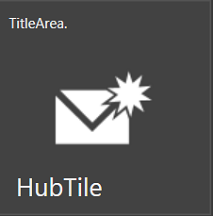
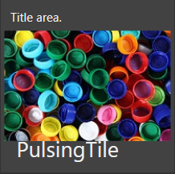

# Themes in HubTile and PulsingTile

Hub Tile and Pulsing Tile supports various themes which can be applied using [SfSkinManager](https://help.syncfusion.com/wpf/themes/getting-started) and also provides support to create custom theme using [theme studio](https://help.syncfusion.com/wpf/themes/theme-studio). 

## Themes using SkinManager

The appearance of Hub Tile and Pulsing Tile control can be customized by using [VisualStyle](https://help.syncfusion.com/cr/cref_files/wpf/Syncfusion.SfSkinManager.WPF~Syncfusion.SfSkinManager.VisualStyles.html) attached property of the [SfSkinManager](https://help.syncfusion.com/cr/cref_files/wpf/Syncfusion.SfSkinManager.WPF~Syncfusion.SfSkinManager.SfSkinManager.html). You can find the list of available  themes and the assemblies needs to be referred in the below documentation [link](https://help.syncfusion.com/wpf/themes/getting-started).

Below example explains how to apply blend theme for HubTile and PulsingTile using `SfSkinManager` in an existing application.

 * Add reference to **Syncfusion.SfSkinManager.Wpf.dll** and **Syncfusion.Themes.Blend.Wpf.dll** assembly.

 * Import SfSkinManager namespace and set SfSkinManager.VisualStyle attached property to window or HubTile. Setting VisualStyle property to window will apply blend theme for all controls in Windows.




<Window x:Class="VisualStylesDemo.MainWindow"
      xmlns="http://schemas.microsoft.com/winfx/2006/xaml/presentation"
	  xmlns:x="http://schemas.microsoft.com/winfx/2006/xaml"   xmlns:syncfusion="http://schemas.syncfusion.com/wpf"
      xmlns:local="clr-namespace:VisualStylesDemo"
      xmlns:skinManager="clr-namespace:Syncfusion.SfSkinManager;assembly=Syncfusion.SfSkinManager.WPF"
      Title="Visual Styles Demo"  Icon="App.ico"
      Width="1200" Height="720"
     WindowStartupLocation="CenterScreen">
<Grid>
    <!--SfHubTile-->						 
    <syncfusion:SfHubTile x:Name="hubtile"Header="HubTile" skinManager:SfSkinManager.VisualStyle="Blend" Title="TitleArea."/>
 <!--SfPulsingTile-->						
  <syncfusion:SfPulsingTile x:Name="pulsingtile" Header="PulsingTile" skinManager:SfSkinManager.VisualStyle="Blend" Title="Title area.">
			<Image Source="Assests/PulsingTile.jpg"/>	
</syncfusion:SfPulsingTile>	
</Grid>
</Window>		 
										


using Syncfusion.SfSkinManager;

SfSkinManager.SetVisualStyle(this, VisualStyles.Blend); 




* Now run the application, you can see the blend theme applied for SfHubTile and SfPulsingTile.

N> Refer below theme studio documentation to know more about `SfSkinManger` and its various features such as theming MS controls, changing themes at runtime and applying theme globally in the application.

## Customize Themes using ThemeStudio

Hub Tile and Pulsing Tile themes can be customized using theme studio. Refer the documentation [link](https://help.syncfusion.com/wpf/themes/theme-studio) for more information.