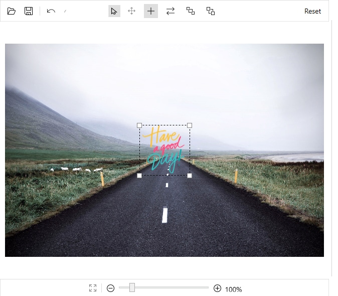

# CustomView in SfImageEditor

This feature allows you to add a custom view in the Image Editor and provide the different customization options. 

## Add a custom view on image editor

You can add any custom shapes or views to an image using the `AddCustomView` method in the Image Editor control. To add a custom view, specify the view and its desired `CustomViewSettings` as shown in the following code snippet.

 



        <Grid>
            <Grid.RowDefinitions>
                <RowDefinition Height="100"/>
                <RowDefinition Height="*"/>
            </Grid.RowDefinitions>
           <Button x:Name="but" Click="Button_Click" Content="CustomView" />
            <editor:SfImageEditor Grid.Row="1" x:Name="editor" ImageSource="Assets\RoadView.jpeg" >
            </editor:SfImageEditor>
        </Grid>





        private void Button_Click(object sender, RoutedEventArgs e)
        {
          BitmapImage bitmapImage = new BitmapImage();
          bitmapImage.BeginInit();
          bitmapImage.UriSource = new Uri(@"Assets/adventure.jpg", UriKind.Relative);
          bitmapImage.EndInit();
          Image image = new Image() { Height = 100, Width = 100 , Source=bitmapImage} ;
          editor.AddCustomView(image, new CustomViewSettings());
	    }
  


 

## Customize the custom view

The CustomViewSettings is defined to set the values for `CanMaintainAspectRatio` , `Bounds`, and `Angle` .

* `CanMaintainAspectRatio` property is used to decide, whether the aspect ratio value needs to be maintained when resizing the custom view.

* `Bounds` property is used to set the bounds of the custom view. Using this property, you can position the custom view wherever you want on the image. In percentage, the value should fall between 0 and 100.

* `Angle` property is used to set the angle of the custom view. Using this property, you can rotate the custom view at desired angle.

* `IsResizable` property is indicating, whether to resize the custom view or not. Default value of IsResizable is true.

* `IsRotatable` property is indicating, whether to rotate the custom view or not. Default value of IsResizable is false.



            CustomViewSettings customViewSettings = new CustomViewSettings()
            {
                CanMaintainAspectRatio = false,
                Bounds = new Rect(0, 0, 100, 100),
                IsResizable = false,
                IsRotatable=true,
                Angle = 45
            };



