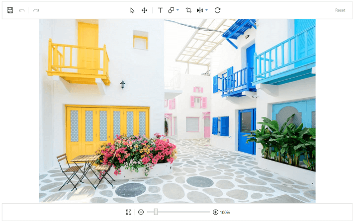
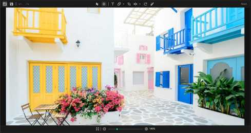

# Getting Started with SfImageEditor

This section explains the steps required to load an image to the image editor control. It has a built-in toolbar that helps in performing various editing operations such as flip, crop, rotate, save, annotating with shapes, text, path (i.e. free hand drawing), zoom, and pan.

## Adding ImageEditor reference

Refer to this [document](https://help.syncfusion.com/wpf/add-syncfusion-controls) to learn how to add Syncfusion controls in Visual Studio projects through various ways. Refer to this [document](https://help.syncfusion.com/wpf/control-dependencies) to learn about the assemblies required for adding ImageEditor to your project.

## Initialize ImageEditor

Import the Image editor namespace as demonstrated in the following code snippet.

 

 

xmlns:editor="clr-namespace:Syncfusion.UI.Xaml.ImageEditor;assembly=Syncfusion.SfImageEditor.WPF"



 

using Syncfusion.UI.Xaml.ImageEditor;



 

You can either use the below schemas or the above mentioned namespace to refer the ImageEditor control in xaml.

 

 

xmlns:editor="http://schemas.syncfusion.com/wpf"



 

Then, initialize the image editor as demonstrated in the following code snippet.

 

 

 <editor:SfImageEditor>
 </editor:SfImageEditor>



 

 SfImageEditor editor = new SfImageEditor();



 

## Loading image in ImageEditor

Image can be loaded in the following two ways:

* Using image source
* Using stream

You can load the [`ImageSource`](https://help.syncfusion.com/cr/wpf/Syncfusion.UI.Xaml.ImageEditor.SfImageEditor.html#Syncfusion_UI_Xaml_ImageEditor_SfImageEditor_ImageSource) as demonstrated in the following code snippet.

 

 

<editor:SfImageEditor x:Name="editor" ImageSource="Assets/Buldingimage.jpeg">
</editor:SfImageEditor>



 

   BitmapImage image = new BitmapImage();
   image.BeginInit();
   image.UriSource = new Uri(@"Assets/Buldingimage.jpeg", UriKind.Relative);
   image.EndInit();
   editor.ImageSource = image;



 

You can load the image as stream using the [`Image`](https://help.syncfusion.com/cr/wpf/Syncfusion.UI.Xaml.ImageEditor.SfImageEditor.html#Syncfusion_UI_Xaml_ImageEditor_SfImageEditor_Image) property as in the following code snippet.

 

  OpenFileDialog openFileDialog = new OpenFileDialog();
            openFileDialog.Filter = "Image Files(*.BMP;*.JPG;*.GIF)|*.BMP;*.JPG;*.GIF|All files (*.*)|*.* ";

            if (openFileDialog.ShowDialog() == true)
            {
                var stream = openFileDialog.OpenFile();
                editor.Image = stream;
            }



   

## Theme

 Image editor control supports various built-in themes. Refer to the below links to apply themes for the  Image editor control,

  * [Apply theme using SfSkinManager](https://help.syncfusion.com/wpf/themes/skin-manager)
	
  * [Create a custom theme using ThemeStudio](https://help.syncfusion.com/wpf/themes/theme-studio#creating-custom-theme)

     

## See also

[How to retrieve a edited image as a stream in an image editor](https://www.syncfusion.com/kb/11214/how-to-retrieve-a-edited-image-as-a-stream-in-an-image-editor)
