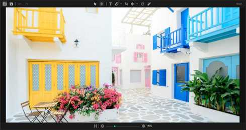

# Getting Started with SfImageEditor

This section explains the steps required to load an image into the SfImageEditor control. It includes a built-in toolbar that helps perform various editing operations such as flip, crop, rotate, save, annotate with shapes, add text, draw free-hand paths, zoom, and pan.

## Adding ImageEditor reference

Refer to the following documents to learn how to add Syncfusion controls in Visual Studio projects and the assemblies required for adding the ImageEditor to your project:

* [Add Syncfusion controls](https://help.syncfusion.com/wpf/add-syncfusion-controls) to Visual Studio projects through various ways.
* [Control dependencies](https://help.syncfusion.com/wpf/control-dependencies) describes the assemblies required for adding the ImageEditor to your project.

## Initialize ImageEditor

Import the Image editor namespace as demonstrated in the following code snippet.





<Window xmlns="http://schemas.microsoft.com/winfx/2006/xaml/presentation"
        xmlns:x="http://schemas.microsoft.com/winfx/2006/xaml"
        xmlns:editor="clr-namespace:Syncfusion.UI.Xaml.ImageEditor;assembly=Syncfusion.SfImageEditor.WPF">
    <Grid>
        <editor:SfImageEditor x:Name="editor" />
    </Grid>
</Window>





using Syncfusion.UI.Xaml.ImageEditor;





You can also use the following schema instead of the namespace shown above to refer to the ImageEditor control in XAML.





xmlns:editor="http://schemas.syncfusion.com/wpf"





Then, initialize the image editor as demonstrated in the following code snippet.





<editor:SfImageEditor>
</editor:SfImageEditor>





using Syncfusion.UI.Xaml.ImageEditor;

SfImageEditor editor = new SfImageEditor();





## Loading image in ImageEditor

An image can be loaded into the ImageEditor in the following ways:

* Using an image source
* Using a stream

You can load the [`ImageSource`](https://help.syncfusion.com/cr/wpf/Syncfusion.UI.Xaml.ImageEditor.SfImageEditor.html#Syncfusion_UI_Xaml_ImageEditor_SfImageEditor_ImageSource) as demonstrated in the following code snippet.





<editor:SfImageEditor x:Name="editor" ImageSource="Assets/Buldingimage.jpeg">
</editor:SfImageEditor>





using System;
using System.Windows.Media.Imaging;
using Syncfusion.UI.Xaml.ImageEditor;

BitmapImage image = new BitmapImage();
image.BeginInit();
image.UriSource = new Uri(@"Assets/Buldingimage.jpeg", UriKind.Relative);
image.EndInit();
editor.ImageSource = image;





You can load the image as a stream using the [`Image`](https://help.syncfusion.com/cr/wpf/Syncfusion.UI.Xaml.ImageEditor.SfImageEditor.html#Syncfusion_UI_Xaml_ImageEditor_SfImageEditor_Image) property, as shown in the following code snippet.





using System.Windows;
using Microsoft.Win32;
using Syncfusion.UI.Xaml.ImageEditor;

OpenFileDialog openFileDialog = new OpenFileDialog();
openFileDialog.Filter = "Image Files(*.BMP;*.JPG;*.GIF)|*.BMP;*.JPG;*.GIF|All files (*.*)|*.*";

if (openFileDialog.ShowDialog() == true)
{
    var stream = openFileDialog.OpenFile();
    editor.Image = stream;
}





## Theme

The ImageEditor control supports various built-in themes. Refer to the following links to apply themes to the ImageEditor control:

* [Apply theme using SfSkinManager](https://help.syncfusion.com/wpf/themes/skin-manager)
* [Create a custom theme using ThemeStudio](https://help.syncfusion.com/wpf/themes/theme-studio#creating-custom-theme)

## See also

[How to retrieve an edited image as a stream in the WPF ImageEditor](https://support.syncfusion.com/kb/article/9828/how-to-retrieve-a-edited-image-as-a-stream-in-wpf-image-editor)
