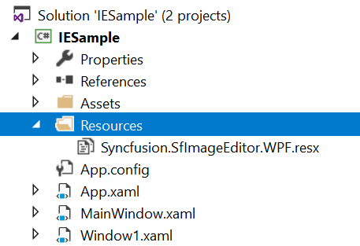
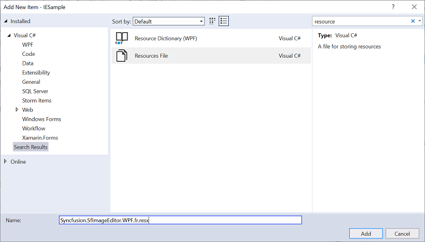
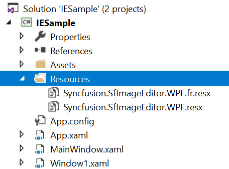
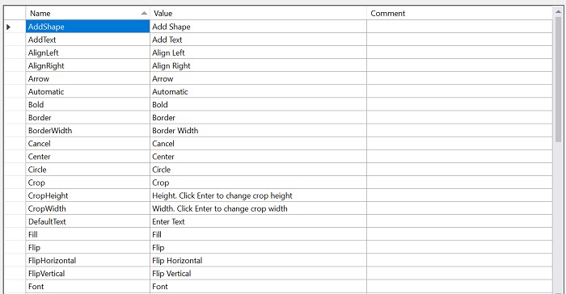
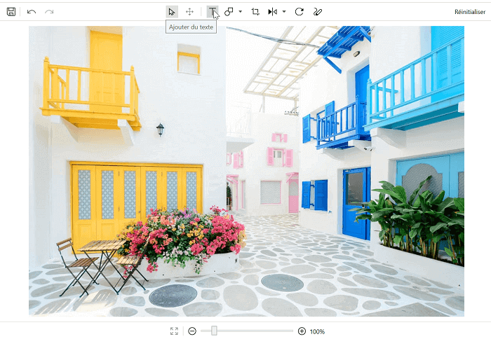

# Localization in WPF ImageEditor (SfImageEditor)

Localization is the process of translating the application resources into different language for the specific cultures. You can localize the SfImageEditor by adding resource file. Application culture can be changed by setting `CurrentUICulture` before `InitializeComponent()` method.

Use the below code to change the application culture to French.

 

 

        public MainWindow()
        {
            Thread.CurrentThread.CurrentUICulture = new System.Globalization.CultureInfo("fr-FR");
            InitializeComponent();           
        }  



 

To localize SfImageEditor based on `CurrentUICulture` using resource files, follow the below steps.

1.Create new folder and name it as **Resources** in your application.
2.Add the default resource file of SfImageEditor into **Resources** folder. You can download the Syncfusion.SfImageEditor.WPF.resx [`here`](https://www.syncfusion.com/downloads/support/directtrac/general/ze/Syncfusion.SfImageEditor.WPF-240771729).

 

3.Right-click on the Resources folder, select Add and then NewItem.

4.In Add New Item wizard, select the Resource File option and name it as Syncfusion.SfImageEditor.WPF.<culture name>.resx. For example, you have to give name as Syncfusion.SfImageEditor.WPF.fr.resx for French culture.

 

5.Now, select Add option to add the resource file in the Resources folder.

 

6.Add the Name/Value pair in Resource Designer of Syncfusion.SfImageEditor.WPF.fr.resx file and change its corresponding value to the corresponding culture.

 

Below image depicts the application translated into French culture.

   
