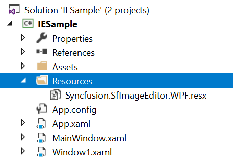
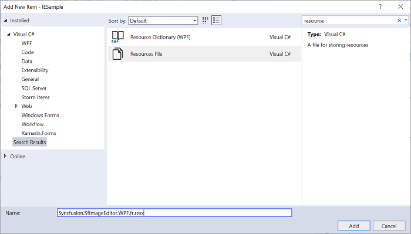
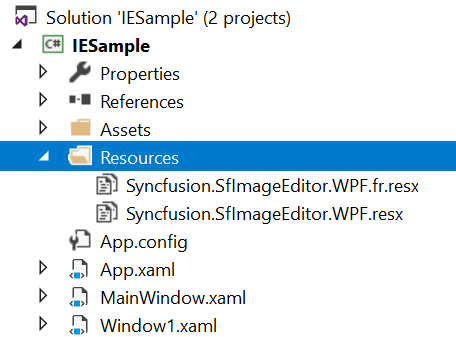
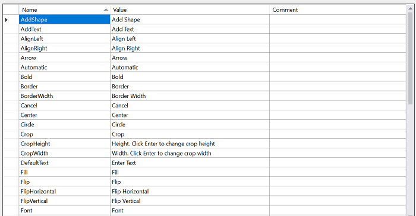
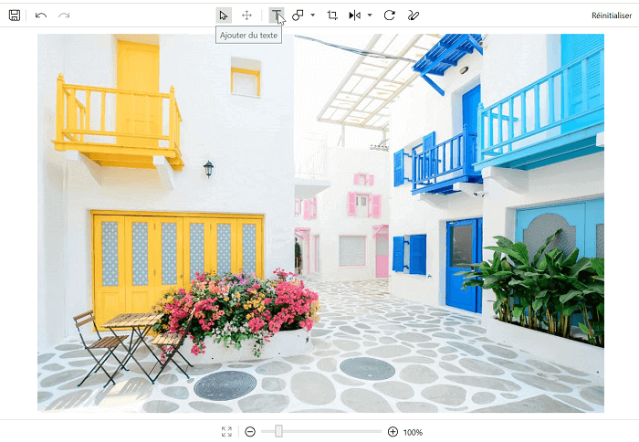

# Localization in WPF ImageEditor (SfImageEditor)

Localization is the process of translating the application resources into different languages for specific cultures. You can localize the SfImageEditor by adding a resource file. The application culture can be changed by setting `CurrentUICulture` before the `InitializeComponent()` method.

Use the following code to change the application culture to French.





using System.Globalization;
using System.Threading;

public MainWindow()
{
    Thread.CurrentThread.CurrentUICulture = new CultureInfo("fr-FR");
    InitializeComponent();
}





To localize SfImageEditor based on `CurrentUICulture` using resource files, follow these steps.

1. Create a new folder and name it **Resources** in your application.
2. Add the default resource file of SfImageEditor into the **Resources** folder. You can download the `Syncfusion.SfImageEditor.WPF.resx` file [`here`](https://www.syncfusion.com/downloads/support/directtrac/general/ze/Syncfusion.SfImageEditor.WPF-240771729).

   

3. Right-click the **Resources** folder, select **Add**, and then choose **New Item**.

4. In the **Add New Item** wizard, select the **Resource File** option and name the file `Syncfusion.SfImageEditor.WPF.<culture name>.resx`. For example, name the file `Syncfusion.SfImageEditor.WPF.fr.resx` for the French culture.

   

5. Select **Add** to add the resource file to the **Resources** folder.

   

6. Add the Name/Value pairs in the Resource Designer of the `Syncfusion.SfImageEditor.WPF.fr.resx` file and change the corresponding values to the localized culture.

   

The following image depicts the application translated into the French culture.

   
