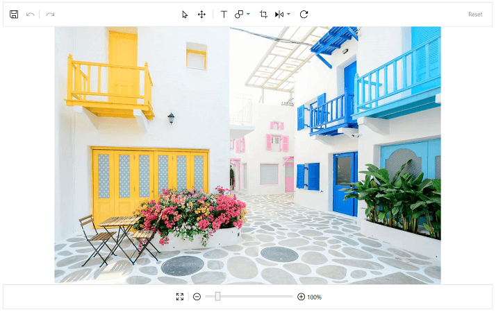

# About Syncfusion® WPF ImageEditor Control
---

## SfImageEditor

The image editor control is a very handy tool that is used to edit an image by annotating with text, pen and built-in shapes. It allows you to crop, rotate, and flip an image. The image editor control has a built-in toolbar, which helps in performing editing operations.

   

## Key features

* Built-in toolbar
* Flip
* Crop
* Rotate
* Adding shapes such as rectangle, circle, and arrow
* Annotating with text, pen (i.e. free hand drawing)
* Saving the edited image
* Zooming and panning
* Undo and redo
* Reset
