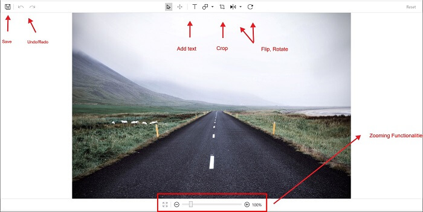
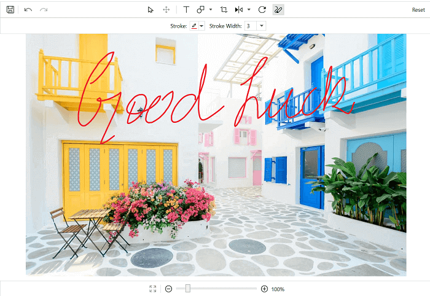

# Shapes in WPF Image Editor (SfImageEditor)

You can annotate an image by adding regular shapes such as circle, rectangle, and arrow. Also image editor provides support to draw path (i.e. free hand sketching). Shapes can be added in the following two ways:

* Using Toolbar
* Programmatically

## Adding shapes using toolbar

To add a shape, click the AddShape icon in the toolbar. This will list out the default shapes, and you can select the desired shape from it. By default, selected shape will be added at the center. You can select and drag the shape to position at the desired location. Upon selecting the shape, handles will be enabled. Handles help in resizing the shapes. Click outside to disable the selection.

## Free hand sketch (Path)

For free hand sketching on the image, select the pen tool in the toolbar, if needed also select the required Stroke and StrokeWidth of the pen from the secondary toolbar. This will let you to draw on the image and you can annotate it by your own shapes, signature or any form of irregular shapes.

N> After selecting the pen tool click and drag on the image to draw.

## Customization

The following properties of the added shape can be customized:

* [`Fill`](https://help.syncfusion.com/cr/wpf/Syncfusion.UI.Xaml.ImageEditor.PenSettings.html#Syncfusion_UI_Xaml_ImageEditor_PenSettings_Fill)
* [`Stroke`](https://help.syncfusion.com/cr/wpf/Syncfusion.UI.Xaml.ImageEditor.PenSettings.html#Syncfusion_UI_Xaml_ImageEditor_PenSettings_Stroke)
* [`StrokeWidth`](https://help.syncfusion.com/cr/wpf/Syncfusion.UI.Xaml.ImageEditor.PenSettings.html#Syncfusion_UI_Xaml_ImageEditor_PenSettings_StrokeWidth)

By selecting the shape icon in the toolbar, a sub toolbar will be generated below the main toolbar to provide the customizing options for the shapes.

N> Shapes need to be selected to apply customization from the sub toolbar.

In case of free hand sketching, to apply customization you must select it from the sub toolbar before drawing on the image. You cannot change the customization of the drawn path.

### Fill

Color picker will be opened on selecting Fill icon in the secondary toolbar. You can select the desired color from color picker to fill the selected shape. By default, fill is in transparent. This is property is not applicable for free hand sketching.

### Stroke

On selecting the required color from this color picker in the secondary toolbar, you can either update the stroke of the selected shape or can draw a new path with that. By default, stroke will be in Red.

### Stroke width

You can select the desired stroke width from the listed-out sizes either to update the stroke width of the selected shape or to draw a new path.

 

### Delete

To delete the added shape, select the shape, and then use delete key from the keyboard.

## Adding shapes programmatically

Shapes can be added into an image using the AddShape method. This method takes the following two parameters:

* [`ShapeType`](https://help.syncfusion.com/cr/wpf/Syncfusion.UI.Xaml.ImageEditor.Enums.ShapeType.html) - You can choose the required shape type. The available shape types are rectangle, circle, and arrow.
* [`PenSettings`](https://help.syncfusion.com/cr/wpf/Syncfusion.UI.Xaml.ImageEditor.PenSettings.html) – Customizes the added shapes.

 

 

editor.AddShape(ShapeType.Rectangle, new PenSettings());



 

Use the below code to enable free hand sketching programmatically.

 

 

editor.AddShape(ShapeType.Path, new PenSettings());



 

### Delete

To delete the selected shape, use the Delete method as follows.

 

 

editor.Delete();



 

## Pen settings

The added shapes can be customized using the following properties in pen settings:

* [`Fill`](https://help.syncfusion.com/cr/wpf/Syncfusion.UI.Xaml.ImageEditor.PenSettings.html#Syncfusion_UI_Xaml_ImageEditor_PenSettings_Fill) - Fills the selected shape with this color.
* [`Stroke`](https://help.syncfusion.com/cr/wpf/Syncfusion.UI.Xaml.ImageEditor.PenSettings.html#Syncfusion_UI_Xaml_ImageEditor_PenSettings_Stroke) – Applies this stroke to the selected shape.
* [`Opacity`](https://help.syncfusion.com/cr/wpf/Syncfusion.UI.Xaml.ImageEditor.PenSettings.html#Syncfusion_UI_Xaml_ImageEditor_PenSettings_Opacity) – Applies opacity to both stroke and fill of the shape.
* [`StrokeWidth`](https://help.syncfusion.com/cr/wpf/Syncfusion.UI.Xaml.ImageEditor.PenSettings.html#Syncfusion_UI_Xaml_ImageEditor_PenSettings_StrokeWidth) – Applies the specified width to the stroke of a shape.
* [`Bounds`](https://help.syncfusion.com/cr/wpf/Syncfusion.UI.Xaml.ImageEditor.PenSettings.html#Syncfusion_UI_Xaml_ImageEditor_PenSettings_Bounds) – Rect used to position the shape.
* [`IsResizable`](https://help.syncfusion.com/cr/wpf/Syncfusion.UI.Xaml.ImageEditor.PenSettings.html#Syncfusion_UI_Xaml_ImageEditor_PenSettings_IsResizable) - To control the resizing of the shape.

N> Values of the bounds rect will be in percentage. For example (25,25,25,25) will take the position of 25 percent from the left and top.

 

 

            PenSettings penSettings = new PenSettings();
            penSettings.Fill = new SolidColorBrush(Colors.AliceBlue);
            penSettings.Opacity = 0.5f;
            penSettings.Stroke = new SolidColorBrush(Colors.Red);
            penSettings.StrokeWidth = 3;
            penSettings.Bounds = new Rect(10, 30, 20, 20);
            editor.AddShape(ShapeType.Rectangle, penSettings);

            penSettings = new PenSettings();
            penSettings.Fill = new SolidColorBrush(Colors.AliceBlue);
            penSettings.Opacity = 0.5f;
            penSettings.Stroke = new SolidColorBrush(Colors.Red);
            penSettings.StrokeWidth = 3;            
            penSettings.Bounds = new Rect(40, 30, 20, 25);
            editor.AddShape(ShapeType.Circle, penSettings);



 

 

 

 

            PenSettings penSettings = new PenSettings();
            penSettings.Opacity = 0.7f;
            penSettings.Stroke = new SolidColorBrush(Colors.Red);
            penSettings.StrokeWidth = 3;
            editor.AddShape(Syncfusion.UI.Xaml.ImageEditor.Enums.ShapeType.Path, penSettings);



 

 

## Shape resizing

By default, both shapes and text are resizable. You can also control the resizable using the ResizableElements property in image editor. The following code enables the resizing functionality to both shapes and text.

 

 

 editor.ResizableElements = ImageEditorResizableElements.Shapes;



 

## Events

Shapes and Text supports the following two events:

* [`ItemSelected`](https://help.syncfusion.com/cr/wpf/Syncfusion.UI.Xaml.ImageEditor.SfImageEditor.html)
* [`ItemUnselected`](https://help.syncfusion.com/cr/wpf/Syncfusion.UI.Xaml.ImageEditor.SfImageEditor.html)

### ItemSelected

This event occurs when an item (shape/text) is selected. `ItemSelectedEventArgs` will be the parameter. In the `Settings` property, you can get either TextSettings or PenSettings based on the selected item.

You can make changes on the settings such as stroke etc.

 

 

 private void Editor_ItemSelected(object sender, ItemSelectedEventArgs args)
        {
            
        }



 

### ItemUnSelected

This event occurs when an item (shape/text) is unfocused. `ItemUnselectedEventArgs` will be the parameter. In the `Settings` property, you can get either TextSettings or PenSettings based on the selected item.

You can make changes on the settings such as stroke etc. This is applied after the item has been unselected.

 

 

  private void Editor_ItemUnselected(object sender, ItemUnselectedEventArgs args)
        {            
           
        }





## See also

[How to load the image annotated with shapes and text on the image editor](https://www.syncfusion.com/kb/11215/how-to-load-the-image-annotated-with-shapes-and-text-on-the-image-editor)
