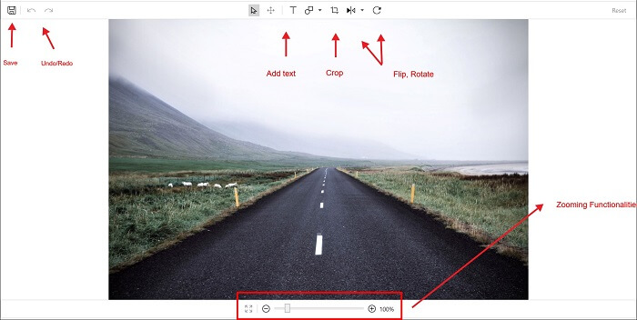
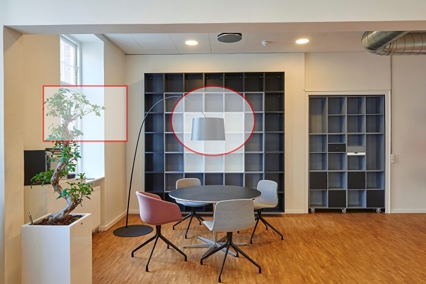
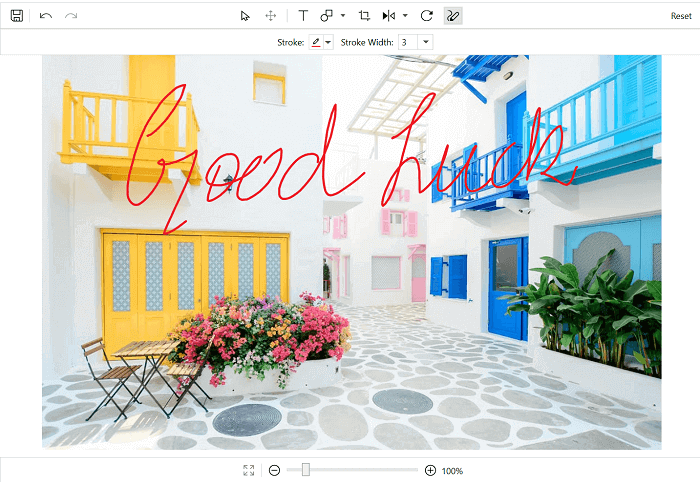

# Shapes in SfImageEditor

You can annotate an image by adding regular shapes such as circle, rectangle, and arrow. The Image Editor also supports drawing a path (i.e. free-hand sketching). Shapes can be added in the following two ways:

* Using the toolbar
* Programmatically

## Adding shapes using toolbar

To add a shape, click the **AddShape** icon in the toolbar. The available default shapes are listed and you can select the desired shape from them. By default, the selected shape is added at the center of the image. You can select and drag the shape to position it at the desired location. Upon selecting the shape, resize handles are enabled. The handles help in resizing the shape. Click outside the shape to disable the selection.

## Free-hand sketch (Path)

For free-hand sketching on the image, select the pen tool in the toolbar. If needed, also select the required `Stroke` and `StrokeWidth` of the pen from the secondary toolbar. This lets you draw on the image and annotate it with your own shapes, signature, or any form of irregular shapes.

N> After selecting the pen tool, click and drag on the image to draw.

## Customization

The following properties of an added shape can be customized:

* [`Fill`](https://help.syncfusion.com/cr/wpf/Syncfusion.UI.Xaml.ImageEditor.PenSettings.html#Syncfusion_UI_Xaml_ImageEditor_PenSettings_Fill)
* [`Stroke`](https://help.syncfusion.com/cr/wpf/Syncfusion.UI.Xaml.ImageEditor.PenSettings.html#Syncfusion_UI_Xaml_ImageEditor_PenSettings_Stroke)
* [`StrokeWidth`](https://help.syncfusion.com/cr/wpf/Syncfusion.UI.Xaml.ImageEditor.PenSettings.html#Syncfusion_UI_Xaml_ImageEditor_PenSettings_StrokeWidth)

Selecting the shape icon in the toolbar displays a sub toolbar below the main toolbar to provide the customization options for shapes.

N> Shapes need to be selected to apply customization from the sub toolbar.

In the case of free-hand sketching, you must select the customization from the sub toolbar before drawing on the image. You cannot change the customization of an already drawn path.

### Fill

The color picker is opened when you select the **Fill** icon in the secondary toolbar. You can select the desired color from the color picker to fill the selected shape. By default, fill is transparent. This property is not applicable for free hand sketching.

### Stroke

On selecting the required color from this color picker in the secondary toolbar, you can either update the stroke of the selected shape or draw a new path with that color. By default, stroke is red.

### Stroke width

You can select the desired stroke width from the listed sizes either to update the stroke width of the selected shape or to draw a new path.

### Delete

To delete an added shape, select the shape and then press the **Delete** key on the keyboard.

## Adding shapes programmatically

Shapes can be added to an image using the [`AddShape`](https://help.syncfusion.com/cr/wpf/Syncfusion.UI.Xaml.ImageEditor.SfImageEditor.html#Syncfusion_UI_Xaml_ImageEditor_SfImageEditor_AddShape_Syncfusion_UI_Xaml_ImageEditor_Enums_ShapeType_Syncfusion_UI_Xaml_ImageEditor_PenSettings_) method. This method takes the following two parameters:

* [`ShapeType`](https://help.syncfusion.com/cr/wpf/Syncfusion.UI.Xaml.ImageEditor.Enums.ShapeType.html) - The required shape type. The available shape types are `Rectangle`, `Circle`, and `Arrow`.
* [`PenSettings`](https://help.syncfusion.com/cr/wpf/Syncfusion.UI.Xaml.ImageEditor.PenSettings.html) - Customizes the added shapes.





using Syncfusion.UI.Xaml.ImageEditor;
using Syncfusion.UI.Xaml.ImageEditor.Enums;

editor.AddShape(ShapeType.Rectangle, new PenSettings());





Use the following code to enable free-hand sketching programmatically.





using Syncfusion.UI.Xaml.ImageEditor;
using Syncfusion.UI.Xaml.ImageEditor.Enums;

editor.AddShape(ShapeType.Path, new PenSettings());





### Delete

To delete the selected shape, use the [`Delete`](https://help.syncfusion.com/cr/wpf/Syncfusion.UI.Xaml.ImageEditor.SfImageEditor.html#Syncfusion_UI_Xaml_ImageEditor_SfImageEditor_Delete) method as follows.





using Syncfusion.UI.Xaml.ImageEditor;

editor.Delete();





## Pen settings

The added shapes can be customized using the following properties in `PenSettings`:

* [`Fill`](https://help.syncfusion.com/cr/wpf/Syncfusion.UI.Xaml.ImageEditor.PenSettings.html#Syncfusion_UI_Xaml_ImageEditor_PenSettings_Fill) - Fills the selected shape with this color.
* [`Stroke`](https://help.syncfusion.com/cr/wpf/Syncfusion.UI.Xaml.ImageEditor.PenSettings.html#Syncfusion_UI_Xaml_ImageEditor_PenSettings_Stroke) - Applies this stroke to the selected shape.
* [`Opacity`](https://help.syncfusion.com/cr/wpf/Syncfusion.UI.Xaml.ImageEditor.PenSettings.html#Syncfusion_UI_Xaml_ImageEditor_PenSettings_Opacity) - Applies opacity to both stroke and fill of the shape.
* [`StrokeWidth`](https://help.syncfusion.com/cr/wpf/Syncfusion.UI.Xaml.ImageEditor.PenSettings.html#Syncfusion_UI_Xaml_ImageEditor_PenSettings_StrokeWidth) - Applies the specified width to the stroke of a shape.
* [`Bounds`](https://help.syncfusion.com/cr/wpf/Syncfusion.UI.Xaml.ImageEditor.PenSettings.html#Syncfusion_UI_Xaml_ImageEditor_PenSettings_Bounds) - `Rect` used to position the shape.
* [`IsResizable`](https://help.syncfusion.com/cr/wpf/Syncfusion.UI.Xaml.ImageEditor.PenSettings.html#Syncfusion_UI_Xaml_ImageEditor_PenSettings_IsResizable) - Controls the resizing of the shape.

N> Values of the bounds rect are in percentage. For example, (25, 25, 25, 25) places the shape at 25 percent from the left and top.





using System.Windows;
using System.Windows.Media;
using Syncfusion.UI.Xaml.ImageEditor;
using Syncfusion.UI.Xaml.ImageEditor.Enums;

PenSettings penSettings = new PenSettings();
penSettings.Fill = new SolidColorBrush(Colors.AliceBlue);
penSettings.Opacity = 0.5f;
penSettings.Stroke = new SolidColorBrush(Colors.Red);
penSettings.StrokeWidth = 3;
penSettings.Bounds = new Rect(10, 30, 20, 20);
editor.AddShape(ShapeType.Rectangle, penSettings);

penSettings = new PenSettings();
penSettings.Fill = new SolidColorBrush(Colors.AliceBlue);
penSettings.Opacity = 0.5f;
penSettings.Stroke = new SolidColorBrush(Colors.Red);
penSettings.StrokeWidth = 3;
penSettings.Bounds = new Rect(40, 30, 20, 25);
editor.AddShape(ShapeType.Circle, penSettings);









using System.Windows.Media;
using Syncfusion.UI.Xaml.ImageEditor;
using Syncfusion.UI.Xaml.ImageEditor.Enums;

PenSettings penSettings = new PenSettings();
penSettings.Opacity = 0.7f;
penSettings.Stroke = new SolidColorBrush(Colors.Red);
penSettings.StrokeWidth = 3;
editor.AddShape(ShapeType.Path, penSettings);





## Shape resizing

By default, both shapes and text are resizable. You can also control this behavior using the [`ResizableElements`](https://help.syncfusion.com/cr/wpf/Syncfusion.UI.Xaml.ImageEditor.SfImageEditor.html#Syncfusion_UI_Xaml_ImageEditor_SfImageEditor_ResizableElements) property in the image editor. The following code enables the resizing functionality for both shapes and text.





using Syncfusion.UI.Xaml.ImageEditor;

editor.ResizableElements = ImageEditorResizableElements.Shapes;





## Events

Shapes and text support the following two events:

* [`ItemSelected`](https://help.syncfusion.com/cr/wpf/Syncfusion.UI.Xaml.ImageEditor.SfImageEditor.html#Syncfusion_UI_Xaml_ImageEditor_SfImageEditor_ItemSelected)
* [`ItemUnselected`](https://help.syncfusion.com/cr/wpf/Syncfusion.UI.Xaml.ImageEditor.SfImageEditor.html#Syncfusion_UI_Xaml_ImageEditor_SfImageEditor_ItemUnselected)

### ItemSelected

This event occurs when an item (shape or text) is selected. `ItemSelectedEventArgs` is the parameter. In the `Settings` property, you can get either `TextSettings` or `PenSettings` based on the selected item. You can modify the settings, such as `Stroke`, from the event handler.





using Syncfusion.UI.Xaml.ImageEditor;

private void Editor_ItemSelected(object sender, ItemSelectedEventArgs args)
{
}





### ItemUnselected

This event occurs when an item (shape or text) is unselected. `ItemUnselectedEventArgs` is the parameter. In the `Settings` property, you can get either `TextSettings` or `PenSettings` based on the unselected item. The settings you modify in this event are applied after the item has been unselected.





using Syncfusion.UI.Xaml.ImageEditor;

private void Editor_ItemUnselected(object sender, ItemUnselectedEventArgs args)
{
}





## See also

[How to load an image annotated with shapes and text in the image editor](https://www.syncfusion.com/kb/11215/how-to-load-the-image-annotated-with-shapes-and-text-on-the-image-editor)
