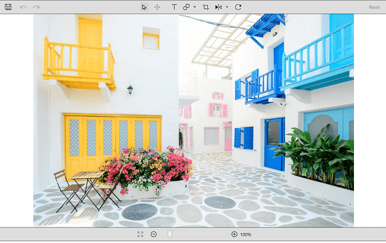
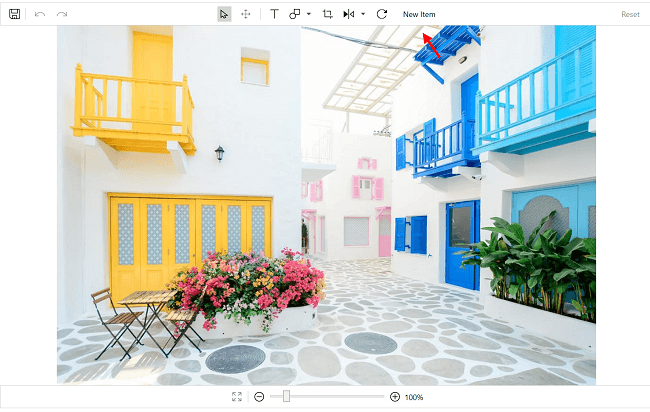
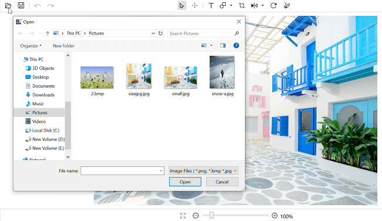

# Toolbar Customization

## Customization

### Visibility

Toolbar can be made visible or hidden using the `IsToolbarVisiblity` property in the [`ToolbarSettings`](https://help.syncfusion.com/cr/wpf/Syncfusion.UI.Xaml.ImageEditor.SfImageEditor.html#Syncfusion_UI_Xaml_ImageEditor_SfImageEditor_ToolbarSettings).

 



<Window x:Class="SfImageEditorSample.MainWindow"
        xmlns="http://schemas.microsoft.com/winfx/2006/xaml/presentation"
        xmlns:x="http://schemas.microsoft.com/winfx/2006/xaml"
        xmlns:editor="clr-namespace:Syncfusion.UI.Xaml.ImageEditor;assembly=Syncfusion.SfImageEditor.WPF"
        Title="SfImageEditor Sample" Height="600" Width="800">
    <Grid>
        <editor:SfImageEditor x:Name="editor">
            <editor:SfImageEditor.ToolbarSettings>
                <editor:ToolbarSettings IsToolbarVisiblity="True" />
            </editor:SfImageEditor.ToolbarSettings>
        </editor:SfImageEditor>
    </Grid>
</Window>





using Syncfusion.UI.Xaml.ImageEditor;

editor.ToolbarSettings.IsToolbarVisiblity = true;





### Add an item

You can add additional items to the toolbar and perform your own operation. To add an additional item, specify the toolbar item, and add it to the `ToolbarItems` collection as demonstrated in the following code snippet. You can specify your own template using the `IconTemplate` property in `ToolbarItem`.

 



<Window x:Class="SfImageEditorSample.MainWindow"
        xmlns="http://schemas.microsoft.com/winfx/2006/xaml/presentation"
        xmlns:x="http://schemas.microsoft.com/winfx/2006/xaml"
        xmlns:editor="clr-namespace:Syncfusion.UI.Xaml.ImageEditor;assembly=Syncfusion.SfImageEditor.WPF"
        Title="SfImageEditor Sample" Height="600" Width="800">
    <Window.Resources>
        <DataTemplate x:Key="template">
            <TextBlock Text="New Item" />
        </DataTemplate>
    </Window.Resources>
    <Grid x:Name="grid">
        <editor:SfImageEditor x:Name="editor">
            <editor:SfImageEditor.ToolbarSettings>
                <editor:ToolbarSettings x:Name="toolbarSettings" />
            </editor:SfImageEditor.ToolbarSettings>
        </editor:SfImageEditor>
    </Grid>
</Window>





using Syncfusion.UI.Xaml.ImageEditor;
using System.Windows;

editor.ToolbarSettings.ToolbarItems.Add(new ToolbarItem() { IconTemplate = grid.Resources["template"] as DataTemplate });





### Customization

You can change the [`Background`](https://help.syncfusion.com/cr/wpf/Syncfusion.UI.Xaml.ImageEditor.ToolbarSettings.html#Syncfusion_UI_Xaml_ImageEditor_ToolbarSettings_Background) and [`BorderColor`](https://help.syncfusion.com/cr/wpf/Syncfusion.UI.Xaml.ImageEditor.ToolbarSettings.html#Syncfusion_UI_Xaml_ImageEditor_ToolbarSettings_BorderColor) of the toolbar. Also, you can change the height of the main toolbar using the [`HeaderToolbarHeight`](https://help.syncfusion.com/cr/wpf/Syncfusion.UI.Xaml.ImageEditor.ToolbarSettings.html#Syncfusion_UI_Xaml_ImageEditor_ToolbarSettings_HeaderToolbarHeight) property, the height of the sub-toolbar can be changed using the [`SubItemToolbarHeight`](https://help.syncfusion.com/cr/wpf/Syncfusion.UI.Xaml.ImageEditor.ToolbarSettings.html#Syncfusion_UI_Xaml_ImageEditor_ToolbarSettings_SubItemToolbarHeight) property, and the footer toolbar height can be changed using the [`FooterToolbarHeight`](https://help.syncfusion.com/cr/wpf/Syncfusion.UI.Xaml.ImageEditor.ToolbarSettings.html#Syncfusion_UI_Xaml_ImageEditor_ToolbarSettings_FooterToolbarHeight) property.

This can be done as in the following code snippet.

 



<Window x:Class="SfImageEditorSample.MainWindow"
        xmlns="http://schemas.microsoft.com/winfx/2006/xaml/presentation"
        xmlns:x="http://schemas.microsoft.com/winfx/2006/xaml"
        xmlns:editor="clr-namespace:Syncfusion.UI.Xaml.ImageEditor;assembly=Syncfusion.SfImageEditor.WPF"
        Title="SfImageEditor Sample" Height="600" Width="800">
    <Grid>
        <editor:SfImageEditor x:Name="editor">
            <editor:SfImageEditor.ToolbarSettings>
                <editor:ToolbarSettings IsToolbarVisiblity="True" HeaderToolbarHeight="36"
                                        FooterToolbarHeight="36" Background="#DEDEDE" BorderColor="Black" />
            </editor:SfImageEditor.ToolbarSettings>
        </editor:SfImageEditor>
    </Grid>
</Window>





using Syncfusion.UI.Xaml.ImageEditor;
using System.Windows.Media;

editor.ToolbarSettings.Background = (SolidColorBrush)new BrushConverter().ConvertFromString("#DEDEDE");
editor.ToolbarSettings.BorderColor = new SolidColorBrush(Colors.Black);
editor.ToolbarSettings.HeaderToolbarHeight = 36;
editor.ToolbarSettings.FooterToolbarHeight = 36;
editor.ToolbarSettings.IsToolbarVisiblity = true;




 

## Events

### ToolbarItemSelected

This event occurs when an item in the toolbar is selected. `ToolbarItemSelectedEventArgs` is the parameter. You can control the selected item operation by setting the `Cancel` property to `true`. You can also get the information about the `ToolbarItem`.

 



using Syncfusion.UI.Xaml.ImageEditor;

private void ToolbarSettings_ToolbarItemSelected(object sender, ToolbarItemSelectedEventArgs e)
{
    e.Cancel = true;
}





 

## Image picker support

You can browse images in a local folder and load them in the Image Editor using the toolbar item browse icon. 

 

## Commands

Invoke commands from the custom toolbar to perform toolbar item operations of the image editor. The `CommandTarget` must be set when using the `Command`.

<table>
<tr>
<td>
Command  </td><td>
Description  </td></tr>
<tr>
<td>
BrowseImage  </td><td>
Browses the local folder to pick and load the image  to an image editor.  </td></tr>
<tr>
<td>
Save  </td><td>
Saves the edited image.  </td></tr>
<tr>
<td>
Undo  </td><td>
Reverses the last performed action.  </td></tr>
<tr>
<td>
Redo  </td><td>
Restores the actions carried out by Undo.  </td></tr>
<tr>
<td>
Reset  </td><td>
Clears all the editing done on the image and brings to an initial state.  </td></tr>
<tr>
<td>
ResetZoom  </td><td>
Resets the zooming applied to the image.  </td></tr>
<tr>
<td>
IncreaseZoom  </td><td>
Zoom In the image by increasing the zoom level from its current state.  </td></tr>
<tr>
<td>
DecreaseZoom  </td><td>
Zoom Out the image by decreasing the zoom level from its current state.  </td></tr>
<tr>
<td>
Select  </td><td>
Used to select the items such as Shapes, Text, Custom view added on the image.  </td></tr>
<tr>
<td>
Pan  </td><td>
Used to Pan the image when it is in zoomed state.  </td></tr>
</table>

This can be done as in the below code snippet.

 



<Window x:Class="SfImageEditorSample.MainWindow"
        xmlns="http://schemas.microsoft.com/winfx/2006/xaml/presentation"
        xmlns:x="http://schemas.microsoft.com/winfx/2006/xaml"
        xmlns:editor="clr-namespace:Syncfusion.UI.Xaml.ImageEditor;assembly=Syncfusion.SfImageEditor.WPF"
        Title="SfImageEditor Sample" Height="600" Width="800">
    <Grid>
        <Grid.ColumnDefinitions>
            <ColumnDefinition Width="*" />
            <ColumnDefinition Width="200" />
        </Grid.ColumnDefinitions>
        <editor:SfImageEditor Grid.Column="0" x:Name="imageEditor" ImageSource="Assets\RoadView.jpeg">
            <editor:SfImageEditor.ToolbarSettings>
                <editor:ToolbarSettings IsToolbarVisiblity="False" />
            </editor:SfImageEditor.ToolbarSettings>
        </editor:SfImageEditor>

        <Button Grid.Column="1" HorizontalAlignment="Center" VerticalAlignment="Center" Background="White"
                Width="Auto" CommandTarget="{Binding ElementName=imageEditor}"
                Content="Save" Command="{x:Static editor:ImageEditorCommands.Save}" />
    </Grid>
</Window>




 
