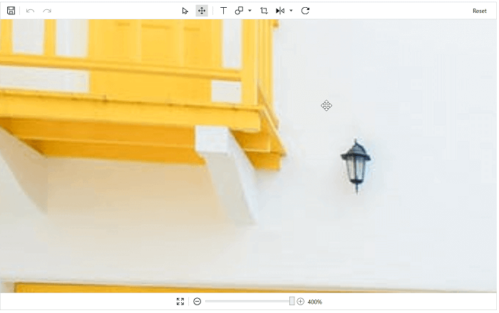

# Zooming and Panning in WPF ImageEditor (SfImageEditor) control

## Zooming

## Toolbar

Images can be zoomed in or zoomed out for better viewing and this can be enabled using the [`EnableZooming`](https://help.syncfusion.com/cr/wpf/Syncfusion.UI.Xaml.ImageEditor.SfImageEditor.html#Syncfusion_UI_Xaml_ImageEditor_SfImageEditor_EnableZooming). In the footer toolbar, you can find the slider, which helps in increasing the zoom level of an image.

Zoom level ranges from 50 to 400 percents. You can move the slider to increase the zoom level. Also, there will be Increase and Decrease icons on both sides of the slider. These icons help in increasing of the level gradually.

At a time, this Increase/Decrease icon can increase/decrease the level upto 10 percent. To reset the zoom level, click the ResetZoom icon, which is placed at the left of the DecreaseZoom icon.

## Mouse wheel

You can also zoom an image using mouse wheel. Based on the mouse wheel, delta images will be zoomed from the cursor position.

 

## Panning

## With toolbar
Zoomed image can be panned to view the hidden portion. To enable pan, click the pan icon in the top toolbar. This enables the panning operation on the image. When panning is enabled, shapes or text added in the image cannot be resized or repositioned. To resize the shape, enable the Select icon in the toolbar; it will disable the pan operation.

Select and Pan operations work like toggle functions.

## Without toolbar

You can also pan the zoomed image to view the hidden portion and this can be enabled using the property `EnablePanning`. When panning is enabled, shapes or text added in the image cannot be resized or repositioned. When `EnablePanning` is true, shapes or text added in the image cannot be resized or repositioned. By default, the property is set to false.

 
