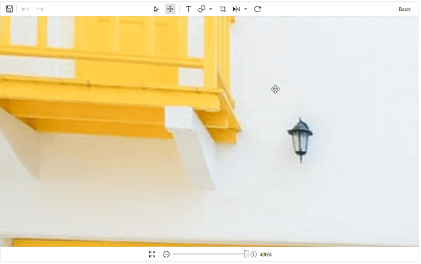

# Zooming and Panning in WPF ImageEditor (SfImageEditor) Control

## Zooming

Images can be zoomed in or zoomed out for better viewing. This can be enabled using the [`EnableZooming`](https://help.syncfusion.com/cr/wpf/Syncfusion.UI.Xaml.ImageEditor.SfImageEditor.html#Syncfusion_UI_Xaml_ImageEditor_SfImageEditor_EnableZooming) property.





<Window x:Class="SfImageEditorSample.MainWindow"
        xmlns="http://schemas.microsoft.com/winfx/2006/xaml/presentation"
        xmlns:x="http://schemas.microsoft.com/winfx/2006/xaml"
        xmlns:editor="clr-namespace:Syncfusion.UI.Xaml.ImageEditor;assembly=Syncfusion.SfImageEditor.WPF"
        Title="SfImageEditor Sample" Height="600" Width="800">
    <Grid>
        <editor:SfImageEditor x:Name="editor"
                              ImageSource="Assets\RoadView.jpeg"
                              EnableZooming="True" />
    </Grid>
</Window>





### Toolbar

In the footer toolbar, you can find the slider, which helps in increasing the zoom level of an image.

The zoom level ranges from 50 to 400 percent. You can move the slider to increase the zoom level. Also, there will be Increase and Decrease icons on both sides of the slider. These icons help in increasing the level gradually.

At a time, the Increase/Decrease icon can increase or decrease the level by up to 10 percent. To reset the zoom level, click the ResetZoom icon, which is placed to the left of the DecreaseZoom icon.

### Mouse wheel

You can also zoom an image using the mouse wheel. Based on the mouse wheel delta, the image will be zoomed from the cursor position.

## Panning

A zoomed image can be panned to view the hidden portion. By default, panning is disabled. This can be enabled using the [`EnablePanning`](https://help.syncfusion.com/cr/wpf/Syncfusion.UI.Xaml.ImageEditor.SfImageEditor.html#Syncfusion_UI_Xaml_ImageEditor_SfImageEditor_EnablePanning) property.





<Window x:Class="SfImageEditorSample.MainWindow"
        xmlns="http://schemas.microsoft.com/winfx/2006/xaml/presentation"
        xmlns:x="http://schemas.microsoft.com/winfx/2006/xaml"
        xmlns:editor="clr-namespace:Syncfusion.UI.Xaml.ImageEditor;assembly=Syncfusion.SfImageEditor.WPF"
        Title="SfImageEditor Sample" Height="600" Width="800">
    <Grid>
        <editor:SfImageEditor x:Name="editor"
                              ImageSource="Assets\RoadView.jpeg"
                              EnablePanning="True" />
    </Grid>
</Window>





### With toolbar

To enable pan, click the pan icon in the top toolbar. This enables the panning operation on the image. When panning is enabled, shapes or text added in the image cannot be resized or repositioned. To resize the shape, enable the Select icon in the toolbar; it will disable the pan operation.

Select and Pan operations work like toggle functions.

### Without toolbar (Programmatically)

When panning is enabled using the `EnablePanning` property, shapes and text cannot be selected. By default, the property is set to `false`.

 
