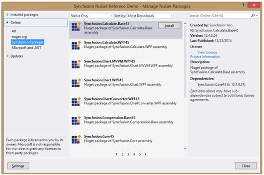
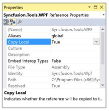
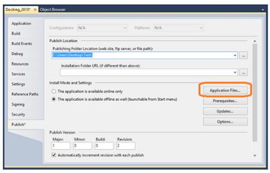
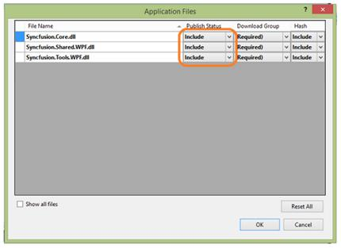
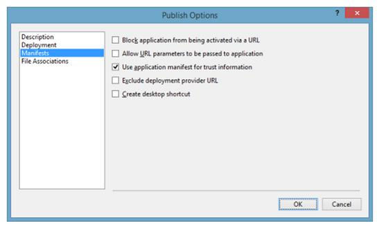

# Installation and Deployment

## Manual Installation

The following procedure illustrates how to install Essential Studio.

1. Double-click the Syncfusion Essential Studio WPF Setup file. The Self-Extractor Wizard opens and extracts the package automatically.
2. Enter User Name, Organization and Unlock Key in the corresponding text boxes provided.
3. Click Next
4. After reading the terms, click the “I accept the terms and conditions” check box.
5. Click Next. The Select the Installation and Samples Folder window opens.
6. To install it in the displayed default location, click Install.
7. Select the Run Dashboard check box to launch the Dashboard after installing.
8. Click Finish. Essential Studio is installed in your system and the Syncfusion Essential Studio [Dashboard](http://help.syncfusion.com/ug/common/documents/dashboard.htm# "") is launched automatically.

## Nuget Installation

Refer to the Syncfusion NuGet Packages from the Visual Studio applications. The following steps help you add the reference of the Syncfusion assemblies in the Project References.

1. Right-click on Project and choose the Manage NuGet Packages.
2. Select Online. Refer to the following screenshot for more information. 

3. Install the required corresponding framework control to use in Visual Studio projects. You can install the dependent assemblies when needed. Note: The framework number at the end of package name like, 35, 40, and 45, 451 is added.
4. Find the installed Syncfusion Packages in the Directory location, of the solution file, of the created project (Syncfusion Packages).
5. You can [configure ](http://help.syncfusion.com/ug/extension/index.html#!Documents/nugetinstallandconfiguration.htm "")Nuget for the required purpose.

## Commandline installation

You can follow the given steps to install through Command Line in Silent mode.

1. Double-click the Syncfusion Essential Studio Setup file. The Self-Extractor Wizard opens and extracts the package automatically.
2. The SyncfusionEssentialStudio_(version).exe file is extracted into the Temp folder.
3. Run %temp%. The Temp folder opens. The SyncfusionEssentialStudio_(version).exe file is available in one of the folders.
4. Copy the SyncfusionEssentialStudio_(version).exe file in local drive. Example: D:\temp
5. Cancel the wizard.
6. Open Command Prompt in administrator mode and pass the following arguments for corresponding version.

**Essential** **Studio** **version** **13**.**1** **and** **earlier**__:__

“Setup file path\SyncfusionEssentialStudio_(version).exe” Install /PIDKEY:“(product unlock key)” [/log “{Log file path}”] [/InstallPath:{Location to install}]

## Local Copy

Local copy is supported by the Syncfusion assembly reference in the Solution Explorer. It can be achieved by setting its Copy Local property of the reference to True, so that Syncfusion assemblies are copied to the Release/Bin, Debug/Bin folders. And this deployment consists of copying the exe, dlls, xmls files to the client machines that are similar to manual copy.

## GAC

Through Syncfusion installer, Syncfusion assemblies are installed in the GAC of the the developer machines. Also Syncfusion [Assembly Manager](C:\Users\Selvaganapathy\Desktop\assembly manager# "") helps you Add or Remove the Syncfusion assemblies to or from GAC.

## Clickonce Deployment

While processing [ClickOnce](https://msdn.microsoft.com/en-us/library/ms996413.aspx# "") the deployment for publishing an application with Syncfusion WPF component, change the Publish Status option of the Syncfusion Assemblies as “Include”.

__Selecting__ __Application__ __Files__ __for__ __changing__ __the__ __status__

__Publish__ __Status__ __option__ __changed__ __as__ __Include__

### ClickOnce signing process

Before publishing a ClickOnce application, ensure whether it is fully trusted, so that you can authenticate the information. The following steps are used for signing a ClickOnce application.

Signing ClickOnce involves two steps,

* Signing the application manifest
* Signing application executable
#### Signing the manifest

Navigate to project properties and select Signing tab. In the tab check “Sign the ClickOnce manifests” and select “Select From File” option and sign the application with the attached .pfx file.

#### ClickOnce signing

In the Publish tab, click “Options” and in the publish options dialog check “Use application manifest for trust information” under Manifest as in the following screenshot.

#### Publish options dialog box

Note: Before publishing, install the attached certificate in your machine and also follow step 2. Follow the following steps for installing certificate in your machine.

1. __Press__ __Windows__ __+__ __R__ __and__ __type__ __“____certmgr____.____msc____”__ __and__ __press__ __enter__ __that__ __opens__ __certificate__ __manager____.__
2. __Right__ __click__ __the__ __“____Trusted__ __Root__ __certification__ __Authorities____”__ __and__ __navigate__ __to__ __All__ __Tasks__ __->__ __Import____.__ __Now__ __import__ __the__ .pfx __to__ __“____Trusted__ __Root__ __certification__ __Authorities____”.__ __It__ __displays__ __a__ __warning__ __for__ __first__ __time____.__ __Press__ __Yes__ __to__ __continue__ __the__ __importing____.__

### Signing exe

The above process signs only deployment manifest. To sign the application executable, refer to the following steps.

You can sign the application executable by using the Post-build command and use the signtool.exe as in the following command.

"C:\Program Files (x86)\Microsoft SDKs\Windows\v7.1A\Bin\signtool.exe" sign /f "$(ProjectDir)syncfusion.pfx" /p Coolcomp299 /v "$(ProjectDir)obj\x86\$(ConfigurationName)\DataGridSampleBrowser.exe"

Note: Now, sign the exe inside obj folder and Syncfusion.pfx file placed inside Project directory.

## Installed Location

The following table represents Assemblies or Samples and the installed location.

<table>
<tr>
<td>
**Assemblies****/** **Samples******  </td><td>
installed location****  </td></tr>
<tr>
<td>
GAC  </td><td>
C:\Windows\Microsoft.NET\assembly\GAC_MSIL  </td></tr>
<tr>
<td>
Assemblies  </td><td>
C:\Program Files (x86)\Syncfusion\Essential Studio\13.2.0.29\Assemblies  </td></tr>
<tr>
<td>
Precompiled Assemblies  </td><td>
C:\Program Files (x86)\Syncfusion\Essential Studio\[Installed Version]\precompiledassemblies\[Installed Version]  </td></tr>
<tr>
<td>
Samples  </td><td>
{{'__[__'| markdownify }}Installed Drive]:\Users[user name]\AppData\Local\Syncfusion\EssentialStudio\[Installed Version]\WPF\samples  </td></tr>
</table>
