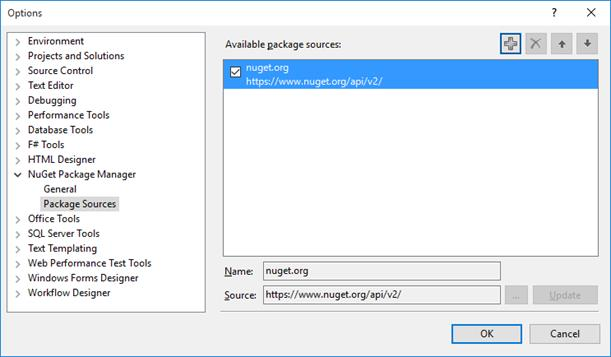
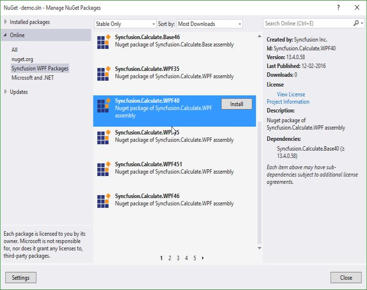
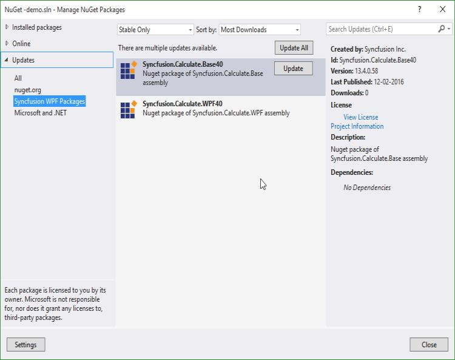

# Installation and Deployment

## Manual Installation

The following procedure illustrates how to install Essential Studio.

1. Double-click the Syncfusion Essential Studio WPF Setup file. The Self-Extractor Wizard opens and extracts the package automatically.
2. Enter User Name, Organization and Unlock Key in the corresponding text boxes provided.
3. Click Next
4. After reading the terms, click the “I accept the terms and conditions” check box.
5. Click Next. The Select the Installation and Samples Folder window opens.
6. To install it in the displayed default location, click Install.
7. Select the Run Dashboard check box to launch the Dashboard after installing.
8. Click Finish. Essential Studio is installed in system and the Syncfusion Essential Studio [Dashboard](http://help.syncfusion.com/ug/common/documents/dashboard.htm#) is launched automatically.

## Configuring Syncfusion NuGet Packages in Visual Studio 

Syncfusion WPF NuGet packages are available [here](http://nuget.syncfusion.com/package/wpf).

### NuGet Configuration  

The steps to install the Syncfusion WPF NuGet Packages in Visual Studio are as follows,

1. In Visual Studio, navigate to `Tools | NuGet Package Manager | Package Manager Settings`, the options dialog will appear on the screen as shows below,

   

2. Select `NuGet Package Manager | Package Sources` and click `Add` button to add the `Package Name` and `Package Source` of Syncfusion NuGet Packages.    

   **Name**: Name of the package that listed in Available package sources  
   **Source**: Syncfusion WPF NuGet Package feed url 
   [http://nuget.syncfusion.com/wpf](http://nuget.syncfusion.com/wpf)
    
   

   N> The `Source` text box in the above image denotes the location of the NuGet packages and the `Name` section, allows you to provide a unique name for NuGet Packages Source.
    
I> Syncfusion other platforms NuGet packages feed links are available [here](http://nuget.syncfusion.com/)

### NuGet Installation

Syncfusion WPF NuGet can install once configured the package source. The NuGet installation steps as below,

1. Once configured the Package source with Syncfusion NuGet Packages, right click on project and choose `Manage NuGet Packages | Online | <Package Source Name>`.

   

2. The NuGet Packages are listed which are available in package source location. Install the required packages to your application by clicking `Install` button.

   N> NuGet packages can be install directly through the **command line** (Package Manager Console). Further details click [here](http://help.syncfusion.com/extension/syncfusion-nuget-packages/nuget-install-and-configuration#install-from-package-manager-console)

### Updating a NuGet Package

Using the `Manage NuGet Packages` in Visual Studio, NuGet packages can be update.
 
1. Right click on Project and Navigate to the `Manage NuGet Packages` and click on the `Updates` tab to check for updates.

2. Select the `Updates -> <Syncfusion Package Source>`. Refer to the following screenshot for more information.

   

3. If there is a new version of NuGet you will see it in the list of available updates.

4. Select NuGet Package in the list and click `Update`. When the update is complete, close and re-open all open instances of Visual Studio.

   N> By clicking `Update All` button, all NuGet packages are getting update. When the update is complete, close and re-open all open instances of Visual Studio.

## Command Line installation

Follow the given steps to install through Command Line in Silent mode.

1. Double-click the Syncfusion Essential Studio Setup file. The Self-Extractor wizard opens and extracts the package automatically.
2. The SyncfusionEssentialStudio_({{ site.releaseversion }}).exe file is extracted into the Temp folder.
3. Run %temp%. The Temp folder opens. The SyncfusionEssentialStudio_({{ site.releaseversion }}).exe file is available in one of the folders.
4. Copy the SyncfusionEssentialStudio_({{ site.releaseversion }}).exe file in local drive. Example: D:\temp
5. Cancel the wizard.
6. Open Command Prompt in administrator mode and pass the following arguments for corresponding version.



  

“Setup file path\SyncfusionEssentialStudio_({{ site.releaseversion }}).exe” Install /PIDKEY:“(product unlock key)” [/log “{Log file path}”] [/InstallPath:{Location to install}]

 



N> In above section, Latest Essential Studio version details has been provided. User can refer installed Essential Studio version instead of mentioned version.

## Copy Local

Copying assemblies in local folder is supported by the Syncfusion assembly reference in the Solution Explorer. It can be achieved by setting its `Copy Local` property of the reference to `True`, so that Syncfusion assemblies are copied to the Release/Bin, Debug/Bin folders and this deployment consists of copying the exe, dll's, xml's files to the client machines that are similar to manual copy.

## GAC

Through Syncfusion installer, Syncfusion assemblies are installed in the GAC of the the developer machines. Also Syncfusion Assembly Manager helps to Add or Remove the Syncfusion assemblies to or from GAC.

## ClickOnce Deployment

While processing [ClickOnce](https://msdn.microsoft.com/en-us/library/ms996413.aspx#) the deployment for publishing an application with Syncfusion WPF component, change the Publish Status option of the Syncfusion Assemblies as “Include”.

### ClickOnce signing process

Before publishing a ClickOnce application, ensure whether it is fully trusted. The following steps are used for signing a ClickOnce application.

Signing ClickOnce involves two steps,

* Signing the application manifest
* Signing application executable

#### Signing the manifest

Navigate to project properties and select "Signing" tab. In the tab check “Sign the ClickOnce manifests” and select “Select From File” option and sign the application with the attached .pfx file.

#### ClickOnce signing

In the Publish tab, click “Options” and check “Use application manifest for trust information” under Manifest in publish options dialog as in the following screenshot.

#### Publish options dialog box

Before publishing, install the attached certificate in machine. Follow the below steps for installing certificate in machine.

1. Press Windows + R and type “certmgr.msc” and press enter that opens certificate manager.
2. Right click the “Trusted Root certification Authorities” and navigate to All Tasks -> Import. Now import the .pfx to “Trusted Root certification Authorities”. It displays a warning for first time. Press Yes to continue the importing.

### Signing exe

The above process signs only deployment manifest. To sign the application executable, refer to the following steps.

Sign the application executable by using the Post-build command and use the signtool.exe as in the following command.



 

"C:\Program Files (x86)\Microsoft SDKs\Windows\v7.1A\Bin\signtool.exe" sign /f "$(ProjectDir)syncfusion.pfx" /p Coolcomp299 /v "$(ProjectDir)obj\x86\$(ConfigurationName)\SampleName.exe"





N> Now, sign the exe inside obj folder and Syncfusion.pfx file placed inside Project directory.

## Installed Location

The following table represents  installed location of Assemblies and Samples.

<table>
<tr>
<td>
Assemblies/Samples  </td><td>
installed location  </td></tr>
<tr>
<td>
GAC  </td><td>
C:\Windows\Microsoft.NET\assembly\GAC_MSIL  </td></tr>
<tr>
<td>
Assemblies  </td><td>
C:\Program Files (x86)\Syncfusion\Essential Studio\{{ site.releaseversion }}\Assemblies  </td></tr>
<tr>
<td>
Precompiled Assemblies  </td><td>
C:\Program Files (x86)\Syncfusion\Essential Studio\{{ site.releaseversion }}\precompiledassemblies\{{ site.releaseversion }}  </td></tr>
<tr>
<td>
Samples  </td><td>
[Installed Drive]:\Users[user name]\AppData\Local\Syncfusion\EssentialStudio\{{ site.releaseversion }}\samples\WPF  </td></tr>
</table>

N> In above table, Latest Essential Studio version details has been provided. User can refer installed Essential Studio version instead of mentioned version.