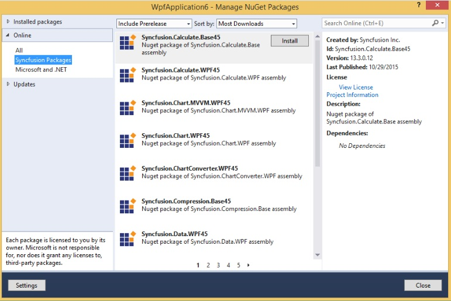
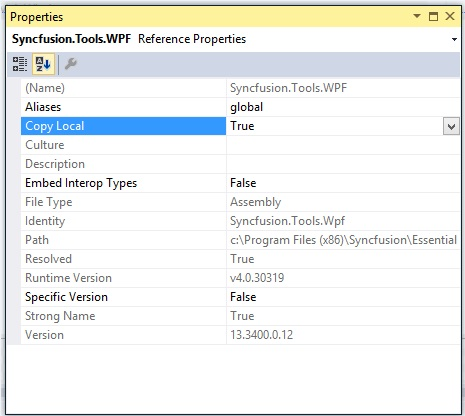
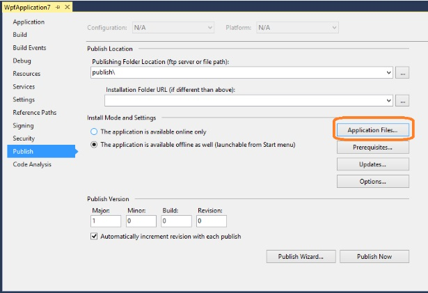
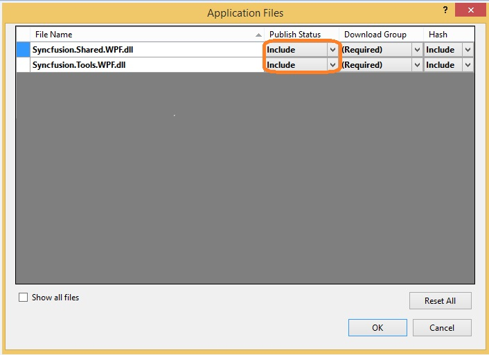
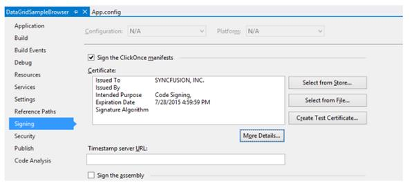
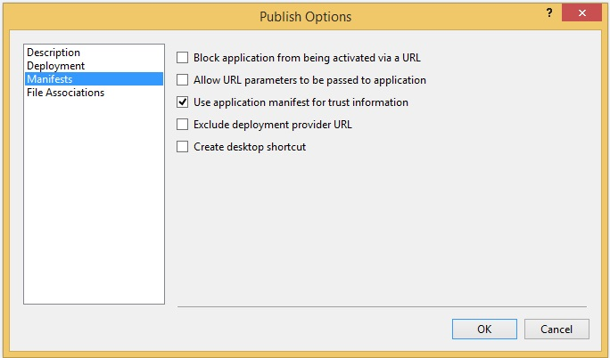

# Installation and Deployment

## Manual Installation

The following procedure illustrates how to install Essential Studio.

1. Double-click the Syncfusion Essential Studio WPF Setup file. The Self-Extractor Wizard opens and extracts the package automatically.
2. Enter User Name, Organization and Unlock Key in the corresponding text boxes provided.
3. Click Next
4. After reading the terms, click the “I accept the terms and conditions” check box.
5. Click Next. The Select the Installation and Samples Folder window opens.
6. To install it in the displayed default location, click Install.
7. Select the Run Dashboard check box to launch the Dashboard after installing.
8. Click Finish. Essential Studio is installed in your system and the Syncfusion Essential Studio [Dashboard](http://help.syncfusion.com/ug/common/documents/dashboard.htm#) is launched automatically.

## Nuget Installation

Refer to the Syncfusion NuGet Packages from the Visual Studio applications. The following steps helps to add the reference of the Syncfusion assemblies in the Project References.

1. Right-click on Project and choose the Manage NuGet Packages.
2. Select Online. Refer to the following screenshot for more information. 

3. Install the required corresponding framework control to use in Visual Studio projects. You can install the dependent assemblies when needed. The framework number at the end of package name like 35, 40, 45, 451 and 46 are added.
4. Find the installed Syncfusion Packages in the Directory location of the created project (Syncfusion Packages).
5. You can [configure ](http://help.syncfusion.com/ug/extension/index.html#!Documents/nugetinstallandconfiguration.htm)Nuget for the required purpose.

## Commandline installation

Follow the given steps to install through Command Line in Silent mode.

1. Double-click the Syncfusion Essential Studio Setup file. The Self-Extractor wizard opens and extracts the package automatically.
2. The SyncfusionEssentialStudio_({{ site.releaseversion }}).exe file is extracted into the Temp folder.
3. Run %temp%. The Temp folder opens. The SyncfusionEssentialStudio_({{ site.releaseversion }}).exe file is available in one of the folders.
4. Copy the SyncfusionEssentialStudio_({{ site.releaseversion }}).exe file in local drive. Example: D:\temp
5. Cancel the wizard.
6. Open Command Prompt in administrator mode and pass the following arguments for corresponding version.

  

“Setup file path\SyncfusionEssentialStudio_({{ site.releaseversion }}).exe” Install /PIDKEY:“(product unlock key)” [/log “{Log file path}”] [/InstallPath:{Location to install}]

 

N> In above section, Latest Essential Studio version details has been provided. User can refer installed Essential Studio version instead of mentioned version.

## Copy Local

Copying assemblies in local folder is supported by the Syncfusion assembly reference in the Solution Explorer. It can be achieved by setting its `Copy Local` property of the reference to True, so that Syncfusion assemblies are copied to the Release/Bin, Debug/Bin folders. And this deployment consists of copying the exe, dlls, xmls files to the client machines that are similar to manual copy.

## GAC

Through Syncfusion installer, Syncfusion assemblies are installed in the GAC of the the developer machines. Also Syncfusion Assembly Manager helps to Add or Remove the Syncfusion assemblies to or from GAC.

## Clickonce Deployment

While processing [ClickOnce](https://msdn.microsoft.com/en-us/library/ms996413.aspx#) the deployment for publishing an application with Syncfusion WPF component, change the Publish Status option of the Syncfusion Assemblies as “Include”.

### ClickOnce signing process

Before publishing a ClickOnce application, ensure whether it is fully trusted. The following steps are used for signing a ClickOnce application.

Signing ClickOnce involves two steps,

* Signing the application manifest
* Signing application executable

#### Signing the manifest

Navigate to project properties and select Signing tab. In the tab check “Sign the ClickOnce manifests” and select “Select From File” option and sign the application with the attached .pfx file.

#### ClickOnce signing

In the Publish tab, click “Options” and check “Use application manifest for trust information” under Manifest in publish options dialog as in the following screenshot.

#### Publish options dialog box

Before publishing, install the attached certificate in your machine. Follow the below steps for installing certificate in your machine.

1. Press Windows + R and type “certmgr.msc” and press enter that opens certificate manager.
2. Right click the “Trusted Root certification Authorities” and navigate to All Tasks -> Import. Now import the .pfx to “Trusted Root certification Authorities”. It displays a warning for first time. Press Yes to continue the importing.

### Signing exe

The above process signs only deployment manifest. To sign the application executable, refer to the following steps.

Sign the application executable by using the Post-build command and use the signtool.exe as in the following command.

 

"C:\Program Files (x86)\Microsoft SDKs\Windows\v7.1A\Bin\signtool.exe" sign /f "$(ProjectDir)syncfusion.pfx" /p Coolcomp299 /v "$(ProjectDir)obj\x86\$(ConfigurationName)\SampleName.exe"



N> Now, sign the exe inside obj folder and Syncfusion.pfx file placed inside Project directory.

## Installed Location

The following table represents  installed location of Assemblies and Samples.

<table>
<tr>
<td>
Assemblies/Samples  </td><td>
installed location  </td></tr>
<tr>
<td>
GAC  </td><td>
C:\Windows\Microsoft.NET\assembly\GAC_MSIL  </td></tr>
<tr>
<td>
Assemblies  </td><td>
C:\Program Files (x86)\Syncfusion\Essential Studio\{{ site.releaseversion }}\Assemblies  </td></tr>
<tr>
<td>
Precompiled Assemblies  </td><td>
C:\Program Files (x86)\Syncfusion\Essential Studio\{{ site.releaseversion }}\precompiledassemblies\{{ site.releaseversion }}  </td></tr>
<tr>
<td>
Samples  </td><td>
[Installed Drive]:\Users[user name]\AppData\Local\Syncfusion\EssentialStudio\{{ site.releaseversion }}\samples\WPF  </td></tr>
</table>

N> In above table, Latest Essential Studio version details has been provided. User can refer installed Essential Studio version instead of mentioned version.