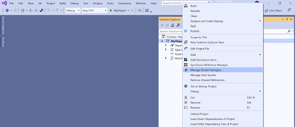
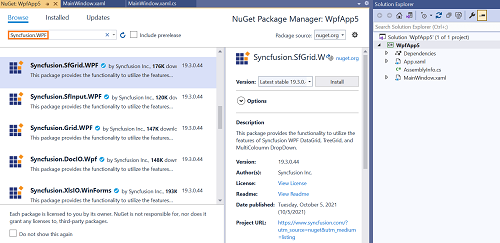
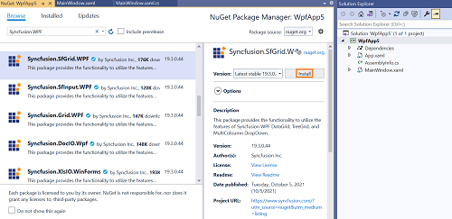
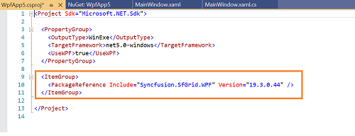
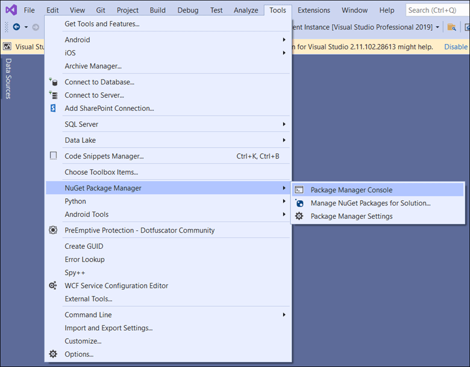
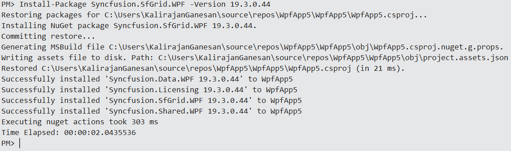

# How to install WPF NuGet packages

## Compatibility

| Project type | Minimum .NET version |
| --- | --- |
| .NET Framework WPF | .NET Framework 4.5 or later |
| .NET (Core) WPF | .NET Core 3.1 / .NET 5 or later |

## Overview

**NuGet** is a package management system for Visual Studio. It makes it easy to add, update, and remove external libraries in your application. Syncfusion publishes all WPF NuGet packages to [nuget.org](https://www.nuget.org/packages?q=Tags%3A%22wpf%22+syncfusion). The Syncfusion WPF NuGet packages can be used without installing the Syncfusion Essential Studio setup. You can simply consume the Syncfusion WPF NuGet packages in a WPF application to develop with the Syncfusion WPF components.

> From v16.2.0.46 (2018 Volume 2 Service Pack 1) onwards, all Syncfusion WPF components are available as NuGet packages on nuget.org.

## Prerequisites

* Visual Studio 2017 or later with the **NuGet Package Manager** workload installed.
* A WPF project that targets a Syncfusion-supported .NET version.
* An active internet connection to reach the [nuget.org](https://www.nuget.org/) feed.
* If you plan to use the CLI method, install the [.NET SDK](https://learn.microsoft.com/en-us/dotnet/core/sdk) matching your project target framework.

## Installation using Package Manager UI

The NuGet **Package Manager UI** allows you to search, install, uninstall, and update Syncfusion WPF NuGet packages in your applications and solutions. You can find and install the Syncfusion WPF NuGet packages in your Visual Studio WPF application by following the steps below:

1. Right-click the WPF application or solution in **Solution Explorer** and choose **Manage NuGet Packages...**

    

    As an alternative, after opening the WPF application in Visual Studio, go to the **Tools** menu, hover **NuGet Package Manager**, and then select **Manage NuGet Packages for Solution...**

2. The **Manage NuGet Packages** window will open. Navigate to the **Browse** tab, then search for the Syncfusion WPF NuGet packages using a term like **"Syncfusion.WPF"**, and select the appropriate Syncfusion WPF NuGet package for your development.

    

    > The [nuget.org](https://api.nuget.org/v3/index.json) package source is selected by default in the **Package source** drop-down. If your Visual Studio does not have nuget.org configured, follow the instructions in the [Microsoft documents](https://learn.microsoft.com/en-us/nuget/tools/package-manager-ui#package-sources) to set up the nuget.org feed URL.

3. When you select a package, the right-side panel will provide more information about it.

4. By default, the package is selected with the latest version. Choose the required version, click the **Install** button, and accept the license terms. The package will be added to your WPF application.

    

5. Your application now has all the required Syncfusion assemblies, and you are ready to start building a high-performance, responsive app with [Syncfusion WPF components](https://www.syncfusion.com/wpf-controls). You can also refer to the [Syncfusion WPF help document](https://help.syncfusion.com/wpf/welcome-to-syncfusion-essential-wpf) for development.

## Installation using dotnet (.NET) CLI

The [dotnet Command Line Interface (CLI)](https://learn.microsoft.com/en-us/nuget/consume-packages/install-use-packages-dotnet-cli) allows you to add, restore, pack, publish, and manage packages without making any changes to your application files. [dotnet add package](https://learn.microsoft.com/en-us/dotnet/core/tools/dotnet-add-package?tabs=netcore2x) adds a package reference to the application file, then runs [dotnet restore](https://learn.microsoft.com/en-us/dotnet/core/tools/dotnet-restore?tabs=netcore2x) to install the package.

Follow the instructions below to use the `dotnet` CLI to install the Syncfusion WPF NuGet packages.

1. Open a command prompt and navigate to the directory that contains your Syncfusion WPF project file.
2. Run the following command to install a NuGet package:

    ```bash
    dotnet add package <Package name>
    ```

    **For example:**

    ```bash
    dotnet add package Syncfusion.SfGrid.WPF
    ```

    > If you do not provide a version flag, this command upgrades the package to the latest version by default. To specify a version, add the `-v` parameter: `dotnet add package Syncfusion.SfGrid.WPF -v 19.3.0.43`.

3. Examine the Syncfusion WPF project file after the command has completed to ensure that the Syncfusion WPF package was installed. To see the added reference, open the `.csproj` file.

    

4. Run [dotnet restore](https://learn.microsoft.com/en-us/dotnet/core/tools/dotnet-restore?tabs=netcore2x) to restore all packages listed in the application file.

    > Restore is performed automatically by `dotnet build` and `dotnet run` in .NET Core 2.0 and later.

## Installation using Package Manager Console

The **Package Manager Console** saves NuGet package installation time: you do not have to search for the Syncfusion WPF NuGet package you want to install, and you can just type the installation command to install the appropriate Syncfusion WPF NuGet package. Follow the instructions below to use the Package Manager Console to reference the Syncfusion WPF component as NuGet packages in your WPF application.

1. To show the Package Manager Console, open your WPF application in Visual Studio and navigate to **Tools -> NuGet Package Manager -> Package Manager Console**.

    

2. The **Package Manager Console** will appear at the bottom of the screen. Install the Syncfusion WPF NuGet packages by entering the following NuGet installation commands.

    **Install a specified Syncfusion WPF NuGet package**

    The command below installs the Syncfusion WPF NuGet package in the WPF application.

    ```powershell
    Install-Package <Package Name>
    ```

    **For example:**

    ```powershell
    Install-Package Syncfusion.SfGrid.WPF
    ```

    > You can find the list of Syncfusion WPF NuGet packages published to nuget.org [here](https://www.nuget.org/packages?q=Tags%3A%22wpf%22+syncfusion).

    **Install a specified Syncfusion WPF NuGet package in a specified WPF application**

    The command below installs the Syncfusion WPF NuGet package in the given WPF application.

    ```powershell
    Install-Package <Package Name> -ProjectName <Project Name>
    ```

    **For example:**

    ```powershell
    Install-Package Syncfusion.SfGrid.WPF -ProjectName SyncfusionWPFApp
    ```

3. By default, the package is installed with the latest version. Specify the required version with the `-Version` term to install a particular version, as shown below:

    ```powershell
    Install-Package Syncfusion.SfGrid.WPF -Version 19.3.0.44
    ```

    

4. The NuGet Package Manager Console installs the Syncfusion WPF NuGet package together with its dependencies. When the installation is complete, the console shows that your Syncfusion WPF package has been successfully added to the application.

5. Your application now has all the required Syncfusion assemblies, and you are ready to start building a high-performance, responsive app with [Syncfusion WPF components](https://www.syncfusion.com/wpf-controls). You can also refer to the [Syncfusion WPF help document](https://help.syncfusion.com/wpf/welcome-to-syncfusion-essential-wpf) for development.