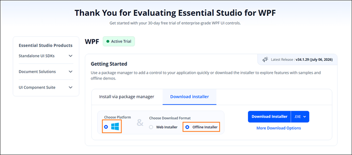
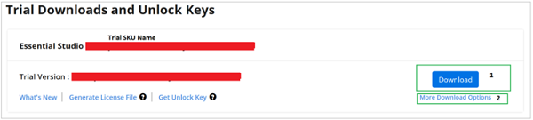
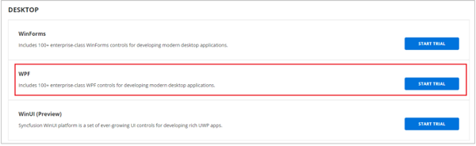
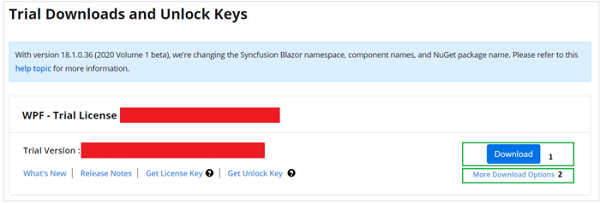
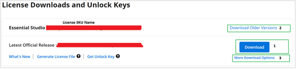

# Downloading Syncfusion WPF offline installer

The Syncfusion WPF offline installer can be downloaded from the [Syncfusion.com](https://www.syncfusion.com/wpf-controls) website. You can either download the licensed installer or try our trial installer depending on your license.

   - Trial Installer
   - Licensed Installer

## Prerequisites

* You must have a Syncfusion account. If you do not have one, sign up at [Syncfusion Account](https://www.syncfusion.com/account/register).

## Download the trial version

Our 30-day trial can be downloaded in two ways.

   * Download free trial setup
   * Start trials if using components through [nuget.org](https://www.nuget.org/packages?q=syncfusion)

### Download free trial setup

1. Visit the [Download Free Trial](https://www.syncfusion.com/downloads) page and select the WPF platform.
2. After completing the required form or logging in with your registered Syncfusion account, you can download the WPF trial installer from the confirmation page (as shown in the screenshot below). 
   
   
   
3. With a trial license, only the latest version's trial installer can be downloaded.
4. After downloading, the Syncfusion WPF trial installer can be unlocked using either the trial unlock key or your Syncfusion registered login credential. For more information on generating an unlock key, see [this](https://www.syncfusion.com/kb/8069/how-to-generate-unlock-key-for-essentials-studio-products) article.
5. Before the trial expires, you can download the trial installer at any time from your registered account's [Trials & Downloads](https://www.syncfusion.com/account/manage-trials/downloads) page (as shown in the screenshot below).
 
   

6. Click the **More Download Options** (element 2 in the above screenshot) button to get the Essential Studio WPF Offline trial installer, which is available in EXE and ZIP format.

   

### Start trials if using components through [nuget.org](https://www.nuget.org/packages?q=syncfusion)

You should initiate an evaluation if you have already obtained our components through [NuGet.org](https://www.nuget.org/packages?q=syncfusion).

1. Start your 30-day free trial for WPF from the [Start Trial](https://www.syncfusion.com/account/manage-trials/start-trials) page in your account.

   N> You can generate the license key for your active trial products from the [Trials & Downloads](https://www.syncfusion.com/account/manage-trials/downloads) page. This license key is mandatory to use our trial products in your application. To learn more about license keys, refer to this [help topic](https://help.syncfusion.com/wpf/licensing/overview). 
	
   
   
2. To access this page, you must sign up or log in with your Syncfusion account.
3. Begin your trial by selecting the WPF product. 

   N> If you've already used the trial products and they haven't expired, you won't be able to start the trial for the same product again.

4. After you've started the trial, go to the [Trials & Downloads](https://www.syncfusion.com/account/manage-trials/downloads) page to get the latest version trial installer. You can generate the [unlock key](https://www.syncfusion.com/kb/8069/how-to-generate-unlock-key-for-essentials-studio-products) and [license key](https://help.syncfusion.com/wpf/licensing/how-to-generate) here at any time before the trial period expires (as shown in the screenshot below).

   

5. You can find your current active trial products on the [Trials & Downloads](https://www.syncfusion.com/account/manage-trials/downloads) page.
   

## Download the license version

1. Syncfusion licensed products are available on the [License & Downloads](https://www.syncfusion.com/account/downloads) page under your registered Syncfusion account.
2. You can view all licenses (both active and expired) associated with your account.
3. Click the **Download** (element 1 in the screenshot below) button to download the respective product's installer.
4. The most recent version of the installer will be downloaded from this page.
5. To download older version installers, go to [Downloads Older Versions](https://www.syncfusion.com/account/downloads/studio) (element 2 in the screenshot below).
6. You can download the WPF licensed offline installer by going to **More Downloads Options** (element 3 in the screenshot below).

   
   
7. For Windows OS, EXE and ZIP formats are available for download. Both are offline installers.

   
   

Refer to the [**Offline installer**](https://help.syncfusion.com/wpf/installation/offline-installer/how-to-install) link for step-by-step installation guidelines.	
