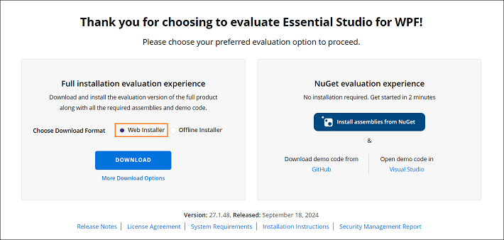

# Downloading Syncfusion WPF web Installer

The Syncfusion WPF web installer can be downloaded from the [Syncfusion.com](https://www.syncfusion.com/wpf-controls) website. You can either download the licensed installer or try our trial installer depending on your license.

   -	Trial Installer
   -	Licensed Installer

## Download the Trial Version

Our 30-day trial can be downloaded in two ways.

   * Download Free Trial Setup
   * Start Trials if using components through [NuGet.org](https://www.nuget.org/packages?q=syncfusion)

### Download Free Trial Setup

1. You can evaluate our 30-day free trial by visiting the [Download Free Trial](https://www.syncfusion.com/downloads) page and select the WPF platform.
2. After completing the required form or logging in with your registered Syncfusion account, you can download the WPF trial installer from the confirmation page. (as shown in below screenshot.) 
   
   
   
3. With a trial license, only the latest version’s trial installer can be downloaded.
4. After downloading, the Syncfusion WPF web installer can be unlocked using either the trial unlock key or the Syncfusion registered login credential. More information on generating an unlock key can be found in [this](https://www.syncfusion.com/kb/8069/how-to-generate-unlock-key-for-essentials-studio-products) article.
5. Before the trial expires, you can download the trial installer at any time from your registered account’s [Trials & Downloads](https://www.syncfusion.com/account/manage-trials/downloads) page (as shown in below screenshot.)
6. Click the Download (element 1 in the screenshot below) button to get the Syncfusion Essential Studio WPF web installer.
 
   

### Start Trials if using components through [NuGet.org](https://www.nuget.org/packages?q=syncfusion)

You should initiate an evaluation if you have already obtained our components through [NuGet.org](https://www.nuget.org/packages?q=syncfusion)

1. You can start your 30-day free trial for WPF from the [Start Trial](https://www.syncfusion.com/account/manage-trials/start-trials) page from your account.

   N> You can generate the license key for your active trial products from [Trials & Downloads](https://www.syncfusion.com/account/manage-trials/downloads) page. This license key will be mandatory to use our trial products in your application. To know more about License key, refer this [help topic](https://help.syncfusion.com/common/essential-studio/licensing/license-key). 
	
   
   
2. To access this page, you must sign up\log in with your Syncfusion account.
3. Begin your trial by selecting the WPF product. 

   N> If you've already used the trial products and they haven't expired, you won't be able to start the trial for the same product again.

4. After you've started the trial, go to the [Trials & Downloads](https://www.syncfusion.com/account/manage-trials/downloads) page to get the latest version trial installer. You can generate the [unlock key](https://www.syncfusion.com/kb/8069/how-to-generate-unlock-key-for-essentials-studio-products) and [license key](https://help.syncfusion.com/wpf/licensing/generating-license-keys) here at any time before the trial period expires. (as shown in below screenshot.)

   

5. You can find your current active trial products on the [Trials & Downloads](https://www.syncfusion.com/account/manage-trials/downloads) page.
   

## Download the License Version

1. Syncfusion licensed products will be available in the [License & Downloads](https://www.syncfusion.com/account/downloads) page under your registered Syncfusion account.
2. You can view all the licenses (both active and expired) associated with your account.
3. Click the Download (element 1 in the screenshot below) button to download the WPF web installer.

   
   
4. Before the license expires, you can download the installer at any time from your registered account’s [License & Downloads](https://www.syncfusion.com/account/downloads) page (See the screenshot below.)
   
   
   
5.After downloading, the Syncfusion WPF web installer can be unlocked using Syncfusion registered login credential.

   N> For Syncfusion trial and licensed products, there is no separate web installer. Based on your account license, Syncfusion trial or licensed products will be installed via web installer.

You can also refer to the [**web installer**](https://help.syncfusion.com/wpf/Installation/web-installer/how-to-install) links for step-by-step installation guidelines.	
