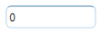
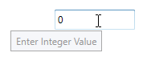
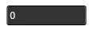

# Appearance in WPF IntegerTextBox

This section deals with the appearance of `IntegerTextBox` control and contains the following topics.

## Setting the Foreground

The [IntegerTextBox](https://www.syncfusion.com/wpf-ui-controls/integer-textbox) control [Foreground](https://docs.microsoft.com/en-us/dotnet/api/system.windows.controls.control.foreground?view=netframework-4.8) can be modified based on the value of the control. The following are the foreground for `IntegerTextBox` control.

### Foreground for Positive Value

We can change a positive color for the value of `IntegerTextBox` by setting the [PositiveForeground](https://help.syncfusion.com/cr/wpf/Syncfusion.Windows.Shared.EditorBase.html#Syncfusion_Windows_Shared_EditorBase_PositiveForeground) property and it will be applied when the [Value](https://help.syncfusion.com/cr/wpf/Syncfusion.Windows.Shared.IntegerTextBox.html#Syncfusion_Windows_Shared_IntegerTextBox_Value) is positive. The default color of `PositiveForeground` is `Black`.




<syncfusion:IntegerTextBox x:Name="integerTextBox" Value="10" Width="100" Height="25" PositiveForeground="Blue" />




IntegerTextBox integerTextBox = new IntegerTextBox();
integerTextBox.Width = 100;
integerTextBox.Height = 25;
integerTextBox.Value = 10;
integerTextBox.PositiveForeground = Brushes.Blue;




### Foreground for Negative Value 

We can change a negative color for the value of `IntegerTextBox` by setting the [NegativeForeground](https://help.syncfusion.com/cr/wpf/Syncfusion.Windows.Shared.EditorBase.html#Syncfusion_Windows_Shared_EditorBase_NegativeForeground) property and it will be applied when the [ApplyNegativeForeground](https://help.syncfusion.com/cr/wpf/Syncfusion.Windows.Shared.EditorBase.html#Syncfusion_Windows_Shared_EditorBase_ApplyNegativeForeground) property is `true` and the `Value` is negative. The default color of `NegativeForeground` is `Red`.




<syncfusion:IntegerTextBox x:Name="integerTextBox" Value="-10" Width="100" Height="25"
                          NegativeForeground="SpringGreen" ApplyNegativeForeground="True" />




IntegerTextBox integerTextBox = new IntegerTextBox();
integerTextBox.Width = 100;
integerTextBox.Height = 25;
integerTextBox.Value = -10;
integerTextBox.ApplyNegativeForeground = true;   
integerTextBox.NegativeForeground = Brushes.SpringGreen;




### Foreground for Zero Value

We can change a zero color for the value of `IntegerTextBox` by setting the [ZeroColor](https://help.syncfusion.com/cr/wpf/Syncfusion.Windows.Shared.EditorBase.html#Syncfusion_Windows_Shared_EditorBase_ZeroColor) property and it will be applied when the [ApplyZeroColor](https://help.syncfusion.com/cr/wpf/Syncfusion.Windows.Shared.EditorBase.html#Syncfusion_Windows_Shared_EditorBase_ApplyZeroColor) property is `true` and the `Value` is zero.
The default color of `ZeroColor` is `Green`. 




<syncfusion:IntegerTextBox x:Name="integerTextBox" Value="0" Width="100" Height="25"
                          ApplyZeroColor="True" ZeroColor="DarkGoldenrod"/>




IntegerTextBox integerTextBox = new IntegerTextBox();
integerTextBox.Width = 100;
integerTextBox.Height = 25;
integerTextBox.Value = 0;
integerTextBox.ApplyZeroColor = true;
integerTextBox.ZeroColor = Brushes.DarkGoldenrod;




## Setting the Background

`IntegerTextBox` allows different brushes to fill the control. The [Background](https://docs.microsoft.com/en-us/dotnet/api/system.windows.controls.control.background?view=netframework-4.8) property can be used to modify the control background color. The default color of `Background` is `White`.




<syncfusion:IntegerTextBox x:Name="integerTextBox" Width="100"
                          Height="25" Value ="80" Background="Cyan"/>




IntegerTextBox integerTextBox = new IntegerTextBox();
integerTextBox.Width = 100;
integerTextBox.Height = 25;
integerTextBox.Background = Brushes.Cyan;




## Setting the Corner Radius

Corner Radius indicates the degree to which the corners of the border can be rounded. To create curved borders for the `IntegerTextBox`, use [CornerRadius](https://help.syncfusion.com/cr/wpf/Syncfusion.Windows.Shared.EditorBase.html#Syncfusion_Windows_Shared_EditorBase_CornerRadius) property. The default value of `CornerRadius` property is 1.





<syncfusion:IntegerTextBox x:Name="integerTextBox" Width="100" Height="25" CornerRadius="5"/>





IntegerTextBox integerTextBox = new IntegerTextBox();
integerTextBox.Width = 100;
integerTextBox.Height = 25;
integerTextBox.CornerRadius = new CornerRadius(5);  




## Apply Background for Selection

`IntegerTextBox` allows different brushes to highlight the selected text by setting the [SelectionBrush](https://docs.microsoft.com/en-us/dotnet/api/system.windows.controls.primitives.textboxbase.selectionbrush?view=netframework-4.8) and [SelectionOpacity](https://docs.microsoft.com/en-us/dotnet/api/system.windows.controls.primitives.textboxbase.selectionopacity?view=netframework-4.8) properties. The `SelectionOpacity` property specifies the opacity of the `SelectionBrush`.




<syncfusion:IntegerTextBox x:Name="integerTextBox" Width="100" Height="25" SelectionBrush="Red" SelectionOpacity="0.5"/>




IntegerTextBox integerTextBox = new IntegerTextBox();
integerTextBox.Width = 100;
integerTextBox.Height = 25;
integerTextBox.SelectionBrush = Brushes.Red;
integerTextBox.SelectionOpacity = 0.3;




## Align Value

`IntegerTextBox` allows to display the value from right or center or left side by setting the [TextAlignment](https://docs.microsoft.com/en-us/dotnet/api/system.windows.controls.textblock.textalignment?view=netframework-4.8) property to `Right` or `Left` or `Center`. The Default value of `TextAlignment` is `Left`.




<syncfusion:IntegerTextBox x:Name="integerTextBox" Width="100" Height="25" TextAlignment="Center"/>




IntegerTextBox integerTextBox = new IntegerTextBox();
integerTextBox.Width = 100;
integerTextBox.Height = 25;
integerTextBox.TextAlignment = TextAlignment.Center;




## Setting ToolTip

`IntegerTextBox` provides support for ToolTip to display certain information when the mouse hovers on the `IntegerTextBox`. You can customize the tooltip information by setting the [ToolTip](https://docs.microsoft.com/en-us/dotnet/api/system.windows.controls.tooltip?view=netframework-4.8) property.




<syncfusion:IntegerTextBox x:Name="integerTextBox" Width="100" Height="25" ToolTip="Enter Integer Value"/>




IntegerTextBox integerTextBox = new IntegerTextBox();
integerTextBox.Width = 100;
integerTextBox.Height = 25;
integerTextBox.ToolTip = "Enter Integer Value";




## Theme

The appearance of the `IntegerTextBox` control can be customized by using the [SfSkinManager.SetVisualStyle](https://help.syncfusion.com/cr/wpf/Syncfusion.SfSkinmanager.SfSkinmanager.html#Syncfusion_SfSkinManager_SfSkinManager_SetVisualStyle_System_Windows_DependencyObject_Syncfusion_SfSkinManager_VisualStyles_) method. The following are the various built-in visual styles for `IntegerTextBox` control.

* Blend
* Default
* Lime
* Metro
* Office2010Black
* Office2010Blue
* Office2010Silver
* Office2013DarkGray
* Office2013LightGray
* Office2013White
* Office2016Colorful
* Office2016DarkGray
* Office2016White
* Office365
* Saffron
* SystemTheme
* VisualStudio2013
* VisualStudio2015

For example, the `Blend` style applied to the `IntegerTextBox` as shown in the following example code:




IntegerTextBox integerTextBox = new IntegerTextBox();
integerTextBox.Width = 100;
integerTextBox.Height = 25;
SfSkinManager.SetVisualStyle(integerTextBox, VisualStyles.Blend);




