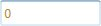
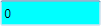
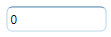
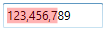
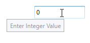

# Appearance in WPF IntegerTextBox

This section deals with the appearance of `IntegerTextBox` control and contains the following topics.

## Setting the Foreground

The foreground of the [IntegerTextBox](https://www.syncfusion.com/wpf-controls/integer-textbox) control can be modified based on the value of the control by using the [Foreground](https://learn.microsoft.com/en-us/dotnet/api/system.windows.controls.control.foreground?view=netframework-4.8) and the value-specific brushes described below.

### Foreground for Positive Value

You can change the foreground color applied to positive values of `IntegerTextBox` by setting the [PositiveForeground](https://help.syncfusion.com/cr/wpf/Syncfusion.Windows.Shared.EditorBase.html#Syncfusion_Windows_Shared_EditorBase_PositiveForeground) property. It is applied when the [Value](https://help.syncfusion.com/cr/wpf/Syncfusion.Windows.Shared.IntegerTextBox.html#Syncfusion_Windows_Shared_IntegerTextBox_Value) is positive. The default color of `PositiveForeground` is `Black`.




<syncfusion:IntegerTextBox x:Name="integerTextBox" Value="10" Width="100" Height="25" PositiveForeground="Blue" />




IntegerTextBox integerTextBox = new IntegerTextBox();
integerTextBox.Width = 100;
integerTextBox.Height = 25;
integerTextBox.Value = 10;
integerTextBox.PositiveForeground = Brushes.Blue;




### Foreground for Negative Value

You can change the foreground color applied to negative values of `IntegerTextBox` by setting the [NegativeForeground](https://help.syncfusion.com/cr/wpf/Syncfusion.Windows.Shared.EditorBase.html#Syncfusion_Windows_Shared_EditorBase_NegativeForeground) property. It is applied when the [ApplyNegativeForeground](https://help.syncfusion.com/cr/wpf/Syncfusion.Windows.Shared.EditorBase.html#Syncfusion_Windows_Shared_EditorBase_ApplyNegativeForeground) property is `true` and the `Value` is negative. The default color of `NegativeForeground` is `Red`. The default value of `ApplyNegativeForeground` is `true`.




<syncfusion:IntegerTextBox x:Name="integerTextBox" Value="-10" Width="100" Height="25"
                          NegativeForeground="SpringGreen" ApplyNegativeForeground="True" />




IntegerTextBox integerTextBox = new IntegerTextBox();
integerTextBox.Width = 100;
integerTextBox.Height = 25;
integerTextBox.Value = -10;
integerTextBox.ApplyNegativeForeground = true;   
integerTextBox.NegativeForeground = Brushes.SpringGreen;




### Foreground for Zero Value

You can change the foreground color applied when the `Value` of `IntegerTextBox` is zero by setting the [ZeroColor](https://help.syncfusion.com/cr/wpf/Syncfusion.Windows.Shared.EditorBase.html#Syncfusion_Windows_Shared_EditorBase_ZeroColor) property. It is applied when the [ApplyZeroColor](https://help.syncfusion.com/cr/wpf/Syncfusion.Windows.Shared.EditorBase.html#Syncfusion_Windows_Shared_EditorBase_ApplyZeroColor) property is `true` and the `Value` is zero. The default value of `ApplyZeroColor` is `true`. The default color of `ZeroColor` is `Green`.




<syncfusion:IntegerTextBox x:Name="integerTextBox" Value="0" Width="100" Height="25"
                          ApplyZeroColor="True" ZeroColor="DarkGoldenrod"/>




IntegerTextBox integerTextBox = new IntegerTextBox();
integerTextBox.Width = 100;
integerTextBox.Height = 25;
integerTextBox.Value = 0;
integerTextBox.ApplyZeroColor = true;
integerTextBox.ZeroColor = Brushes.DarkGoldenrod;




## Setting the Background

`IntegerTextBox` allows different brushes to fill the control. The [Background](https://learn.microsoft.com/en-us/dotnet/api/system.windows.controls.control.background?view=netframework-4.8) property can be used to modify the control background color. The default color of `Background` is `White`.
 For the `NegativeForeground` brush to take effect when entering negative values, see [Foreground for Negative Value](#foreground-for-negative-value).



<syncfusion:IntegerTextBox x:Name="integerTextBox" Width="100"
                          Height="25" Value ="80" Background="Cyan"/>




IntegerTextBox integerTextBox = new IntegerTextBox();
integerTextBox.Width = 100;
integerTextBox.Height = 25;
integerTextBox.Background = Brushes.Cyan;




## Setting the Corner Radius

Corner Radius indicates the degree to which the corners of the border can be rounded. To create curved borders for the `IntegerTextBox`, use the [CornerRadius](https://help.syncfusion.com/cr/wpf/Syncfusion.Windows.Shared.EditorBase.html#Syncfusion_Windows_Shared_EditorBase_CornerRadius) property. The default value of `CornerRadius` is 1.




<syncfusion:IntegerTextBox x:Name="integerTextBox" Width="100" Height="25" CornerRadius="5"/>




using Syncfusion.Windows.Shared;
using System.Windows;

IntegerTextBox integerTextBox = new IntegerTextBox();
integerTextBox.Width = 100;
integerTextBox.Height = 25;
integerTextBox.CornerRadius = new CornerRadius(5);




## Apply Background for Selection

`IntegerTextBox` allows different brushes to highlight the selected text by setting the [SelectionBrush](https://learn.microsoft.com/en-us/dotnet/api/system.windows.controls.primitives.textboxbase.selectionbrush?view=netframework-4.8) and [SelectionOpacity](https://learn.microsoft.com/en-us/dotnet/api/system.windows.controls.primitives.textboxbase.selectionopacity?view=netframework-4.8) properties. The `SelectionOpacity` property specifies the opacity of the `SelectionBrush`. The default value of `SelectionOpacity` is `0.4`.




<syncfusion:IntegerTextBox x:Name="integerTextBox" Width="100" Height="25" SelectionBrush="Red" SelectionOpacity="0.5"/>




using Syncfusion.Windows.Shared;
using System.Windows.Media;

IntegerTextBox integerTextBox = new IntegerTextBox();
integerTextBox.Width = 100;
integerTextBox.Height = 25;
integerTextBox.SelectionBrush = Brushes.Red;
integerTextBox.SelectionOpacity = 0.5;




## Align Value

`IntegerTextBox` allows you to display the value from the right, center, or left side by setting the [TextAlignment](https://learn.microsoft.com/en-us/dotnet/api/system.windows.controls.textblock.textalignment?view=netframework-4.8) property to `Right`, `Left`, or `Center`. The default value of `TextAlignment` is `Left`.




<syncfusion:IntegerTextBox x:Name="integerTextBox" Width="100" Height="25" TextAlignment="Center"/>




IntegerTextBox integerTextBox = new IntegerTextBox();
integerTextBox.Width = 100;
integerTextBox.Height = 25;
integerTextBox.TextAlignment = TextAlignment.Center;




## Setting ToolTip

`IntegerTextBox` provides support for a ToolTip to display certain information when the mouse hovers over the `IntegerTextBox`. You can customize the tooltip information by setting the [ToolTip](https://learn.microsoft.com/en-us/dotnet/api/system.windows.controls.tooltip?view=netframework-4.8) property.




<syncfusion:IntegerTextBox x:Name="integerTextBox" Width="100" Height="25" ToolTip="Enter Integer Value"/>




IntegerTextBox integerTextBox = new IntegerTextBox();
integerTextBox.Width = 100;
integerTextBox.Height = 25;
integerTextBox.ToolTip = "Enter Integer Value";




## Theme

IntegerTextBox supports various built-in themes. Refer to the below links to apply themes for the IntegerTextBox,

  * [Apply theme using SfSkinManager](https://help.syncfusion.com/wpf/themes/skin-manager)
	
  * [Create a custom theme using ThemeStudio](https://help.syncfusion.com/wpf/themes/theme-studio#creating-custom-theme)

  
