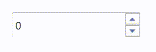

# Changing Integer Value in WPF IntegerTextBox

The [IntegerTextBox](https://www.syncfusion.com/wpf-ui-controls/integer-textbox) allows the user to change the value using the [Value](https://help.syncfusion.com/cr/wpf/Syncfusion.Windows.Shared.IntegerTextBox.html#Syncfusion_Windows_Shared_IntegerTextBox_Value) property.




<syncfusion:IntegerTextBox x:Name="integerTextBox" Height="25"
                          Width="150" Value="10"/>

                       


IntegerTextBox integerTextBox = new IntegerTextBox();
integerTextBox.Width = 150;
integerTextBox.Height = 25;
integerTextBox.Value = 10;




Data binding is the process of establishing a connection between the application UI and business logic. Data binding can be unidirectional (source -> target or target <- source) or bidirectional (source <-> target). By assigning a value to the `Value` property by binding, you can change the `IntegerTextBox` value.

The following code snippets illustrate the value binding from one `IntegerTextBox` to another.




<syncfusion:IntegerTextBox x:Name="integerTextBox1" Value="{Binding MyValue,UpdateSourceTrigger=PropertyChanged}" Height="25" Width="100"/>
<syncfusion:IntegerTextBox x:Name="integerTextBox2" Value="{Binding MyValue,UpdateSourceTrigger=PropertyChanged}" Width="100" Height="25"  />




ViewModel.cs




class ViewModel : NotificationObject
{
    private int myValue;
    public int MyValue
    {
        get
        {
            return myValue;
        }
        set
        {
            myValue = value;
            RaisePropertyChanged("MyValue");
        }
    }
}




## Change integer value by pasting the clipboard's text

By default, `IntegerTextBox` simply replaces the whole value by copied value with the current number format. If you want to replace or insert the copied value on specific place, use the [PasteMode](https://help.syncfusion.com/cr/wpf/Syncfusion.Windows.Shared.EditorBase.html#Syncfusion_Windows_Shared_EditorBase_PasteMode) property value as `Advanced`. The default value of `PasteMode` property is `Default`. 

The following table explains the pasting behaviour in `Advanced` paste mode,

<table>
<tr>
<th> S.No </th>
<th> Action </th>
<th> Pasting behaviour in Advanced paste mode</th>
</tr>
<tr>
<td>1</td>
<td>When the whole value is selected</td>
<td>It simply replaces the whole value by copied value with the current number format.</td>
</tr>
<tr>
<td>2</td>
<td>When the cursor is at some position and the copied value does not contain a number decimal separator</td>
<td>It inserts the copied value into the current cursor position.</td>
</tr>
<tr>
<td>3</td>
<td>When the cursor is at some position and the copied value contains a number decimal separator</td>
<td>It won’t perform pasting operation.</td>
</tr>
<tr>
<td>4</td>
<td>When the cursor is at some position and the control value is 0 or null</td>
<td>It simply replaces the whole value by copied value with the current number format.</td>
</tr>
<tr>
<td>5</td>
<td>When a part of the number is selected and copied value contains number decimal separator</td>
<td> it won’t perform pasting operation.</td>
</tr>
</table>




<syncfusion:IntegerTextBox PasteMode="Advanced" 
                           Value="12345"
                           Name="integerTextBox"/>

                       


IntegerTextBox integerTextBox = new IntegerTextBox();
integerTextBox.PasteMode = PasteMode.Advanced;
integerTextBox.Value = 12345;




## Changing integer value by SpinButton

You can increment or decrement the integer value of `IntegerTextBox` by setting the `ShowSpinButton` property value as `true`. Click UpButton to increment or DownButton to decrement the integer value. The default value of `ShowSpinButton` property is `false`.




<syncfusion:IntegerTextBox Height="30" Width="150" ShowSpinButton="True" />




IntegerTextBox integerTextBox = new IntegerTextBox();
integerTextBox.ShowSpinButton = true;




## Value Changed Event

The `IntegerTextBox` control can notify changes in value through the [ValueChanged](https://help.syncfusion.com/cr/wpf/Syncfusion.Windows.Shared.IntegerTextBox.html) event. In `ValueChanged` event, you can get old value and new value from the `OldValue` and  `NewValue` properties.




<syncfusion:IntegerTextBox ValueChanged="IntegerTextBox_ValueChanged"/>


 

IntegerTextBox integerTextBox = new IntegerTextBox();
integerTextBox.ValueChanged += new PropertyChangedCallback(IntegerTextBox_ValueChanged);




You can handle the event as follows:




private void IntegerTextBox_ValueChanged(DependencyObject d, DependencyPropertyChangedEventArgs e)
{
    // Get old and new value
    var newValue = e.NewValue;
    var oldValue = e.OldValue;
}




## Setting the Null value

 By default, the `IntegerTextBox` control will display zero value when the `Value` is set to `null`. You can use the [NullValue](https://help.syncfusion.com/cr/wpf/Syncfusion.Windows.Shared.IntegerTextBox.html#Syncfusion_Windows_Shared_IntegerTextBox_NullValue) and [UseNullOption](https://help.syncfusion.com/cr/wpf/Syncfusion.Windows.Shared.EditorBase.html#Syncfusion_Windows_Shared_EditorBase_UseNullOption) properties to show the null or any other value instead of zero.
 
 The default value of the `NullValue` property is `null`, you can reset this to any other integer value. It will display only on setting the `UseNullOption` property is set to `true`.
 
**NullValue = Null**




<syncfusion:IntegerTextBox x:Name="integerTextBox" Height="25"
                          Width="100" UseNullOption="True"  NullValue="{x:Null}"/>




IntegerTextBox integerTextBox = new IntegerTextBox();
integerTextBox.Width = 100;
integerTextBox.Height = 25;
integerTextBox.NullValue = null;
integerTextBox.UseNullOption = true;




**NullValue = 10**




<syncfusion:IntegerTextBox x:Name="integerTextBox" Height="25"
                          Width="100" UseNullOption="True" NullValue="10"/>




IntegerTextBox integerTextBox = new IntegerTextBox();
integerTextBox.Width = 100;
integerTextBox.Height = 25;
integerTextBox.NullValue = 10;
integerTextBox.UseNullOption = true;




## Setting Watermark Text

We can display certain information within the control by using the [WaterMarkText](https://help.syncfusion.com/cr/wpf/Syncfusion.Windows.Shared.EditorBase.html#Syncfusion_Windows_Shared_EditorBase_WatermarkText) property. `WaterMarkText` is shown when the [WatermarkTextIsVisible](https://help.syncfusion.com/cr/wpf/Syncfusion.Windows.Shared.EditorBase.html#Syncfusion_Windows_Shared_EditorBase_WatermarkTextIsVisible) property is `true` and the value is `null` or empty, the control is not in focus and the `UseNullOption` property is `true`.

### Setting the WatermarkText Foreground

The `IntegerTextBox` allows you to set the desired brush as a foreground for `WaterMarkText` using [WaterMarkTextForeground](https://help.syncfusion.com/cr/wpf/Syncfusion.Windows.Shared.EditorBase.html#Syncfusion_Windows_Shared_EditorBase_WatermarkTextForeground) property. The default color of `WaterMarkTextForeground` is `Black`.




<syncfusion:IntegerTextBox x:Name="integerTextBox" Width="100"
                          Height="25" UseNullOption="True" WatermarkText="Type here"
                          WatermarkTextIsVisible="True" WatermarkTextForeground="Red"/>




IntegerTextBox integerTextBox = new IntegerTextBox();
integerTextBox.Width = 100;
integerTextBox.Height = 25;
integerTextBox.UseNullOption = true;
integerTextBox.WatermarkText = "Type Here";
integerTextBox.WatermarkTextIsVisible = true;
integerTextBox.WatermarkTextForeground = Brushes.Red;




### Setting Watermark Template

You can customize the Visual appearance of the `WatermarkText` by using the [WatermarkTemplate](https://help.syncfusion.com/cr/wpf/Syncfusion.Windows.Shared.EditorBase.html#Syncfusion_Windows_Shared_EditorBase_WatermarkTemplate) property.



<syncfusion:IntegerTextBox x:Name="integerTextBox" Width="100" Height="25"
                          WatermarkText="Type Here" CornerRadius="3" 
                          WatermarkTextIsVisible="True" WatermarkOpacity="0.5" 
                          UseNullOption="True">
    <syncfusion:IntegerTextBox.WatermarkTemplate >
        <DataTemplate>
            <Border Background="Red">
                <TextBlock Text="{Binding}" VerticalAlignment="Center" Margin="5,0,0,0"/>
            </Border>
        </DataTemplate>
    </syncfusion:IntegerTextBox.WatermarkTemplate>
</syncfusion:IntegerTextBox>



N> The `UseNullOption` property must be enabled if you want to see `NullValue` or `WaterMarkText` in `IntegerTextBox` control.

N> If both `NullValue` and `WaterMarkText` are specified, you will only see `NullValue` but not `WaterMarkText`.
