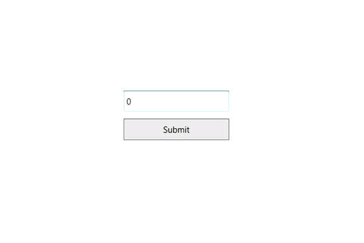

# Restriction or Validation in WPF Integer TextBox

This section explains how to validate or restrict the [IntegerTextBox](https://help.syncfusion.com/cr/wpf/Syncfusion.Shared.Wpf~Syncfusion.Windows.Shared.IntegerTextBox.html) control value.

## Restrict the value within minimum and maximum value

The [Value](https://help.syncfusion.com/cr/wpf/Syncfusion.Windows.Shared.IntegerTextBox.html#Syncfusion_Windows_Shared_IntegerTextBox_Value) of the [IntegerTextBox](https://help.syncfusion.com/cr/wpf/Syncfusion.Windows.Shared.IntegerTextBox.html) can be restricted within the maximum and minimum limits. Once the value has reached the maximum or minimum value, the value does not exceed the limit. You can change the minimum and maximum limits by using the [MinValue](https://help.syncfusion.com/cr/wpf/Syncfusion.Windows.Shared.IntegerTextBox.html#Syncfusion_Windows_Shared_IntegerTextBox_MinValue) and [MaxValue](https://help.syncfusion.com/cr/wpf/Syncfusion.Windows.Shared.IntegerTextBox.html#Syncfusion_Windows_Shared_IntegerTextBox_MaxValue) properties.

You can choose when to validate the maximum and minimum limits while changing the values by using the [MinValidation](https://help.syncfusion.com/cr/wpf/Syncfusion.Windows.Shared.EditorBase.html#Syncfusion_Windows_Shared_EditorBase_MinValidation) and [MaxValidation](https://help.syncfusion.com/cr/wpf/Syncfusion.Windows.Shared.EditorBase.html#Syncfusion_Windows_Shared_EditorBase_MaxValidation) properties.

* `OnKeyPress` — When [MaxValidation](https://help.syncfusion.com/cr/wpf/Syncfusion.Windows.Shared.EditorBase.html#Syncfusion_Windows_Shared_EditorBase_MaxValidation) or [MinValidation](https://help.syncfusion.com/cr/wpf/Syncfusion.Windows.Shared.EditorBase.html#Syncfusion_Windows_Shared_EditorBase_MinValidation) is set to `OnKeyPress`, the value in the `WPF Integer TextBox` is validated shortly after pressing a key. As a result, invalid input is not allowed, and the value does not exceed the maximum and minimum limits.

* `OnLostFocus` - When [MaxValidation](https://help.syncfusion.com/cr/wpf/Syncfusion.Windows.Shared.EditorBase.html#Syncfusion_Windows_Shared_EditorBase_MaxValidation) or [MinValidation](https://help.syncfusion.com/cr/wpf/Syncfusion.Windows.Shared.EditorBase.html#Syncfusion_Windows_Shared_EditorBase_MinValidation) is set to `OnLostFocus`, the value in the `WPF Integer TextBox` is validated when the control loses keyboard focus. After validation, when the value is greater than the `MaxValue` or less than the `MinValue`, the value will be automatically set to `MaxValue` or `MinValue`.

* [MaxValueOnExceedMaxDigit](https://help.syncfusion.com/cr/wpf/Syncfusion.Windows.Shared.EditorBase.html#Syncfusion_Windows_Shared_EditorBase_MaxValueOnExceedMaxDigit) - When you give input greater than the specified maximum limit, `MaxValueOnExceedMaxDigit` decides whether to retain the old value or reset to the specified maximum limit. For example, if `MaxValue` is set to 100 and you are trying to input 200, the `Value` will change to 100 when `MaxValueOnExceedMaxDigit` is `true`, or 20 will be retained if `MaxValueOnExceedMaxDigit` is `false`.

* [MinValueOnExceedMinDigit](https://help.syncfusion.com/cr/wpf/Syncfusion.Windows.Shared.EditorBase.html#Syncfusion_Windows_Shared_EditorBase_MinValueOnExceedMinDigit) - When you give input less than the specified minimum limit, `MinValueOnExceedMinDigit` decides whether to retain the old value or reset to the specified minimum limit. For example, if `MinValue` is set to 200 and the `Value` is 205, and you try to change the value to 20, the `Value` will change to 200 when `MinValueOnExceedMinDigit` is `true`, or the old value 205 will be retained if `MinValueOnExceedMinDigit` is `false`.

  N> `MaxValueOnExceedMaxDigit` and `MinValueOnExceedMinDigit` are only effective when the corresponding `MaxValidation` and `MinValidation` properties are set to `OnKeyPress`.




<syncfusion:IntegerTextBox x:Name="integerTextBox" Width="150" MaxValue="100" MinValue="10"
                          MinValueOnExceedMinDigit="True" MaxValueOnExceedMaxDigit="True"
                          MinValidation="OnKeyPress" MaxValidation="OnLostFocus"/>




using Syncfusion.Windows.Shared;

IntegerTextBox integerTextBox = new IntegerTextBox();
integerTextBox.Width = 150;
integerTextBox.Height = 25;
integerTextBox.MinValue = 10;
integerTextBox.MaxValue = 100;
integerTextBox.MinValidation = MinValidation.OnKeyPress;
integerTextBox.MaxValidation = MaxValidation.OnLostFocus;
integerTextBox.MinValueOnExceedMinDigit = true;
integerTextBox.MaxValueOnExceedMaxDigit = true;




When `MinValidation` is set to `OnKeyPress`, you cannot enter a value less than the `MinValue`. If you try to enter a value less than the `MinValue`, the `MinValue` will be set to the `Value` property because `MinValueOnExceedMinDigit` is set to `true`.

`MaxValidation` is set to `OnLostFocus`, so the `MaxValidation` will be performed only on lost focus.

## Read-only mode

The [WPF Integer TextBox](https://help.syncfusion.com/cr/wpf/Syncfusion.Windows.Shared.IntegerTextBox.html) does not allow user input or edits at runtime when the [IsReadOnly](https://learn.microsoft.com/en-us/dotnet/api/system.windows.controls.primitives.textboxbase.isreadonly?view=netframework-4.8#System_Windows_Controls_Primitives_TextBoxBase_IsReadOnly) property is set to `true`. The user can still select text and display the cursor in the `WPF Integer TextBox` by setting the [IsReadOnlyCaretVisible](https://learn.microsoft.com/en-us/dotnet/api/system.windows.controls.primitives.textboxbase.isreadonlycaretvisible?view=netframework-4.8) property to `true`. The default value of `IsReadOnly` is `false` and the default value of `IsReadOnlyCaretVisible` is `false`. The `Value` can still be changed programmatically in read-only mode.




<syncfusion:IntegerTextBox x:Name="integerTextBox" IsReadOnly="True" Value="78" IsReadOnlyCaretVisible="True"/>




using Syncfusion.Windows.Shared;

IntegerTextBox integerTextBox = new IntegerTextBox();
integerTextBox.Value = 78;
integerTextBox.IsReadOnly = true;
integerTextBox.IsReadOnlyCaretVisible = true;




## Customizing the Behavior for an Invalid Value

You can customize how the [WPF Integer TextBox](https://help.syncfusion.com/cr/wpf/Syncfusion.Windows.Shared.IntegerTextBox.html) behaves when the entered value is not equal to the [ValidationValue](https://help.syncfusion.com/cr/wpf/Syncfusion.Windows.Shared.IntegerTextBox.html#Syncfusion_Windows_Shared_IntegerTextBox_ValidationValue) property, by using the [InvalidValueBehavior](https://help.syncfusion.com/cr/wpf/Syncfusion.Windows.Shared.IntegerTextBox.html#Syncfusion_Windows_Shared_IntegerTextBox_InvalidValueBehavior) property. It can be customized by the following values:

* `DisplayErrorMessage` - Shows a MessageBox with the message "String validation failed" after focus is lost from the `WPF Integer TextBox`.
* `None` - Validation will not occur.
* `ResetValue` - Resets the entered value to `0` after focus is lost.

N> By default the `ValidationValue` property value is `String.Empty`. The `ValidationValue` is a string; the entered value is compared to it as a string.




<syncfusion:IntegerTextBox Width="120" Height="30"
                         InvalidValueBehavior="DisplayErrorMessage"
                         ValidationValue="1222"
                         VerticalAlignment="Center"
                         HorizontalAlignment="Center" />




using Syncfusion.Windows.Shared;
using System.Windows;

IntegerTextBox integerTextBox = new IntegerTextBox()
{
    Height = 30,
    Width = 120,
    InvalidValueBehavior = InvalidValueBehavior.DisplayErrorMessage,
    ValidationValue = "1222",
    HorizontalAlignment = HorizontalAlignment.Center,
    VerticalAlignment = VerticalAlignment.Center
};




