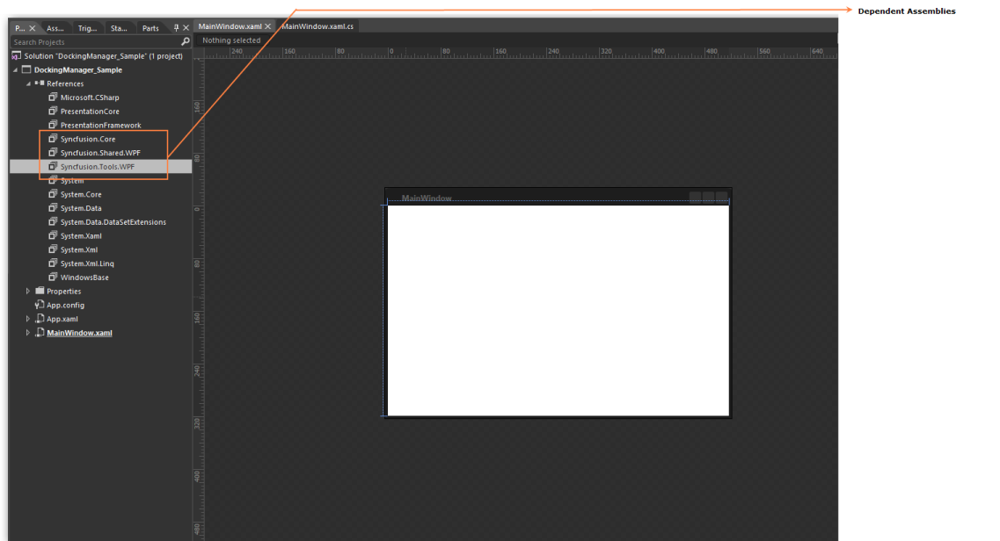
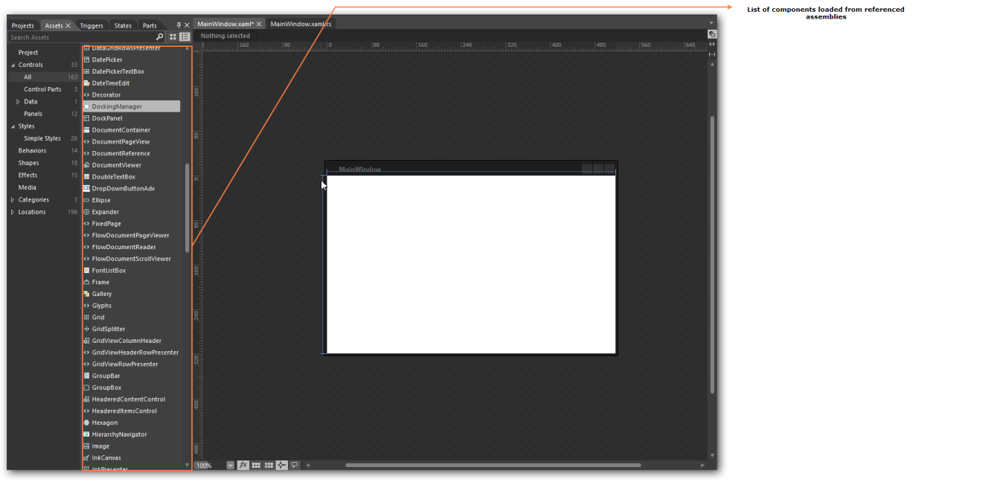
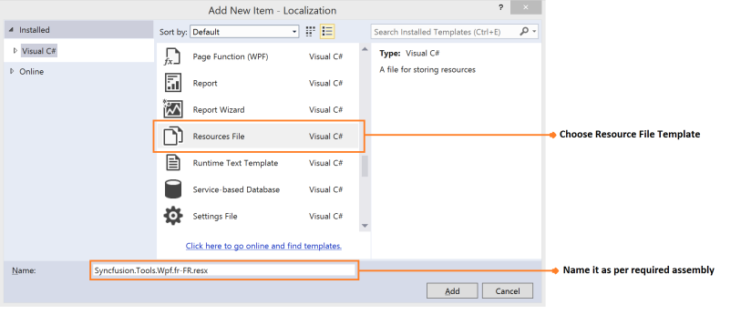
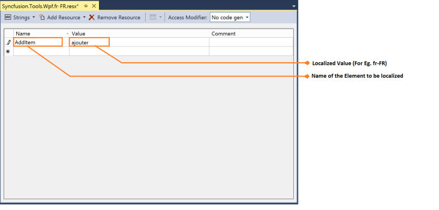
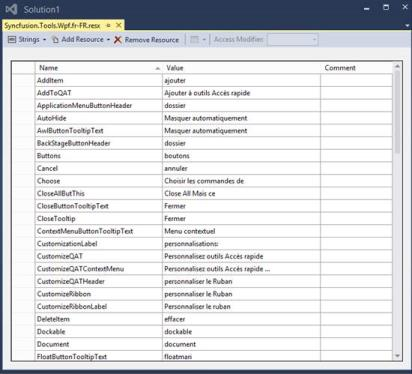

# Common Supports

## Expression Blend

Most of the Syncfusion controls are enhanced with blend support. The following steps allow the control to design in Visual Studio Expression Blend.

1. Create a WPF project in Expression Blend and refer to the Syncfusion corresponding control’s assemblies. For example, to add Docking Manager control, add its assembly Syncfusion.Tools.Wpf and its dependency assembly Syncfusion.Shared.Wpf
  
   
   

  

2. Search for Control in the Toolbox.

  
   

  

3. Drag the control to the designer. It generates the control in designer.
   

   

  
   

## Testing

The following Syncfusion controls come with built in testing support like [Coded UI](https://msdn.microsoft.com/en-us/magazine/hh875174.aspx) and QTP that enables you to develop enriched automation Test Project for automation to ensure the reliability.

### Coded UI

* CellGrid
* DataGrid
* TreeGrid
* GridDataControl
* Ribbon
* DockingManager

### QTP

* CellGrid
* DataGrid
* TreeGrid
* GridDataControl

## Localization

Localization is the process of making your application multi-lingual, by formatting the content according to cultures. This involves configuring the application for a specific language. Culture is the combination of language and location, for example En-US is the culture for English spoken in United States; En-GB is the culture for English spoken in Great Britain. Syncfusion controls allow you to set custom resource through the Resx file with standard filename as [AssemblyName].[CultureInfo Code].resx, for example Syncfusion.Tools.wpf.fr-FR.resx, Syncfusion.SfSchedule.wpf.fr-FR.resx. And by giving the string values in the resource file for a specific culture and set the culture in the application. The string values should be set to the controls respective resource key.

### The followings are the step to localize a control:

* Add Resources file for the different cultures.
* Assign the value to each culture using key
* Assign a Current UI Culture to the application.

How to Add a Resource file, like Syncfusion.Tools.Wpf.dll Assembly?

To localize WPF controls, the resource file needs to be created as per following steps:

1. Create a folder named Resources in the application. 
2. Open the Add New Item Dialog using Ctrl+Shift+A keys
3. Create a resource file, Resx file, and name it Syncfusion.Tools.Wpf<culture info name>.resx For example, Syncfusion.Tools.Wpf.fr-FR.resx.

N> In case, the Shared dll controls is used in the application, then create another resource file in name Syncfusion.Shared.Wpf<your culture info name>.resx For example, Syncfusion.Shared.Wpf.fr-FR.resx and the naming convention needs to be followed mandatorily.

The following screenshot explains the addition of a Resource file to the application.

How to assign values in Resources file?

To assign Values in Resource, the resource file need to be updated as per the following steps.

1. Open the required file by double clicking it from Solution Explorer. 
2. Add key (Name) and its corresponding localized value by editing its field as shown in the following image.

   

3. Similarly add all need key (Name) for required assembly for example (Syncfusion.Tools.Wpf.dll). And the following screenshot displays the String property names for Tools.WPF controls with French values.

   

  

N> The default resource file for applicable assemblies can be downloaded by table provided at the end of this page.

How to assign UI Culture to the application?

Mention the culture to be referred while initializing the application, so that you can refer to the appropriate value provided in resource file. The following code illustrates the implementation of culture information settings.


public MainWindow()

 {

    InitializeComponent();

    System.Threading.Thread.CurrentThread.CurrentUICulture = newSystem.Globalization.CultureInfo("fr-FR");

  }


### Localization Resource file

Following table represents available Resource file to the Assemblies and it can be downloaded.

### Properties

<table>
<tr>
<th>
Assembly</th><th>
Resource file (.resx)</th></tr>
<tr>
<td>
Syncfusion.Tools.wpf.dll</td><td>
{{ '[Syncfusion.Tools.Wpf.resx](http://www.syncfusion.com/downloads/support/directtrac/general/ze/Syncfusion.Tools.Wpf441372344.zip)' | markdownify }}</td></tr>
<tr>
<td>
Syncfusion.Shared.wpf.dll</td><td>
{{ '[Syncfusion.Shared.Wpf.resx](http://www.syncfusion.com/downloads/support/directtrac/general/ze/Syncfusion.Shared.Wpf1050714761.zip)' | markdownify }}</td></tr>
<tr>
<td>
Syncfusion.ReportViewer.wpf.dll.</td><td>
{{ '[Syncfusion.ReportViewer.Wpf.resx](http://www.syncfusion.com/downloads/support/directtrac/general/ze/Syncfusion.ReportViewer.Wpf-1945952232.zip)' | markdownify }}</td></tr>
<tr>
<td>
Syncfusion.ReportDesigner.wpf.dll</td><td>
{{ '[Syncfusion.ReportDesigner.Wpf.resx](http://www.syncfusion.com/downloads/support/directtrac/general/ze/Syncfusion.ReportDesigner.Wpf-1041727457.zip)' | markdownify }}</td></tr>
<tr>
<td>
Syncfusion.SfSchedule.WPF.dll</td><td>
{{ '[Syncfusion.Schedule.WPF.resx](http://www.syncfusion.com/downloads/support/directtrac/general/ze/Syncfusion.Schedule.WPF-2114011865.zip)' | markdownify }}</td></tr>
<tr>
<td>
Syncfusion.Diagram.wpf.dll</td><td>
{{ '[Syncfusion.Diagram.Wpf.resx](http://www.syncfusion.com/downloads/support/directtrac/general/ze/Syncfusion.Diagram.Wpf399807340.zip)' | markdownify }}</td></tr>
<tr>
<td>
Syncfusion.OlapChart.WPF.dll</td><td>
{{ '[Syncfusion.OlapChart.WPF.resx](http://www.syncfusion.com/downloads/support/directtrac/general/ze/Syncfusion.OlapChart.WPF1784490155.zip)' | markdownify }}</td></tr>
<tr>
<td>
Syncfusion.OlapGrid.WPF.dll</td><td>
{{ '[Syncfusion.OlapGrid.WPF.resx](http://www.syncfusion.com/downloads/support/directtrac/general/ze/Syncfusion.OlapGrid.WPF-1780476966.zip)' | markdownify }}</td></tr>
<tr>
<td>
Syncfusion.OlapClient.WPF.dll</td><td>
{{ '[Syncfusion.OlapClient.WPF.resx](http://www.syncfusion.com/downloads/support/directtrac/general/ze/Syncfusion.OlapClient.WPF800223558.zip)' | markdownify }}</td></tr>
<tr>
<td>
Syncfusion.OlapGauge.WPF.dll</td><td>
{{ '[Syncfusion.OlapGauge.wpf.resx](http://www.syncfusion.com/downloads/support/directtrac/general/ze/Syncfusion.OlapGauge.wpf-703450722.zip)' | markdownify }}</td></tr>
<tr>
<td>
Syncfusion.OlapShared.WPF.dll</td><td>
{{ '[Syncfusion.OlapShared.WPF.resx](http://www.syncfusion.com/downloads/support/directtrac/general/ze/Syncfusion.OlapShared.WPF892025005.zip)' | markdownify }}</td></tr>
<tr>
<td>
Syncfusion.OlapTools.WPF.dll</td><td>
{{ '[Syncfusion.OlapTools.WPF.resx](http://www.syncfusion.com/downloads/support/directtrac/general/ze/Syncfusion.OlapTools.WPF1635487656.zip)' | markdownify }}</td></tr>
<tr>
<td>
Syncfusion.PdfViewer.Windows.dll</td><td>
{{ '[Syncfusion.PdfViewer.Windows.resx](http://www.syncfusion.com/downloads/support/directtrac/general/ze/Syncfusion.PdfViewer.Windows1715928907.zip)' | markdownify }}</td></tr>
<tr>
<td>
Syncfusion.PdfViewer.WPF.dll</td><td>
{{ '[Syncfusion.PdfViewer.WPF.resx](http://www.syncfusion.com/downloads/support/directtrac/general/ze/Syncfusion.PdfViewer.WPF1353718278.zip)' | markdownify }}</td></tr>
<tr>
<td>
Syncfusion.PivotAnalysis.WPF.dll</td><td>
{{ '[Syncfusion.PivotAnalysis.Wpf.resx](http://www.syncfusion.com/downloads/support/directtrac/general/ze/Syncfusion.PivotAnalysis.Wpf1519720402.zip)' | markdownify }}</td></tr>
<tr>
<td>
Syncfusion.SfGrid.WPF.dll</td><td>
{{ '[Syncfusion.SfGrid.WPF.resx](http://www.syncfusion.com/downloads/support/directtrac/general/ze/Syncfusion.SfGrid.WPF-2055371759.zip)' | markdownify }}</td></tr>
<tr>
<td>
Syncfusion.Spreadsheet.Wpf.dll</td><td>
{{ '[Syncfusion.Speradsheet.Wpf.resx](http://www.syncfusion.com/downloads/support/directtrac/general/ze/Syncfusion.Speradsheet.Wpf-1712328665.zip)' | markdownify }}</td></tr>
<tr>
<td>
Syncfusion.Grid.WPF.dll</td><td>
{{ '[Syncfusion.Grid.Wpf.resx](http://www.syncfusion.com/downloads/support/directtrac/general/ze/Syncfusion.Grid.Wpf1812217710.zip)' | markdownify }}</td></tr>
<tr>
<td>
Syncfusion.SfRichTextBoxAdv.WPF.dll</td><td>
{{ '[Syncfusion.SfRichTextBoxAdv.WPF.resx](http://www.syncfusion.com/downloads/support/directtrac/general/ze/Resources86404579.zip)' | markdownify }}</td></tr>
<tr>
<td>
Syncfusion.SfRichTextRibbon.WPF.dll</td><td>
{{ '[Syncfusion.SfRichTextRibbon.WPF.resx](http://www.syncfusion.com/downloads/support/directtrac/general/ze/Resources86404579.zip)' | markdownify }}</td></tr>
</table>

