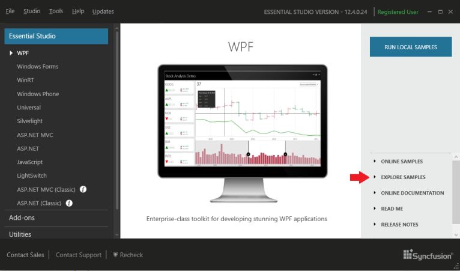

# Sample Locations of Essential Studio WPF

## The Essential WPF samples are installed in the following location:

_[Installed Drive]:\Users\[user name]\AppData\Local\Syncfusion\EssentialStudio\XX.X.X.XX\WPF\samples_

You can copy it from the above location and paste it in your project for the development purpose.

## Run the samples

To run the samples, open the corresponding Dashboard from the following location:

Start -> All Programs -> Syncfusion -> Essential Studio <x.x.x.x> -> Dashboard

Else open the Dashboard from the following installed location:

_C:\Program Files (x86)\Syncfusion\EssentialStudio\XX.X.X.XX\Infrastructure\Dashboard\4.0\Dashboard.exe_

The following screenshot displays the Dashboard.

Essential Studio Dashboard
{:.caption}
