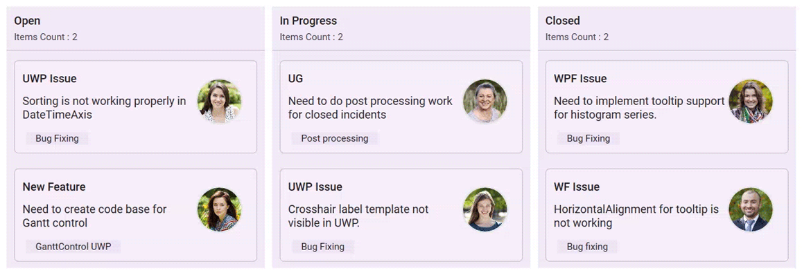
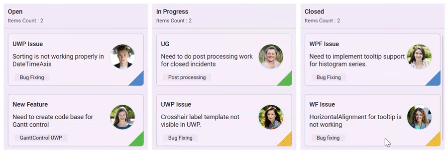

# Cards in WPF Kanban (SfKanban) control

The default elements of a card can be customized using the below properties of [`KanbanModel`](https://help.syncfusion.com/cr/wpf/Syncfusion.UI.Xaml.Kanban.KanbanModel.html).

* [`Title`](https://help.syncfusion.com/cr/wpf/Syncfusion.UI.Xaml.Kanban.KanbanModel.html#Syncfusion_UI_Xaml_Kanban_KanbanModel_Title)         - Used to set the title of a card.
* [`ImageURL`](https://help.syncfusion.com/cr/wpf/Syncfusion.UI.Xaml.Kanban.KanbanModel.html#Syncfusion_UI_Xaml_Kanban_KanbanModel_ImageURL)      - Used to set the image URL of a card. The image will be displayed at right side in default card template.
* [`Category`](https://help.syncfusion.com/cr/wpf/Syncfusion.UI.Xaml.Kanban.KanbanModel.html#Syncfusion_UI_Xaml_Kanban_KanbanModel_Category)      - Used to set the category of a card. Based on the category the [`Cards`](https://help.syncfusion.com/cr/wpf/Syncfusion.UI.Xaml.Kanban.KanbanColumn.html#Syncfusion_UI_Xaml_Kanban_KanbanColumn_Cards) will be added to the respective columns. 
* [`Description`](https://help.syncfusion.com/cr/wpf/Syncfusion.UI.Xaml.Kanban.KanbanModel.html#Syncfusion_UI_Xaml_Kanban_KanbanModel_Description)   - Used to set the description text of a card.
* [`ColorKey`](https://help.syncfusion.com/cr/wpf/Syncfusion.UI.Xaml.Kanban.KanbanModel.html#Syncfusion_UI_Xaml_Kanban_KanbanModel_ColorKey)      - Used to specify the indicator [`ColorKey`](https://help.syncfusion.com/cr/wpf/Syncfusion.UI.Xaml.Kanban.IKanbanModel.html#Syncfusion_UI_Xaml_Kanban_IKanbanModel_ColorKey). The [`Color`](https://help.syncfusion.com/cr/wpf/Syncfusion.UI.Xaml.Kanban.ColorMapping.html#Syncfusion_UI_Xaml_Kanban_ColorMapping_Color) value of the corresponding [`Key`](https://help.syncfusion.com/cr/wpf/Syncfusion.UI.Xaml.Kanban.ColorMapping.html#Syncfusion_UI_Xaml_Kanban_ColorMapping_Key) should be added in [`IndicatorColorPalette`](https://help.syncfusion.com/cr/wpf/Syncfusion.UI.Xaml.Kanban.SfKanban.html#Syncfusion_UI_Xaml_Kanban_SfKanban_IndicatorColorPalette) collection of [`SfKanban`](https://help.syncfusion.com/cr/wpf/Syncfusion.UI.Xaml.Kanban.SfKanban.html).
* [`Tags`](https://help.syncfusion.com/cr/wpf/Syncfusion.UI.Xaml.Kanban.KanbanModel.html#Syncfusion_UI_Xaml_Kanban_KanbanModel_Tags)     - Used to specify the tags of a card. The tags will be displayed at bottom in default card template.
* [`ID`](https://help.syncfusion.com/cr/wpf/Syncfusion.UI.Xaml.Kanban.KanbanModel.html#Syncfusion_UI_Xaml_Kanban_KanbanModel_ID)     - Used to set the ID of a card.



new KanbanModel()
{

    Title = "Universal App",

    ID = "27654",

    Description = "Incorporate feedback into functional specifications",

    Category = "Open",

    ColorKey = "Low",

    Tags = new string[] { "Deployment" },

    ImageURL = new Uri("/images/icon.jpg", UriKind.RelativeOrAbsolute )
};



Following code snippet is used to define the colors for each key.





<kanban:SfKanban.IndicatorColorPalette>

    <kanban:ColorMapping Key="Low" Color="Blue"/>

    <kanban:ColorMapping Key="Normal" Color="Green" />

    <kanban:ColorMapping Key="High" Color="Red" />

</kanban:SfKanban.IndicatorColorPalette>





IndicatorColorPalette indicatorColorPalette = new IndicatorColorPalette();

indicatorColorPalette.Add(new ColorMapping() { Key = "Low", Color = Colors.Blue });

indicatorColorPalette.Add(new ColorMapping() { Key = "High", Color = Colors.Red });

indicatorColorPalette.Add(new ColorMapping() { Key = "Normal", Color = Colors.Green });

sfKanban.IndicatorColorPalette = indicatorColorPalette;





## Customizing kanban cards

The [`CardStyle`](https://help.syncfusion.com/cr/wpf/Syncfusion.UI.Xaml.Kanban.SfKanban.html#Syncfusion_UI_Xaml_Kanban_SfKanban_CardStyle) property customizes the kanban cards. The following properties of [`CardStyle`](https://help.syncfusion.com/cr/wpf/Syncfusion.UI.Xaml.Kanban.SfKanban.html#Syncfusion_UI_Xaml_Kanban_SfKanban_CardStyle) are used to customize its appearance:

* [`Background`](https://help.syncfusion.com/cr/wpf/Syncfusion.UI.Xaml.Kanban.KanbanCardStyle.html#Syncfusion_UI_Xaml_Kanban_KanbanCardStyle_Background) - Changes the background color of a card.
* [`BorderBrush`](https://help.syncfusion.com/cr/wpf/Syncfusion.UI.Xaml.Kanban.KanbanCardStyle.html#Syncfusion_UI_Xaml_Kanban_KanbanCardStyle_BorderBrush) - Changes the border brush of a card.
* [`BorderThickness`](https://help.syncfusion.com/cr/wpf/Syncfusion.UI.Xaml.Kanban.KanbanCardStyle.html#Syncfusion_UI_Xaml_Kanban_KanbanCardStyle_BorderThickness) - Changes the border thickness of a card.
* [`CornerRadius`](https://help.syncfusion.com/cr/wpf/Syncfusion.UI.Xaml.Kanban.KanbanCardStyle.html#Syncfusion_UI_Xaml_Kanban_KanbanCardStyle_CornerRadius) - Adds rounded corners to a card.
* [`IconVisibility`](https://help.syncfusion.com/cr/wpf/Syncfusion.UI.Xaml.Kanban.KanbanCardStyle.html#Syncfusion_UI_Xaml_Kanban_KanbanCardStyle_IconVisibility) - Changes the icon visibility of a card.
* [`IndicatorVisibility`](https://help.syncfusion.com/cr/wpf/Syncfusion.UI.Xaml.Kanban.KanbanCardStyle.html#Syncfusion_UI_Xaml_Kanban_KanbanCardStyle_IndicatorVisibility) - Changes the indicator visibility of a card.
* [`TagVisibility`](https://help.syncfusion.com/cr/wpf/Syncfusion.UI.Xaml.Kanban.KanbanCardStyle.html#Syncfusion_UI_Xaml_Kanban_KanbanCardStyle_TagVisibility) -  Changes the tag panel visibility of a card.
* [`TitleColor`](https://help.syncfusion.com/cr/wpf/Syncfusion.UI.Xaml.Kanban.KanbanCardStyle.html#Syncfusion_UI_Xaml_Kanban_KanbanCardStyle_TitleColor) - Changes the header color of a kanban card item.
* [`TitleFontSize`](https://help.syncfusion.com/cr/wpf/Syncfusion.UI.Xaml.Kanban.KanbanCardStyle.html#Syncfusion_UI_Xaml_Kanban_KanbanCardStyle_TitleFontSize) - Changes the font size of a card title.
* [`TitleHorizontalAlignment`](https://help.syncfusion.com/cr/wpf/Syncfusion.UI.Xaml.Kanban.KanbanCardStyle.html#Syncfusion_UI_Xaml_Kanban_KanbanCardStyle_TitleHorizontalAlignment) - Changes the horizontal alignment of a card title.
* [`FontSize`](https://help.syncfusion.com/cr/wpf/Syncfusion.UI.Xaml.Kanban.KanbanCardStyle.html#Syncfusion_UI_Xaml_Kanban_KanbanCardStyle_FontSize) - Changes the font size of a card description.
* [`Foreground`](https://help.syncfusion.com/cr/wpf/Syncfusion.UI.Xaml.Kanban.KanbanCardStyle.html#Syncfusion_UI_Xaml_Kanban_KanbanCardStyle_Foreground) - Changes the foreground color of a card description.
* [`TagBackground`](https://help.syncfusion.com/cr/wpf/Syncfusion.UI.Xaml.Kanban.KanbanCardStyle.html#Syncfusion_UI_Xaml_Kanban_KanbanCardStyle_TagBackground) - Changes the tag's background color.
* [`TagForeground`](https://help.syncfusion.com/cr/wpf/Syncfusion.UI.Xaml.Kanban.KanbanCardStyle.html#Syncfusion_UI_Xaml_Kanban_KanbanCardStyle_TagForeground) - Changes the tag's foreground color.

## Template

You can replace the entire card template with your own design using [`SfKanban.CardTemplate`](https://help.syncfusion.com/cr/wpf/Syncfusion.UI.Xaml.Kanban.SfKanban.html#Syncfusion_UI_Xaml_Kanban_SfKanban_CardTemplate) property. The following code snippet and screenshot illustrates this.



<kanban:SfKanban.CardTemplate>
    
    <DataTemplate>
    
        <Border BorderBrush="Black"
    
                BorderThickness="0.75"
    
                CornerRadius="10"
    
                Background="AliceBlue"
    
                Margin="0,5,0,5">
    
            <Grid Margin="10,5,5,10">
    
                <Grid.ColumnDefinitions>
    
                    <ColumnDefinition Width="7*" />
    
                    <ColumnDefinition Width="3*" />
                
                </Grid.ColumnDefinitions>
                
                <Grid.RowDefinitions>
                
                    <RowDefinition Height="Auto" />
                
                    <RowDefinition Height="Auto" />
                
                </Grid.RowDefinitions>
                
                <TextBlock Text="{Binding Path=Title}"
                
                           FontWeight="Bold"
                
                           FontSize="16" />
                
                <TextBlock Grid.Row="1"
                
                           FontSize="14"
                
                           HorizontalAlignment="Left"
                
                           Text="{Binding Description}"
                
                           TextWrapping="WrapWholeWords" />
                
                <Border Grid.Row="1"
                
                        Grid.Column="1"
                
                        Height="50"
                
                        CornerRadius="50"
                
                        Width="50"
                
                        BorderBrush="Silver"
                
                        BorderThickness=".75">
                
                    <Border.Background>
                
                        <ImageBrush ImageSource="{Binding ImageURL}" />
                
                    </Border.Background>
                
                </Border>
            
            </Grid>
        
        </Border>

    </DataTemplate>

</kanban:SfKanban.CardTemplate>



## Cards tooltip

An interactive tooltip provides additional details about the cards on hovering the mouse over them.

### Enable tooltip for cards

To enable tooltip for the kanban cards, use [IsToolTipEnabled](https://help.syncfusion.com/cr/wpf/Syncfusion.UI.Xaml.Kanban.SfKanban.html#Syncfusion_UI_Xaml_Kanban_SfKanban_IsToolTipEnabled) property of [SfKanban](https://help.syncfusion.com/cr/wpf/Syncfusion.UI.Xaml.Kanban.SfKanban.html). By default, [IsToolTipEnabled](https://help.syncfusion.com/cr/wpf/Syncfusion.UI.Xaml.Kanban.SfKanban.html#Syncfusion_UI_Xaml_Kanban_SfKanban_IsToolTipEnabled) is set to `false.` To provide users with additional information or context about cards, simply set this property to `true.`




<kanban:SfKanban x:Name="kanban"
                 IsToolTipEnabled="True"
                 ItemsSource="{Binding Tasks}">
    <kanban:SfKanban.DataContext>
        <local:ViewModel/>
    </kanban:SfKanban.DataContext>
</kanban:SfKanban>




this.kanban.IsToolTipEnabled = true;




public class ViewModel
{
    /// 

    /// Gets or sets the collection of <see cref="KanbanModel"/> objects representing tasks in various stages.
    /// 

    public ObservableCollection<KanbanModel> Tasks { get; set; }

    /// 

    /// Initializes a new instance of the <see cref="ViewModel"/> class.
    /// 

    public ViewModel()
    {
        Tasks = new ObservableCollection<KanbanModel>();

        KanbanModel task = new KanbanModel();
        task.Title = "UWP Issue";
        task.Description = "Sorting is not working properly in DateTimeAxis";
        task.Category = "Open";
        task.Tags = new string[] { "Bug Fixing" };
        Tasks.Add(task);

        task = new KanbanModel();
        task.Title = "New Feature";
        task.Description = "Need to create code base for Gantt control";
        task.Category = "Open";
        task.Tags = new string[] { "GanttControl UWP" };
        Tasks.Add(task);

        task = new KanbanModel();
        task.Title = "UG";
        task.Description = "Need to do post processing work for closed incidents";
        task.Category = "In Progress";
        task.Tags = new string[] { "Post processing" };
        Tasks.Add(task);

        task = new KanbanModel();
        task.Title = "UWP Issue";
        task.Description = "Crosshair label template not visible in UWP.";
        task.Category = "In Progress";
        task.Tags = new string[] { "Bug Fixing" };
        Tasks.Add(task);

        task = new KanbanModel();
        task.Title = "WPF Issue";
        task.Description = "Need to implement tooltip support for histogram series.";
        task.Category = "Closed";
        task.Tags = new string[] { "Bug Fixing" };
        Tasks.Add(task);

        task = new KanbanModel();
        task.Title = "WF Issue";
        task.Description = "HorizontalAlignment for tooltip is not working";
        task.Category = "Closed";
        task.Tags = new string[] { "Bug fixing" };
        Tasks.Add(task);
    }
}




### Customize tooltip appearance

You can customize the tooltip appearance by using the [`ToolTipTemplate`](https://help.syncfusion.com/cr/wpf/Syncfusion.UI.Xaml.Kanban.SfKanban.html#Syncfusion_UI_Xaml_Kanban_SfKanban_ToolTipTemplate) property in the [SfKanban](https://help.syncfusion.com/cr/wpf/Syncfusion.UI.Xaml.Kanban.SfKanban.html).

The following code example shows the usage of DataTemplate.




<kanban:SfKanban x:Name="kanban"   
                 IsToolTipEnabled="True" 
                 ItemsSource="{Binding Tasks}">
    <kanban:SfKanban.ToolTipTemplate>
        <DataTemplate>
            <Border CornerRadius="4" Padding="10" Background="Black">
                <Grid>
                    <Grid.ColumnDefinitions>
                        <ColumnDefinition Width="Auto" />
                        <ColumnDefinition Width="*" />
                    </Grid.ColumnDefinitions>
                    <Rectangle Fill="{Binding ColorKey}" Grid.Column="0" VerticalAlignment="Stretch"
                               HorizontalAlignment="Left" Width="8" Margin="0,0,5,0" />
                    <Grid Grid.Column="1">
                        <Grid.ColumnDefinitions>
                            <ColumnDefinition Width="5*"/>
                            <ColumnDefinition Width="5*"/>
                        </Grid.ColumnDefinitions>
                        <Grid.RowDefinitions >
                            <RowDefinition Height="3.5*"/>
                            <RowDefinition Height="3.5*"/>
                            <RowDefinition Height="3*"/>
                        </Grid.RowDefinitions>
                        <TextBlock Text="Title : " FontSize="10.5" Grid.Row="0" Grid.Column="0"
                                   Margin="0,0,0,8" Foreground="White" />
                        <TextBlock Text="{Binding  Title}" Grid.Row="0" Grid.Column="1"
                                   FontSize="10.5"   Margin="5,0,0,8" Foreground="White" />
                        <TextBlock Text="Status : " Margin="0,0,0,8" Grid.Row="1" Grid.Column="0"
                                   FontSize="10.5" Foreground="White" />
                        <TextBlock Text="{Binding Category}" Grid.Row="1" Grid.Column="1"
                                   FontSize="10.5" Margin="5,0,0,8" Foreground="White" />
                        <TextBlock Text="Description : " Grid.Row="2" Grid.Column="0"
                                   FontSize="10.5" Foreground="White" />
                        <TextBlock Text="{Binding Description}" Margin="5,0,0,0" Width="150"
                                   TextWrapping="Wrap" TextTrimming="CharacterEllipsis"
                                   FontSize="10.5"   Grid.Row="2" Grid.Column="1" Foreground="White" />
                    </Grid>
                </Grid>
            </Border>
        </DataTemplate>
    </kanban:SfKanban.ToolTipTemplate>
    <kanban:SfKanban.DataContext>
        <local:ViewModel/>
    </kanban:SfKanban.DataContext>
</kanban:SfKanban>




this.kanban.IsToolTipEnabled = true;
this.kanban.ItemsSource = new ViewModel().Tasks;




public class ViewModel
{
    /// 

    /// Gets or sets the collection of <see cref="KanbanModel"/> objects representing tasks in various stages.
    /// 

    public ObservableCollection<KanbanModel> Tasks { get; set; }

    /// 

    /// Initializes a new instance of the <see cref="ViewModel"/> class.
    /// 

    public ViewModel()
    {
        Tasks = new ObservableCollection<KanbanModel>();

        KanbanModel task = new KanbanModel();
        task.Title = "UWP Issue";
        task.Description = "Sorting is not working properly in DateTimeAxis";
        task.Category = "Open";
        task.ColorKey = "#FF5187C6";
        task.Tags = new string[] { "Bug Fixing" };
        Tasks.Add(task);

        task = new KanbanModel();
        task.Title = "New Feature";
        task.Description = "Need to create code base for Gantt control";
        task.Category = "Open";
        task.ColorKey = "#FF57B94C";
        task.Tags = new string[] { "GanttControl UWP" };
        Tasks.Add(task);

        task = new KanbanModel();
        task.Title = "UG";
        task.Description = "Need to do post processing work for closed incidents";
        task.Category = "In Progress";
        task.ColorKey = "#FF57B94C";
        task.Tags = new string[] { "Post processing" };
        Tasks.Add(task);

        task = new KanbanModel();
        task.Title = "UWP Issue";
        task.Description = "Crosshair label template not visible in UWP.";
        task.Category = "In Progress";
        task.ColorKey = "#FFECB93C";
        task.Tags = new string[] { "Bug Fixing" };
        Tasks.Add(task);

        task = new KanbanModel();
        task.Title = "WPF Issue";
        task.Description = "Need to implement tooltip support for histogram series.";
        task.Category = "Closed";
        task.ColorKey = "#FF5187C6";
        task.Tags = new string[] { "Bug Fixing" };
        Tasks.Add(task);

        task = new KanbanModel();
        task.Title = "WF Issue";
        task.Description = "HorizontalAlignment for tooltip is not working";
        task.Category = "Closed";
        task.ColorKey = "#FFECB93C";
        task.Tags = new string[] { "Bug fixing" };
        Tasks.Add(task);
    }
}




N>
* This property will only be applicable when [IsToolTipEnabled](https://help.syncfusion.com/cr/wpf/Syncfusion.UI.Xaml.Kanban.SfKanban.html#Syncfusion_UI_Xaml_Kanban_SfKanban_IsToolTipEnabled) is set to `true.`
