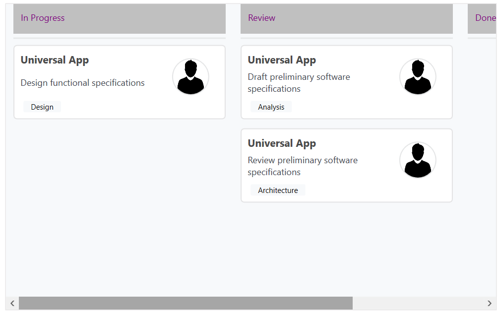
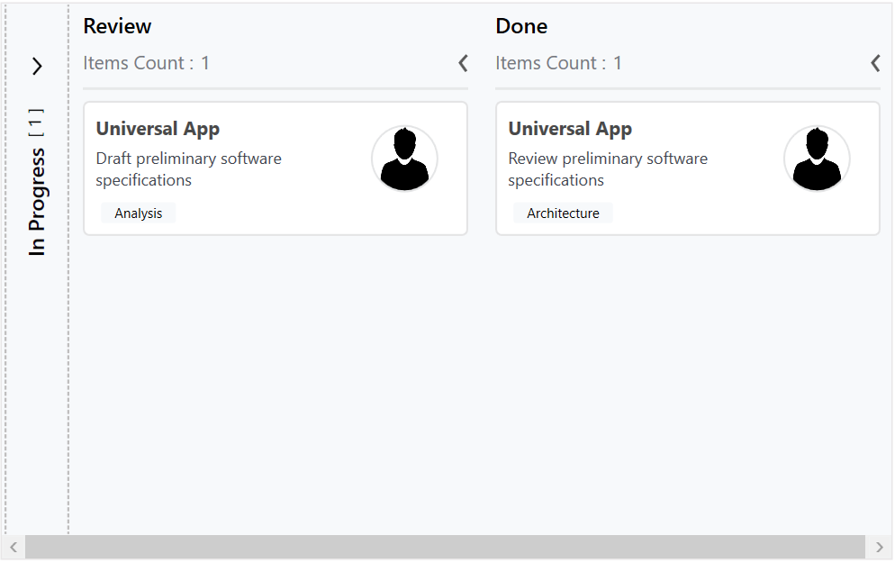

# Column in WPF Kanban (SfKanban) Control

## Customizing Column Size

By default, the columns are sized smartly to arrange the default elements of the cards with better readability. You can also define the minimum and maximum widths for the columns in [`SfKanban`](https://help.syncfusion.com/cr/wpf/Syncfusion.UI.Xaml.Kanban.SfKanban.html) using the [`MinColumnWidth`](https://help.syncfusion.com/cr/wpf/Syncfusion.UI.Xaml.Kanban.SfKanban.html#Syncfusion_UI_Xaml_Kanban_SfKanban_MinColumnWidth) and [`MaxColumnWidth`](https://help.syncfusion.com/cr/wpf/Syncfusion.UI.Xaml.Kanban.SfKanban.html#Syncfusion_UI_Xaml_Kanban_SfKanban_MaxColumnWidth) properties, respectively.

N> The snippets in this document use the `kanban:` prefix for the Syncfusion namespace. Make sure the following namespace mapping is declared on the root element: `xmlns:kanban="clr-namespace:Syncfusion.UI.Xaml.Kanban;assembly=Syncfusion.SfKanban.WPF"`.




<kanban:SfKanban MinColumnWidth="300" MaxColumnWidth="340" />




using Syncfusion.UI.Xaml.Kanban;

SfKanban kanban = new SfKanban();
kanban.MinColumnWidth = 300;
kanban.MaxColumnWidth = 340;




You can also define the exact column width using the [`ColumnWidth`](https://help.syncfusion.com/cr/wpf/Syncfusion.UI.Xaml.Kanban.SfKanban.html#Syncfusion_UI_Xaml_Kanban_SfKanban_ColumnWidth) property of [`SfKanban`](https://help.syncfusion.com/cr/wpf/Syncfusion.UI.Xaml.Kanban.SfKanban.html).




<kanban:SfKanban ColumnWidth="250" />




SfKanban kanban = new SfKanban();
kanban.ColumnWidth = 250;




## Categorizing Columns

Cards are categorized and added to the respective columns using the value of the [`Category`](https://help.syncfusion.com/cr/wpf/Syncfusion.UI.Xaml.Kanban.KanbanModel.html#Syncfusion_UI_Xaml_Kanban_KanbanModel_Category) property of [`KanbanModel`](https://help.syncfusion.com/cr/wpf/Syncfusion.UI.Xaml.Kanban.KanbanModel.html) when the [`ItemsSource`](https://help.syncfusion.com/cr/wpf/Syncfusion.UI.Xaml.Kanban.SfKanban.html#Syncfusion_UI_Xaml_Kanban_SfKanban_ItemsSource) is a collection of `KanbanModel`. However, if the `ItemsSource` is populated with custom objects, the property of the custom object used to categorize the cards must be defined explicitly using the [`ColumnMappingPath`](https://help.syncfusion.com/cr/wpf/Syncfusion.UI.Xaml.Kanban.SfKanban.html#Syncfusion_UI_Xaml_Kanban_SfKanban_ColumnMappingPath) property.




<kanban:SfKanban ColumnMappingPath="Group" />




SfKanban kanban = new SfKanban();
kanban.ColumnMappingPath = "Group";




### Populating the Column with Cards from Different Categories

More than one category can be mapped to a column by assigning multiple values to the [`Categories`](https://help.syncfusion.com/cr/wpf/Syncfusion.UI.Xaml.Kanban.KanbanColumn.html#Syncfusion_UI_Xaml_Kanban_KanbanColumn_Categories) collection of [`KanbanColumn`](https://help.syncfusion.com/cr/wpf/Syncfusion.UI.Xaml.Kanban.KanbanColumn.html). For example, you can map the "In Progress" and "Validated" categories under the "In Progress" column.




<kanban:SfKanban>
    <kanban:SfKanban.Columns>
        <kanban:KanbanColumn Title="In Progress"
                             Categories="In Progress,Validated">
        </kanban:KanbanColumn>
    </kanban:SfKanban.Columns>
</kanban:SfKanban>




using System.Collections.Generic;
using Syncfusion.UI.Xaml.Kanban;

SfKanban kanban = new SfKanban();
KanbanColumn progressColumn = new KanbanColumn()
{
    Title = "In Progress",
    Categories = new List<object>() { "In Progress", "Validated" }
};
kanban.Columns.Add(progressColumn);




## Column Header

The [`Header`](https://help.syncfusion.com/cr/wpf/Syncfusion.UI.Xaml.Kanban.ColumnTag.html#Syncfusion_UI_Xaml_Kanban_ColumnTag_Header) of a column shows the [`Title`](https://help.syncfusion.com/cr/wpf/Syncfusion.UI.Xaml.Kanban.KanbanColumn.html#Syncfusion_UI_Xaml_Kanban_KanbanColumn_Title), item count, and the minimum and maximum card limits of a column. The UI of the header can be replaced entirely using the [`ColumnHeaderTemplate`](https://help.syncfusion.com/cr/wpf/Syncfusion.UI.Xaml.Kanban.SfKanban.html#Syncfusion_UI_Xaml_Kanban_SfKanban_ColumnHeaderTemplate) property of [`SfKanban`](https://help.syncfusion.com/cr/wpf/Syncfusion.UI.Xaml.Kanban.SfKanban.html). The following code sample and screenshot illustrate this.




<kanban:SfKanban.ColumnHeaderTemplate>
    <DataTemplate>
        <StackPanel Width="300" Height="40" Background="Silver">
            <TextBlock Margin="10"
                       Text="{Binding Header}"
                       Foreground="Purple"
                       HorizontalAlignment="Left" />
        </StackPanel>
    </DataTemplate>
</kanban:SfKanban.ColumnHeaderTemplate>




## Column Tag

The [`Tags`](https://help.syncfusion.com/cr/wpf/Syncfusion.UI.Xaml.Kanban.KanbanColumn.html#Syncfusion_UI_Xaml_Kanban_KanbanColumn_Tags) property of [`KanbanColumn`](https://help.syncfusion.com/cr/wpf/Syncfusion.UI.Xaml.Kanban.KanbanColumn.html) customizes the header of a Kanban column. The following properties of [`ColumnTag`](https://help.syncfusion.com/cr/wpf/Syncfusion.UI.Xaml.Kanban.ColumnTag.html) are used to customize the column header:

* [`CardCount`](https://help.syncfusion.com/cr/wpf/Syncfusion.UI.Xaml.Kanban.ColumnTag.html#Syncfusion_UI_Xaml_Kanban_ColumnTag_CardCount) - Gets or sets the count of cards available in the column.
* [`Maximum`](https://help.syncfusion.com/cr/wpf/Syncfusion.UI.Xaml.Kanban.ColumnTag.html#Syncfusion_UI_Xaml_Kanban_ColumnTag_Maximum) - Gets or sets a value that indicates the maximum card limit of the `KanbanColumn`.
* [`Minimum`](https://help.syncfusion.com/cr/wpf/Syncfusion.UI.Xaml.Kanban.ColumnTag.html#Syncfusion_UI_Xaml_Kanban_ColumnTag_Minimum) - Gets or sets a value that indicates the minimum card limit of the `KanbanColumn`.
* [`IsExpanded`](https://help.syncfusion.com/cr/wpf/Syncfusion.UI.Xaml.Kanban.ColumnTag.html#Syncfusion_UI_Xaml_Kanban_ColumnTag_IsExpanded) - Gets or sets a value that indicates whether the `KanbanColumn` is expanded or collapsed.
* [`Header`](https://help.syncfusion.com/cr/wpf/Syncfusion.UI.Xaml.Kanban.ColumnTag.html#Syncfusion_UI_Xaml_Kanban_ColumnTag_Header) - Gets or sets an object which indicates the `KanbanColumn` header.

## Expand/Collapse Column

The columns can be expanded or collapsed by tapping the toggle button placed at the top-right corner of the Kanban column header. The [`IsExpanded`](https://help.syncfusion.com/cr/wpf/Syncfusion.UI.Xaml.Kanban.KanbanColumn.html#Syncfusion_UI_Xaml_Kanban_KanbanColumn_IsExpanded) property of [`KanbanColumn`](https://help.syncfusion.com/cr/wpf/Syncfusion.UI.Xaml.Kanban.KanbanColumn.html) is used to programmatically expand or collapse a Kanban column.




<kanban:SfKanban>
    <kanban:SfKanban.Columns>
        <kanban:KanbanColumn Title="In Progress"
                             IsExpanded="False"
                             Categories="In Progress,Validated">
        </kanban:KanbanColumn>
    </kanban:SfKanban.Columns>
</kanban:SfKanban>




using Syncfusion.UI.Xaml.Kanban;

SfKanban kanban = new SfKanban();
KanbanColumn kanbanColumn = new KanbanColumn()
{
    Title = "In Progress",
    IsExpanded = false
};
kanban.Columns.Add(kanbanColumn);




## Enable/Disable Drag and Drop

The Kanban control provides built-in support to enable or disable drag-and-drop functionality for both cards and columns, allowing flexible control over user interactions.

### Reordering Columns

Columns can be reordered in the WPF Kanban control using built-in drag-and-drop. Enable this by setting the [`AllowColumnReorder`](https://help.syncfusion.com/cr/wpf/Syncfusion.UI.Xaml.Kanban.SfKanban.html#Syncfusion_UI_Xaml_Kanban_SfKanban_AllowColumnReorder) property of [`SfKanban`](https://help.syncfusion.com/cr/wpf/Syncfusion.UI.Xaml.Kanban.SfKanban.html) to `true`. The default value is `false`.




<kanban:SfKanban AllowColumnReorder="True" />




SfKanban kanban = new SfKanban();
kanban.AllowColumnReorder = true;




### Dragging Cards

You can enable or disable the drag-and-drop operation of cards for a particular column using the [`AllowDrag`](https://help.syncfusion.com/cr/wpf/Syncfusion.UI.Xaml.Kanban.KanbanColumn.html#Syncfusion_UI_Xaml_Kanban_KanbanColumn_AllowDrag) property of [`KanbanColumn`](https://help.syncfusion.com/cr/wpf/Syncfusion.UI.Xaml.Kanban.KanbanColumn.html).




<kanban:SfKanban>
    <kanban:SfKanban.Columns>
        <kanban:KanbanColumn Title="In Progress" AllowDrag="False" />
    </kanban:SfKanban.Columns>
</kanban:SfKanban>




SfKanban kanban = new SfKanban();
KanbanColumn kanbanColumn = new KanbanColumn()
{
    Title = "In Progress",
    AllowDrag = false
};
kanban.Columns.Add(kanbanColumn);



