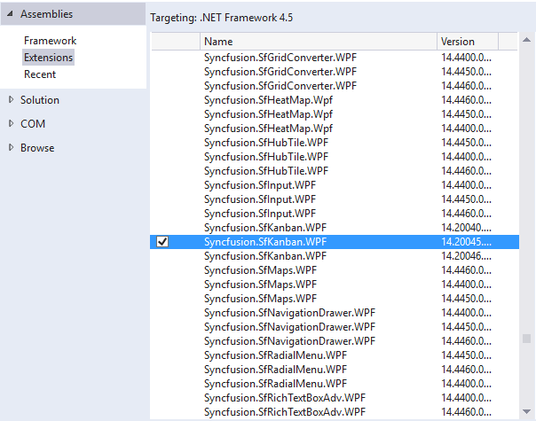
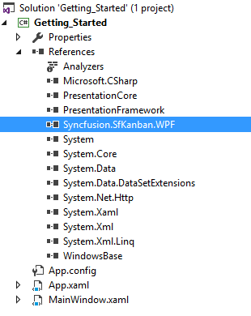
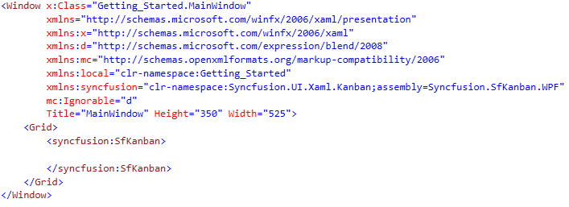
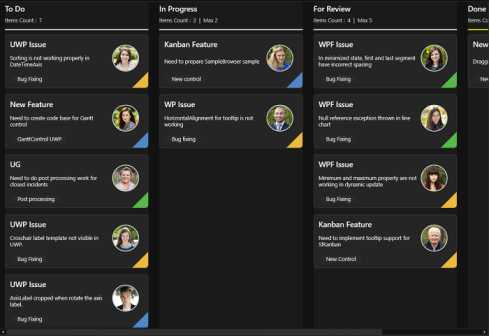

# Getting Started with WPF Kanban(SfKanban)

The following section provides an assistance to create a simple Kanban application and to configure it. 

## Adding assembly reference

1. Open the Add Reference window from your project
2. Choose Assemblies -> Extensions -> Syncfusion.SfKanban.WPF

N> This window differs for the Visual Basic project.

## Create a simple Kanban Board

In this section, we'll demonstrate how to build a new WPF application that integrates the `SfKanban` control.

### Adding SfKanban

1. Add the required assembly references to the project as discussed in the Reference Essential Studio Components in your Solution section.
2. Add the “Syncfusion.UI.Xaml.Kanban” namespace to the application as shown below.





xmlns:syncfusion="clr-namespace:Syncfusion.UI.Xaml.Kanban;assembly=Syncfusion.SfKanban.WPF"



using Syncfusion.UI.Xaml.Kanban;



{{ codesnippet1 | OrderList_Indent_Level_1 }}

3. Create an instance of SfKanban control.





<syncfusion:SfKanban>

</syncfusion:SfKanban>




SfKanban kanban = new SfKanban();





{{ codesnippet2 | OrderList_Indent_Level_1 }}

### Adding SfKanban from toolbox

Drag and drop the Kanban control from the toolbox to your application.

Now the Syncfusion.SfKanban.WPF reference is added to the application references and the xmlns namespace code is generated in MainWindow.xaml as below.

## Populate WPF Kanban item source

This section explains how to populate the WPF Kanban control's `ItemSource` by creating and binding both default and custom task data models.

### Creating the default model tasks

* **Define the View Model:** Create a view model class to set values for the properties listed in the [`KanbanModel`](https://help.syncfusion.com/cr/wpf/Syncfusion.UI.Xaml.Kanban.KanbanModel.html) class as shown in the following example code. Each [`KanbanModel`](https://help.syncfusion.com/cr/wpf/Syncfusion.UI.Xaml.Kanban.KanbanModel.html) instance represent a card in Kanban control.

* **Bind item source for Kanban:** To populate the kanban card items, utilize the [`ItemsSource`](https://help.syncfusion.com/cr/wpf/Syncfusion.UI.Xaml.Kanban.SfKanban.html#Syncfusion_UI_Xaml_Kanban_SfKanban_ItemsSource) property of [`SfKanban`](https://help.syncfusion.com/cr/wpf/Syncfusion.UI.Xaml.Kanban.SfKanban.html).

* **Defining columns in the Kanban Board:** The columns are generated automatically based on the different values of the [`Category`](https://help.syncfusion.com/cr/wpf/Syncfusion.UI.Xaml.Kanban.KanbanModel.html#Syncfusion_UI_Xaml_Kanban_KanbanModel_Category) in the [`KanbanModel`](https://help.syncfusion.com/cr/wpf/Syncfusion.UI.Xaml.Kanban.KanbanModel.html) class from the [`ItemsSource`](https://help.syncfusion.com/cr/wpf/Syncfusion.UI.Xaml.Kanban.SfKanban.html#Syncfusion_UI_Xaml_Kanban_SfKanban_ItemsSource). However, you can manually define the columns by setting the [`AutoGenerateColumns`](https://help.syncfusion.com/cr/wpf/Syncfusion.UI.Xaml.Kanban.SfKanban.html#Syncfusion_UI_Xaml_Kanban_SfKanban_AutoGenerateColumns) property to `false` and adding [`KanbanColumn`](https://help.syncfusion.com/cr/wpf/Syncfusion.UI.Xaml.Kanban.KanbanColumn.html) instances to the [`Columns`](https://help.syncfusion.com/cr/wpf/Syncfusion.UI.Xaml.Kanban.SfKanban.html#Syncfusion_UI_Xaml_Kanban_SfKanban_Columns) property of [`SfKanban`](https://help.syncfusion.com/cr/wpf/Syncfusion.UI.Xaml.Kanban.SfKanban.html). You can define the column categories using the [`Categories`](https://help.syncfusion.com/cr/wpf/Syncfusion.UI.Xaml.Kanban.KanbanColumn.html#Syncfusion_UI_Xaml_Kanban_KanbanColumn_Categories) property of [`KanbanColumn`](https://help.syncfusion.com/cr/wpf/Syncfusion.UI.Xaml.Kanban.KanbanColumn.html), and the cards will be added to their respective columns.

The following sample code demonstrates this process in action:




<Grid x:Name="grid">
    <syncfusion:SfKanban x:Name="kanban"
                         ItemsSource="{Binding Tasks}"
                         AutoGenerateColumns="False">
        <syncfusion:SfKanban.DataContext>
            <local:ViewModel />
        </syncfusion:SfKanban.DataContext>
        <syncfusion:KanbanColumn Categories="Open"
                                 Title="To Do"/>
        <syncfusion:KanbanColumn Categories="In Progress"
                                 Title="In Progress"/>
        <syncfusion:KanbanColumn Categories="Review,Done"
                                 Title="Done"/>
    </syncfusion:SfKanban>
</Grid>




SfKanban kanban = new SfKanban()
{
    AutoGenerateColumns = false,
    ItemsSource = new ViewModel().Tasks
};

kanban.Columns.Add(new KanbanColumn()
{
    Categories = "Open",
    Title = "To Do"
});

kanban.Columns.Add(new KanbanColumn()
{
    Categories = "In Progress",
    Title = "In Progress"
});

kanban.Columns.Add(new KanbanColumn()
{
    Categories = "Review,Done",
    Title = "Done"
});

this.grid.Children.Add(kanban);




using Syncfusion.UI.Xaml.Kanban;

public class ViewModel
{
    public ObservableCollection<KanbanModel> Tasks { get; set; }
    public ViewModel()
    {
        Tasks = new ObservableCollection<KanbanModel>();
        Tasks.Add(new KanbanModel()
        {
            Title = "Universal App",
            ID = "27654",
            Description = "Incorporate feedback into functional specifications",
            Category = "Open",
            ColorKey = "Low",
            Tags = new string[] { "Deployment" },
        });

        Tasks.Add(new KanbanModel()
        {
            Title = "Universal App",
            ID = "29477",
            Description = "Design functional specifications",
            Category = "In Progress",
            ColorKey = "Normal",
            Tags = new string[] { "Design" },
        });

        Tasks.Add(new KanbanModel()
        {
            Title = "Universal App",
            ID = "25678",
            Description = "Review preliminary software specifications",
            Category = "Done",
            ColorKey = "Low",
            Tags = new string[] { "Analysis" },
        });

        Tasks.Add(new KanbanModel()
        {
            Title = "Universal App",
            ID = "6593",
            Description = "Draft preliminary software specifications",
            Category = "Review",
            ColorKey = "High",
            Tags = new string[] { "Analysis" },
        });
    }
}




N> View the sample in [`GitHub`](https://github.com/SyncfusionExamples/Getting-started-in-SfKanban-WPF).

### Creating the custom model tasks with data mapping

You can also map custom data model to our Kanban control. The following steps demonstrate how to render tasks using the [WPF Kanban](https://help.syncfusion.com/cr/wpf/Syncfusion.UI.Xaml.Kanban.SfKanban.html) control with respective custom data properties.

* **Create a data model for kanban:** Create a simple data model in a new class file as shown in the following example code.

* **Create view model:** Create a view model class to set values for the properties listed in the model class as shown in the following example code.

* **Bind item source for Kanban:** To populate the Kanban card items, utilize the [`ItemsSource`](https://help.syncfusion.com/cr/wpf/Syncfusion.UI.Xaml.Kanban.SfKanban.html#Syncfusion_UI_Xaml_Kanban_SfKanban_ItemsSource) property of [`SfKanban`](https://help.syncfusion.com/cr/wpf/Syncfusion.UI.Xaml.Kanban.SfKanban.html) control. Additionally, ensure that the following property of `SfKanban` are mapped from corresponding properties in the `ItemsSource` while initializing the kanban control.

The [ColumnMappingPath](https://help.syncfusion.com/cr/wpf/Syncfusion.UI.Xaml.Kanban.SfKanban.html#Syncfusion_UI_Xaml_Kanban_SfKanban_ColumnMappingPath) specifies the name of the property within the data object that is used to generate columns in the Kanban control when [`AutoGenerateColumns`](https://help.syncfusion.com/cr/wpf/Syncfusion.UI.Xaml.Kanban.SfKanban.html#Syncfusion_UI_Xaml_Kanban_SfKanban_AutoGenerateColumns) is set to `true`.

* **Defining columns in the Kanban Board:** The [`Columns`](https://help.syncfusion.com/cr/wpf/Syncfusion.UI.Xaml.Kanban.SfKanban.html#Syncfusion_UI_Xaml_Kanban_SfKanban_Columns) in the Kanban board are mapped based on the values of a specified property (e.g., "Status") from your custom data model. The [`ColumnMappingPath`](https://help.syncfusion.com/cr/wpf/Syncfusion.UI.Xaml.Kanban.SfKanban.html#Syncfusion_UI_Xaml_Kanban_SfKanban_ColumnMappingPath) specifies the name of the property within the data object that is used to generate columns in the Kanban control when [`AutoGenerateColumns`](https://help.syncfusion.com/cr/wpf/Syncfusion.UI.Xaml.Kanban.SfKanban.html#Syncfusion_UI_Xaml_Kanban_SfKanban_AutoGenerateColumns) is set to `true`.

Alternatively, you can manually define columns by setting [`AutoGenerateColumns`](https://help.syncfusion.com/cr/wpf/Syncfusion.UI.Xaml.Kanban.SfKanban.html#Syncfusion_UI_Xaml_Kanban_SfKanban_AutoGenerateColumns) to `false` and adding instances of [`KanbanColumn`](https://help.syncfusion.com/cr/wpf/Syncfusion.UI.Xaml.Kanban.KanbanColumn.html) to the [`Columns`](https://help.syncfusion.com/cr/wpf/Syncfusion.UI.Xaml.Kanban.SfKanban.html#Syncfusion_UI_Xaml_Kanban_SfKanban_Columns) collection of the [`SfKanban`](https://help.syncfusion.com/cr/wpf/Syncfusion.UI.Xaml.Kanban.SfKanban.html) control. Based on the property specified in [ColumnMappingPath](https://help.syncfusion.com/cr/wpf/Syncfusion.UI.Xaml.Kanban.SfKanban.html#Syncfusion_UI_Xaml_Kanban_SfKanban_ColumnMappingPath), the Kanban control will generate the columns and render the corresponding cards accordingly.

Let’s look at the practical code example:




<syncfusion:SfKanban x:Name="kanban"
                     ColumnMappingPath="Status"
                     ItemsSource="{Binding Tasks}">
    <syncfusion:SfKanban.DataContext>
        <local:ViewModel />
    </syncfusion:SfKanban.DataContext>
    <syncfusion:SfKanban.CardTemplate>
        <DataTemplate>
            <Border BorderBrush="Black"
                    BorderThickness="1"
                    CornerRadius="3"
                    Background="#F3CFCE">
                <StackPanel Margin="10">
                    <TextBlock Text="{Binding Title}"
                               TextAlignment="Center"
                               FontWeight="Bold"
                               FontSize="14" />
                    <TextBlock Text="{Binding Description}"
                               TextAlignment="Center"
                               FontSize="12"
                               TextWrapping="Wrap"
                               Margin="5" />
                </StackPanel>
            </Border>
        </DataTemplate>
    </syncfusion:SfKanban.CardTemplate>
</syncfusion:SfKanban>




this.kanban.ItemsSource = new ViewModel().Tasks;
this.kanban.ColumnMappingPath = "Status";




public class TaskDetails
{
    public string Title { get; set; }
    public string Description { get; set; }
    public object Status { get; set; }
}





public class ViewModel
{
    public ObservableCollection<TaskDetails> Tasks { get; set; }
    public ViewModel()
    {
        Tasks = new ObservableCollection<TaskDetails>();
        Tasks.Add(new TaskDetails()
        {
            Title = "Universal App",
            Description = "Incorporate feedback into functional specifications",
            Status = "Open",
        });

        Tasks.Add(new TaskDetails()
        {
            Title = "Universal App",
            Description = "Design functional specifications",
            Status = "In Progress",
        });

        Tasks.Add(new TaskDetails()
        {
            Title = "Universal App",
            Description = "Review preliminary software specifications",
            Status = "Done",
        });

        Tasks.Add(new TaskDetails()
        {
            Title = "Universal App",
            Description = "Draft preliminary software specifications",
            Status = "Review",
        });
    }
}




You can also set [`AutoGenerateColumns`](https://help.syncfusion.com/cr/wpf/Syncfusion.UI.Xaml.Kanban.SfKanban.html#Syncfusion_UI_Xaml_Kanban_SfKanban_AutoGenerateColumns) property to true in which you don’t need to define the columns as mentioned in the above example. This will create columns depending on the ColumnMappingPath property for all the distinct values in ItemsSource.

N> 
* When the columns are auto-generated, you can handle the ColumnsGenerated event to customize the columns.
* When using a custom data model, the default card UI is not applicable. You must define a custom `DataTemplate` using the [`CardTemplate`](https://help.syncfusion.com/cr/wpf/Syncfusion.UI.Xaml.Kanban.SfKanban.html#Syncfusion_UI_Xaml_Kanban_SfKanban_CardTemplate) property to render the card content appropriately.

## Theme

Kanban control supports various built-in themes. Refer to the below links to apply themes for the Kanban control,

  * [Apply theme using SfSkinManager](https://help.syncfusion.com/wpf/themes/skin-manager)
	
  * [Create a custom theme using ThemeStudio](https://help.syncfusion.com/wpf/themes/theme-studio#creating-custom-theme)

  