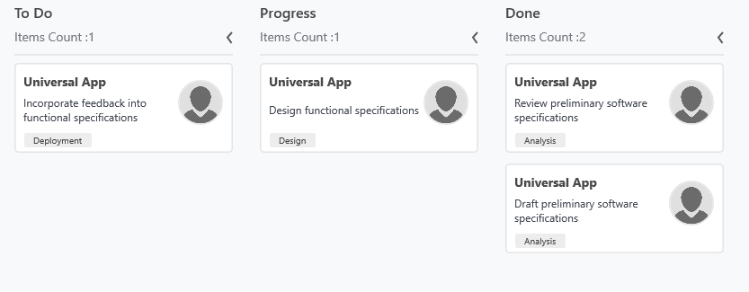

# Getting Started with WPF Kanban(SfKanban)

The following section provides an assistance to create a simple Kanban application and to configure it. 

## Adding assembly reference

1. Open the Add Reference window from your project
2. Choose Assemblies -> Extensions -> Syncfusion.SfKanban.WPF

N> This window differs for the Visual Basic project.

## Create a simple Kanban

### Adding SfKanban

1. Add the required assembly references to the project as discussed in the Reference Essential Studio Components in your Solution section.
2. Add the “Syncfusion.UI.Xaml.Kanban” namespace to the application as shown below.





xmlns:syncfusion="clr-namespace:Syncfusion.UI.Xaml.Kanban;assembly=Syncfusion.SfKanban.WPF"



using Syncfusion.UI.Xaml.Kanban;



{{ codesnippet1 | OrderList_Indent_Level_1 }}

3. Create an instance of SfKanban control.





<syncfusion:SfKanban>

</syncfusion:SfKanban>




SfKanban kanban = new SfKanban();





{{ codesnippet2 | OrderList_Indent_Level_1 }}

### Adding SfKanban from toolbox

Drag and drop the Kanban control from the toolbox to your application.

Now the Syncfusion.SfKanban.WPF reference is added to the application references and the xmlns namespace code is generated in MainWindow.xaml as below.

## Populate WPF Kanban item source

### Creating the default model tasks

* **Define the View Model:** Create a view model class to set values for the properties listed in the [`KanbanModel`](https://help.syncfusion.com/cr/wpf/Syncfusion.UI.Xaml.Kanban.KanbanModel.html) instance. Each [`KanbanModel`](https://help.syncfusion.com/cr/wpf/Syncfusion.UI.Xaml.Kanban.KanbanModel.html) instance represents a card in the Kanban control.
* **Bind item source for Kanban:** To populate the kanban card items, utilize the [`ItemsSource`]() property of [`SfKanban`](https://help.syncfusion.com/cr/wpf/Syncfusion.UI.Xaml.Kanban.SfKanban.html).
* **Defining columns in the Kanban Board:** The columns are generated automatically based on the different values of the [`Category`](https://help.syncfusion.com/cr/wpf/Syncfusion.UI.Xaml.Kanban.KanbanModel.html#Syncfusion_UI_Xaml_Kanban_KanbanModel_Category) in the [`KanbanModel`](https://help.syncfusion.com/cr/wpf/Syncfusion.UI.Xaml.Kanban.KanbanModel.html) class from the [`ItemsSource`](https://help.syncfusion.com/cr/wpf/Syncfusion.UI.Xaml.Kanban.SfKanban.html#Syncfusion_UI_Xaml_Kanban_SfKanban_ItemsSource). However, you can manually define the columns by setting the [`AutoGenerateColumns`](https://help.syncfusion.com/cr/wpf/Syncfusion.UI.Xaml.Kanban.SfKanban.html#Syncfusion_UI_Xaml_Kanban_SfKanban_AutoGenerateColumns) property to `false` and adding [`KanbanColumn`](https://help.syncfusion.com/cr/wpf/Syncfusion.UI.Xaml.Kanban.KanbanColumn.html) instances to the [`Columns`](https://help.syncfusion.com/cr/wpf/Syncfusion.UI.Xaml.Kanban.SfKanban.html#Syncfusion_UI_Xaml_Kanban_SfKanban_Columns) property of [`SfKanban`](https://help.syncfusion.com/cr/wpf/Syncfusion.UI.Xaml.Kanban.SfKanban.html). You can define the column categories using the [`Categories`](https://help.syncfusion.com/cr/wpf/Syncfusion.UI.Xaml.Kanban.KanbanColumn.html#Syncfusion_UI_Xaml_Kanban_KanbanColumn_Categories) property of [`KanbanColumn`](https://help.syncfusion.com/cr/wpf/Syncfusion.UI.Xaml.Kanban.KanbanColumn.html), and the cards will be added to their respective columns.

The following sample code demonstrates this process in action:





<Window x:Class="Getting_Started.MainWindow"
        xmlns="http://schemas.microsoft.com/winfx/2006/xaml/presentation"
        xmlns:x="http://schemas.microsoft.com/winfx/2006/xaml"
        xmlns:d="http://schemas.microsoft.com/expression/blend/2008"
        xmlns:mc="http://schemas.openxmlformats.org/markup-compatibility/2006"
        xmlns:local="clr-namespace:Getting_Started"
        xmlns:syncfusion="clr-namespace:Syncfusion.UI.Xaml.Kanban;assembly=Syncfusion.SfKanban.WPF"
        mc:Ignorable="d"
        Title="MainWindow" Height="450" Width="800">
    <Window.DataContext>
        <local:TaskDetails/>
    </Window.DataContext>
    <Grid x:Name="grid">
        <syncfusion:SfKanban x:Name="kanban"
							 MinColumnWidth="150"
							 ColumnMappingPath="Category"
							 ItemsSource="{Binding Tasks}"
							 AutoGenerateColumns="False">

			<syncfusion:KanbanColumn Categories="Open"
									 Title="To Do"></syncfusion:KanbanColumn>

			<syncfusion:KanbanColumn Categories="In Progress"
									 Title="Progress"></syncfusion:KanbanColumn>

			<syncfusion:KanbanColumn Categories="Review,Done"
									 Title="Done"></syncfusion:KanbanColumn>

		</syncfusion:SfKanban>
    </Grid>
</Window>





SfKanban kanban = new SfKanban()
{
    AutoGenerateColumns = false,
    ItemsSource = new TaskDetails().Tasks
};

kanban.Columns.Add(new KanbanColumn()
{
    Categories = "Open",
    Title = "To Do",
    MinimumLimit = 1,
    MaximumLimit = 2,
});

kanban.Columns.Add(new KanbanColumn()
{
    Categories = "In Progress",
    Title = "Progress",
    MinimumLimit = 1,
    MaximumLimit = 2
});

kanban.Columns.Add(new KanbanColumn()
{
    Categories = "Review,Done",
    Title = "Done",
    MinimumLimit = 1,
    MaximumLimit = 2
});

this.grid.Children.Add(kanban);





using Syncfusion.UI.Xaml.Kanban;
public class KanbanViewModel
{
    public ObservableCollection<KanbanModel> Tasks { get; set; }

    public KanbanViewModel()
    {

        Tasks = new ObservableCollection<KanbanModel>();

        Tasks.Add(new KanbanModel()
        {
            Title = "Universal App",
            ID = "27654",
            Description = "Incorporate feedback into functional specifications",
            Category = "Open",
            ColorKey = "Low",
            Tags = new string[] { "Deployment" },
            ImageURL = new Uri("/images/People_Circle1.png", UriKind.RelativeOrAbsolute)
        });

        Tasks.Add(new KanbanModel()
        {
            Title = "Universal App",
            ID = "29477",
            Description = "Design functional specifications",
            Category = "In Progress",
            ColorKey = "Normal",
            Tags = new string[] { "Design" },
            ImageURL = new Uri("/images/People_Circle2.png", UriKind.RelativeOrAbsolute)
        });

        Tasks.Add(new KanbanModel()
        {
            Title = "Universal App",
            ID = "25678",
            Description = "Review preliminary software specifications",
            Category = "Done",
            ColorKey = "Low",
            Tags = new string[] { "Analysis" },
            ImageURL = new Uri("/images/People_Circle3.png", UriKind.RelativeOrAbsolute)
        });

        Tasks.Add(new KanbanModel()
        {
            Title = "Universal App",
            ID = "6593",
            Description = "Draft preliminary software specifications",
            Category = "Review",
            ColorKey = "High",
            Tags = new string[] { "Analysis" },
            ImageURL = new Uri("/images/People_Circle4.png", UriKind.RelativeOrAbsolute)
        });
    }
}





You can find the complete getting started sample from this [`link`](https://github.com/SyncfusionExamples/Getting-started-in-SfKanban-WPF).

### Creating the custom model tasks with data mapping

You can also map custom model data to our Kanban. Here are the steps to render tasks using the [WPF Kanban](https://help.syncfusion.com/cr/wpf/Syncfusion.UI.Xaml.Kanban.SfKanban.html) control with respective custom data properties.

* **Define the the Custom Model:** Create a custom class `TaskDetails` with mandatory fields `Subject`, `Details`, and `Status` similar to the [`KanbanModel`](https://help.syncfusion.com/cr/wpf/Syncfusion.UI.Xaml.Kanban.KanbanModel.html) fields `Title`, `Description`, and `Category`.
* **Define the the Custom View Model:** Create a `ViewModel` class with a collection property to hold instances of your custom model. Each custom model instance should represent a card in the Kanban control, similar to the [`KanbanModel`](https://help.syncfusion.com/cr/wpf/Syncfusion.UI.Xaml.Kanban.KanbanModel.html) instance provided by Syncfusion.
* **Bind the ViewModel:** Set the `ViewModel` instance as the `BindingContext` of your Page; this is done to bind properties of `ViewModel` to [`SfKanban`](https://help.syncfusion.com/cr/wpf/Syncfusion.UI.Xaml.Kanban.SfKanban.html).
* **Bind Data to the Kanban Board:** Assign the custom data collection to the [`ItemsSource`](https://help.syncfusion.com/cr/wpf/Syncfusion.UI.Xaml.Kanban.SfKanban.html#Syncfusion_UI_Xaml_Kanban_SfKanban_ItemsSource) property of [`SfKanban`](https://help.syncfusion.com/cr/wpf/Syncfusion.UI.Xaml.Kanban.SfKanban.html). Specify the property in your custom model that represents the column field (such as "Status") by setting the [`ColumnMappingPath`](https://help.syncfusion.com/cr/wpf/Syncfusion.UI.Xaml.Kanban.SfKanban.html#Syncfusion_UI_Xaml_Kanban_SfKanban_ColumnMappingPath) property.
* **Defining columns in the Kanban Board:** The [`Columns`](https://help.syncfusion.com/cr/wpf/Syncfusion.UI.Xaml.Kanban.SfKanban.html#Syncfusion_UI_Xaml_Kanban_SfKanban_Columns) are mapped based on the values of your specified column property (e.g., "Status") from the custom model, not [`Category`](https://help.syncfusion.com/cr/wpf/Syncfusion.UI.Xaml.Kanban.KanbanModel.html#Syncfusion_UI_Xaml_Kanban_KanbanModel_Category). You can allow columns to be generated automatically, or set [`AutoGenerateColumns`](https://help.syncfusion.com/cr/wpf/Syncfusion.UI.Xaml.Kanban.SfKanban.html#Syncfusion_UI_Xaml_Kanban_SfKanban_AutoGenerateColumns) to `false` and manually define columns using the required values from your custom data (for example, `Open`, `In Progress`, `Done`, etc.) in the [`Categories`](https://help.syncfusion.com/cr/wpf/Syncfusion.UI.Xaml.Kanban.KanbanColumn.html#Syncfusion_UI_Xaml_Kanban_KanbanColumn_Categories) property.

Let’s look at the practical code example:





<Window x:Class="Getting_Started.MainWindow"
        xmlns="http://schemas.microsoft.com/winfx/2006/xaml/presentation"
        xmlns:x="http://schemas.microsoft.com/winfx/2006/xaml"
        xmlns:d="http://schemas.microsoft.com/expression/blend/2008"
        xmlns:mc="http://schemas.openxmlformats.org/markup-compatibility/2006"
        xmlns:local="clr-namespace:Getting_Started"
        xmlns:syncfusion="clr-namespace:Syncfusion.UI.Xaml.Kanban;assembly=Syncfusion.SfKanban.WPF"
        mc:Ignorable="d"
        Title="MainWindow" Height="450" Width="800">
    <Window.DataContext>
        <local:TaskDetails/>
    </Window.DataContext>
    <Grid x:Name="grid">
        <syncfusion:SfKanban x:Name="kanban"
							 MinColumnWidth="150"
							 ColumnMappingPath="Category"
							 ItemsSource="{Binding Tasks}"
							 AutoGenerateColumns="False">
			<syncfusion:SfKanban.CardTemplate>
				<DataTemplate>
					<StackPanel Width="250"
								Orientation="Vertical"
								Background="Gray"
								Padding="10,10,10,10">
						<StackPanel  Orientation="Horizontal">
							<TextBlock Text="{Binding Subject}"
									   Foreground="Silver"
									   HorizontalAlignment="Stretch">
							</TextBlock>
						</StackPanel>
						<StackPanel  Orientation="Horizontal">
							<TextBox Text="{Binding Details}"
									 Width="150"
									 FontSize="14"
									 Foreground="Silver"
									 TextWrapping="Wrap" />
							<Image Source="{Binding Avatar}"
								   Height="50"
								   Width="50" />
						</StackPanel>
					</StackPanel>
				</DataTemplate>
			</syncfusion:SfKanban.CardTemplate>

			<syncfusion:KanbanColumn Categories="Open,Postponed"
									 Title="To Do"></syncfusion:KanbanColumn>

			<syncfusion:KanbanColumn Categories="In Progress"
									 Title="In Progress"></syncfusion:KanbanColumn>

			<syncfusion:KanbanColumn Categories="Code Review"
									 Title="For Review"></syncfusion:KanbanColumn>

			<syncfusion:KanbanColumn Categories="Closed,Closed No Changes,Won't Fix"
									 Title="Done"></syncfusion:KanbanColumn>

		</syncfusion:SfKanban>
    </Grid>
</Window>





this.kanban.AutoGenerateColumns = false;
this.kanban.ItemsSource = new KanbanViewModel().TaskDetails;
this.kanban.ColumnMappingPath="Status"

this.kanban.Columns.Add(new KanbanColumn() { Title = "To Do", Categories = "Open", "Postponed" });
this.kanban.Columns.Add(new KanbanColumn() { Title = "In Progress", Categories = "In Progress" });
this.kanban.Columns.Add(new KanbanColumn() { Title = "For Review", Categories = "Code Review" });
this.kanban.Columns.Add(new KanbanColumn() { Title = "Done", Categories = "Closed", "Closed No Changes", "Won't Fix" });





public class TaskDetails : INotifyPropertyChanged
{
    private string subject;

    private string details;

    private object status;

    private string owner;

    public TaskDetails()
    {
        subject = string.Empty;
        details = string.Empty;
        status = string.Empty;
        owner = string.Empty;
        Avatar = new Image();
        PriorityColor = string.Empty;
        ReferenceNumber = string.Empty;
        Labels = new List<string>();
    }

    public string Subject
    {
        get
        {
            return this.subject;
        }

        set
        {
            this.subject = value;
            this.NotifyPropertyChanged("Subject");
        }
    }

    public string Details
    {
        get
        {
            return this.details;
        }

        set
        {
            this.details = value;
            this.NotifyPropertyChanged("Details");
        }
    }

    public object Status
    {
        get
        {
            return this.status;
        }

        set
        {
            this.status = value;
            this.NotifyPropertyChanged("Status");
        }
    }

    public string Owner
    {
        get
        {
            return this.owner;
        }

        set
        {
            this.owner = value;
            this.NotifyPropertyChanged("Owner");
        }
    }

    public Image Avatar
    {
        get; set;
    }

    public object PriorityColor
    {
        get; set;
    }

    public object ReferenceNumber
    {
        get; set;
    }

    public List<string> Labels
    {
        get; set;
    }

    public event PropertyChangedEventHandler? PropertyChanged;

    internal void NotifyPropertyChanged(string propertyName)
    {
        if (this.PropertyChanged != null)
        {
            this.PropertyChanged(this, new PropertyChangedEventArgs(propertyName));
        }
    }
}





public class KanbanViewModel
{
    public ObservableCollection<TaskDetails> TaskDetails { get; set; }

    public KanbanViewModel()
    {
        this.TaskDetails = this.GetTaskDetails();
    }

    private ObservableCollection<TaskDetails> GetTaskDetails()
    {
        var taskDetails = new ObservableCollection<TaskDetails>();
        string path = @"ms-appx:///";

        TaskDetails taskDetail = new TaskDetails();
        taskDetail.Subject = "UWP Issue";
        taskDetail.Details = "Sorting is not working properly in DateTimeAxis";
        taskDetail.Status = "Postponed";
        taskDetail.ReferenceNumber = "6593";
        taskDetail.PriorityColor = "High";
        taskDetail.Labels = new List<string>() { "Bug Fixing" };
        taskDetail.Avatar = new Image
        {
            Source = new BitmapImage(new Uri(path + "Assets/Kanban/People_Circle1.png"))
        };

        taskDetails.Add(taskDetail);

        taskDetail = new TaskDetails();
        taskDetail.Subject = "WPF Issue";
        taskDetail.Details = "Crosshair label template not visible in UWP";
        taskDetail.Status = "Open";
        taskDetail.ReferenceNumber = "6593";
        taskDetail.PriorityColor = "High";
        taskDetail.Labels = new List<string>() { "Bug GanttControl" };
        taskDetail.Avatar = new Image
        {
            Source = new BitmapImage(new Uri(path + "Assets/Kanban/People_Circle2.png"))
        };

        taskDetails.Add(taskDetail);

        taskDetail = new TaskDetails();
        taskDetail.Subject = "WinUI Issue";
        taskDetail.Details = "AxisLabel cropped when rotating the axis label";
        taskDetail.Status = "In Progress";
        taskDetail.ReferenceNumber = "6593";
        taskDetail.PriorityColor = "High";
        taskDetail.Labels = new List<string>() { "Bug processing" };
        taskDetail.Avatar = new Image
        {
            Source = new BitmapImage(new Uri(path + "Assets/Kanban/People_Circle3.png"))
        };

        taskDetails.Add(taskDetail);

        taskDetail = new TaskDetails();
        taskDetail.Subject = "UWP Issue";
        taskDetail.ReferenceNumber = "651";
        taskDetail.Details = "Crosshair label template not visible in UWP";
        taskDetail.Status = "Open";
        taskDetail.PriorityColor = "High";
        taskDetail.Labels = new List<string>() { "Bug Fixing" };
        taskDetail.Avatar = new Image
        {
            Source = new BitmapImage(new Uri(path + "Assets/Kanban/People_Circle4.png"))
        };

        taskDetails.Add(taskDetail);

        taskDetail = new TaskDetails();
        taskDetail.Subject = "Kanban Feature";
        taskDetail.ReferenceNumber = "25678";
        taskDetail.Details = "Provide drag and drop support";
        taskDetail.Status = "In Progress";
        taskDetail.PriorityColor = "Low";
        taskDetail.Labels = new List<string>() { "New control" };
        taskDetail.Avatar = new Image
        {
            Source = new BitmapImage(new Uri(path + "Assets/Kanban/People_Circle5.png"))
        };

        taskDetails.Add(taskDetail);

        taskDetail = new TaskDetails();
        taskDetail.Subject = "WF Issue";
        taskDetail.ReferenceNumber = "1254";
        taskDetail.Details = "HorizontalAlignment for tooltip is not working";
        taskDetail.Status = "In Progress";
        taskDetail.PriorityColor = "High";
        taskDetail.Labels = new List<string>() { "Bug fixing" };
        taskDetail.Avatar = new Image
        {
            Source = new BitmapImage(new Uri(path + "Assets/Kanban/People_Circle1.png"))
        };

        taskDetails.Add(taskDetail);

        taskDetail = new TaskDetails();
        taskDetail.Subject = "WPF Issue";
        taskDetail.ReferenceNumber = "28066";
        taskDetail.Details = "In minimized state, first and last segments have incorrect spacing";
        taskDetail.Status = "Code Review";
        taskDetail.PriorityColor = "Normal";
        taskDetail.Labels = new List<string>() { "Bug Fixing" };
        taskDetail.Avatar = new Image
        {
            Source = new BitmapImage(new Uri(path + "Assets/Kanban/People_Circle2.png"))
        };

        taskDetails.Add(taskDetail);

        taskDetail = new TaskDetails();
        taskDetail.Subject = "WPF Issue";
        taskDetail.ReferenceNumber = "28066";
        taskDetail.Details = "In minimized state, first and last segments have incorrect spacing";
        taskDetail.Status = "Code Review";
        taskDetail.PriorityColor = "Normal";
        taskDetail.Labels = new List<string>() { "Bug Fixing" };
        taskDetail.Avatar = new Image
        {
            Source = new BitmapImage(new Uri(path + "Assets/Kanban/People_Circle3.png"))
        };

        taskDetails.Add(taskDetail);

        taskDetail = new TaskDetails();
        taskDetail.Subject = "New Feature";
        taskDetail.ReferenceNumber = "29574";
        taskDetail.Details = "Dragging events support for Kanban";
        taskDetail.Status = "Closed";
        taskDetail.PriorityColor = "Normal";
        taskDetail.Labels = new List<string>() { "New Control" };
        taskDetail.Avatar = new Image
        {
            Source = new BitmapImage(new Uri(path + "Assets/Kanban/People_Circle4.png"))
        };

        taskDetails.Add(taskDetail);

        return taskDetails;
    }
}





You can also set [`AutoGenerateColumns`](https://help.syncfusion.com/cr/wpf/Syncfusion.UI.Xaml.Kanban.SfKanban.html#Syncfusion_UI_Xaml_Kanban_SfKanban_AutoGenerateColumns) property to true in which you don’t need to define the columns as mentioned in the above example. This will create columns depending on the ColumnMappingPath property for all the distinct values in ItemsSource.

N> When the columns are auto-generated, you can handle the ColumnsGenerated event to customize the columns.

## Theme

Kanban control supports various built-in themes. Refer to the below links to apply themes for the Kanban control,

  * [Apply theme using SfSkinManager](https://help.syncfusion.com/wpf/themes/skin-manager)
	
  * [Create a custom theme using ThemeStudio](https://help.syncfusion.com/wpf/themes/theme-studio#creating-custom-theme)

  