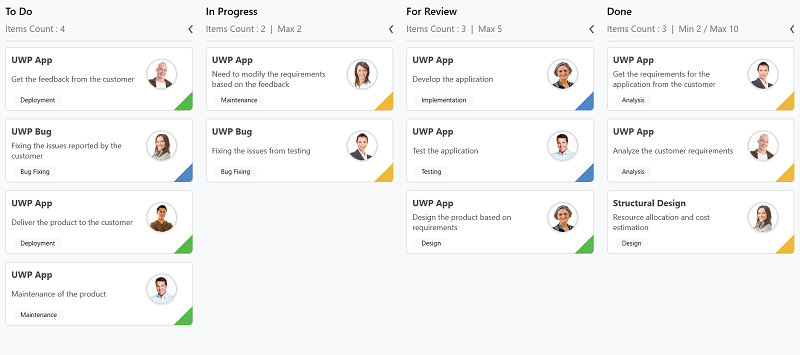

# WPF Kanban (SfKanban) Overview

The Kanban control is an efficient way to visualize a workflow at each stage of completion. Kanban helps define elegant planning and clear visualization of work progression. The SfKanban control also provides many features that are used to monitor task progress in the software development cycle.

## Key Features

* **Workflows** - It allows users to control the transitions between tasks from one category (status) to another.
* **Customization** - Kanban cards and placeholders can be customized.
* **WIP Limit** - Visualize the Work-In-Progress limit.
* **Indicator color customization** - The indicator color for Kanban cards can be customized.
* **Dragging events** - Dragging events are raised while rearranging or repositioning Kanban cards.

## Getting Started

To get started with the SfKanban control, refer to the [Getting Started](Getting-started.md) documentation, which walks you through adding the control to a WPF project, populating it with data, and customizing the appearance.

## See Also

* [Getting Started with WPF Kanban](Getting-started.md)
* [Cards in WPF Kanban](Cards.md)
* [Columns in WPF Kanban](Column.md)
* [Events in WPF Kanban](Events.md)
* [SfKanban API Reference](https://help.syncfusion.com/cr/wpf/Syncfusion.UI.Xaml.Kanban.SfKanban.html)