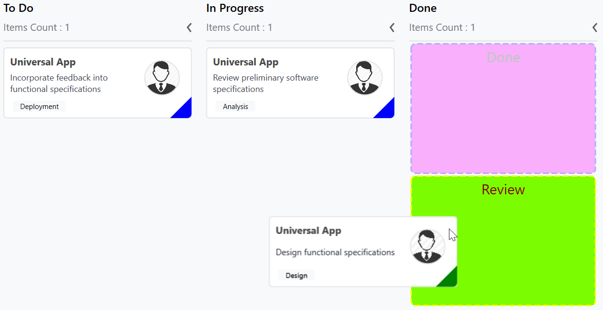

# Placeholder in WPF Kanban (SfKanban) Control

The placeholder denotes a card's new position in the [`KanbanColumn`](https://help.syncfusion.com/cr/wpf/Syncfusion.UI.Xaml.Kanban.KanbanColumn.html). It appears while dragging a card over the column.

N> The snippets in this document use the `kanban:` prefix for the Syncfusion namespace. Make sure the following namespace mapping is declared on the root element: `xmlns:kanban="clr-namespace:Syncfusion.UI.Xaml.Kanban;assembly=Syncfusion.SfKanban.WPF"`.

## Placeholder Style

The [`PlaceholderStyle`](https://help.syncfusion.com/cr/wpf/Syncfusion.UI.Xaml.Kanban.SfKanban.html#Syncfusion_UI_Xaml_Kanban_SfKanban_PlaceholderStyle) property of [`SfKanban`](https://help.syncfusion.com/cr/wpf/Syncfusion.UI.Xaml.Kanban.SfKanban.html) is used to customize the placeholder. The following properties are used to customize its appearance.

### Basic Appearance

* [`Fill`](https://help.syncfusion.com/cr/wpf/Syncfusion.UI.Xaml.Kanban.PlaceholderStyle.html#Syncfusion_UI_Xaml_Kanban_PlaceholderStyle_Fill) - This property is used to change the background color of the placeholder.
* [`Stroke`](https://help.syncfusion.com/cr/wpf/Syncfusion.UI.Xaml.Kanban.PlaceholderStyle.html#Syncfusion_UI_Xaml_Kanban_PlaceholderStyle_Stroke) - This property is used to change the border color of the placeholder.
* [`StrokeThickness`](https://help.syncfusion.com/cr/wpf/Syncfusion.UI.Xaml.Kanban.PlaceholderStyle.html#Syncfusion_UI_Xaml_Kanban_PlaceholderStyle_StrokeThickness) - This property is used to change the border width of the placeholder.
* [`StrokeDashArray`](https://help.syncfusion.com/cr/wpf/Syncfusion.UI.Xaml.Kanban.PlaceholderStyle.html#Syncfusion_UI_Xaml_Kanban_PlaceholderStyle_StrokeDashArray) - This property is used to change the dash pattern of the placeholder border.
* [`FontSize`](https://help.syncfusion.com/cr/wpf/Syncfusion.UI.Xaml.Kanban.PlaceholderStyle.html#Syncfusion_UI_Xaml_Kanban_PlaceholderStyle_FontSize) - This property is used to change the text size of the placeholder.
* [`Foreground`](https://help.syncfusion.com/cr/wpf/Syncfusion.UI.Xaml.Kanban.PlaceholderStyle.html#Syncfusion_UI_Xaml_Kanban_PlaceholderStyle_Foreground) - This property is used to change the text color of the placeholder.
* [`RadiusX`](https://help.syncfusion.com/cr/wpf/Syncfusion.UI.Xaml.Kanban.PlaceholderStyle.html#Syncfusion_UI_Xaml_Kanban_PlaceholderStyle_RadiusX) - This property is used to change the X-radius of the placeholder.
* [`RadiusY`](https://help.syncfusion.com/cr/wpf/Syncfusion.UI.Xaml.Kanban.PlaceholderStyle.html#Syncfusion_UI_Xaml_Kanban_PlaceholderStyle_RadiusY) - This property is used to change the Y-radius of the placeholder.
* [`TextHorizontalAlignment`](https://help.syncfusion.com/cr/wpf/Syncfusion.UI.Xaml.Kanban.PlaceholderStyle.html#Syncfusion_UI_Xaml_Kanban_PlaceholderStyle_TextHorizontalAlignment) - This property is used to change the horizontal alignment of the placeholder text.
* [`TextVerticalAlignment`](https://help.syncfusion.com/cr/wpf/Syncfusion.UI.Xaml.Kanban.PlaceholderStyle.html#Syncfusion_UI_Xaml_Kanban_PlaceholderStyle_TextVerticalAlignment) - This property is used to change the vertical alignment of the placeholder text.

### Selected State Appearance

The following properties are used to customize the selected placeholder when a column contains more than one category.

* [`SelectedBackground`](https://help.syncfusion.com/cr/wpf/Syncfusion.UI.Xaml.Kanban.PlaceholderStyle.html#Syncfusion_UI_Xaml_Kanban_PlaceholderStyle_SelectedBackground) - This property is used to change the background color of the selected placeholder.
* [`SelectedStroke`](https://help.syncfusion.com/cr/wpf/Syncfusion.UI.Xaml.Kanban.PlaceholderStyle.html#Syncfusion_UI_Xaml_Kanban_PlaceholderStyle_SelectedStroke) - This property is used to change the border color of the selected placeholder.
* [`SelectedStrokeThickness`](https://help.syncfusion.com/cr/wpf/Syncfusion.UI.Xaml.Kanban.PlaceholderStyle.html#Syncfusion_UI_Xaml_Kanban_PlaceholderStyle_SelectedStrokeThickness) - This property is used to change the border width of the selected placeholder.
* [`SelectedStrokeDashArray`](https://help.syncfusion.com/cr/wpf/Syncfusion.UI.Xaml.Kanban.PlaceholderStyle.html#Syncfusion_UI_Xaml_Kanban_PlaceholderStyle_SelectedStrokeDashArray) - This property is used to change the dash pattern of the selected placeholder border.
* [`SelectedFontSize`](https://help.syncfusion.com/cr/wpf/Syncfusion.UI.Xaml.Kanban.PlaceholderStyle.html#Syncfusion_UI_Xaml_Kanban_PlaceholderStyle_SelectedFontSize) - This property is used to change the font size of the text in the selected placeholder.
* [`SelectedForeground`](https://help.syncfusion.com/cr/wpf/Syncfusion.UI.Xaml.Kanban.PlaceholderStyle.html#Syncfusion_UI_Xaml_Kanban_PlaceholderStyle_SelectedForeground) - This property is used to change the color of the text in the selected placeholder.

The following code example demonstrates the above behavior.




<kanban:SfKanban x:Name="kanban"
                 ItemsSource="{Binding Tasks}"
                 AutoGenerateColumns="False">
    <kanban:SfKanban.Columns>
        <kanban:KanbanColumn Title="To Do" Categories="Open" />
        <kanban:KanbanColumn Title="In Progress" Categories="In Progress" />
        <kanban:KanbanColumn Title="Done" Categories="Done" />
    </kanban:SfKanban.Columns>
    <kanban:SfKanban.PlaceholderStyle>
        <kanban:PlaceholderStyle FontSize="20"
                                 Foreground="DarkGreen"
                                 Fill="Fuchsia"
                                 Stroke="Blue"
                                 StrokeThickness="2"
                                 SelectedFontSize="20"
                                 SelectedForeground="Maroon"
                                 SelectedStroke="Yellow"
                                 SelectedStrokeThickness="2"
                                 SelectedBackground="LawnGreen" />
    </kanban:SfKanban.PlaceholderStyle>
</kanban:SfKanban>




using Syncfusion.UI.Xaml.Kanban;
using System.Windows.Media;

SfKanban sfKanban = new SfKanban();
PlaceholderStyle style = new PlaceholderStyle()
{
    FontSize = 20,
    Foreground = new SolidColorBrush(Colors.DarkGreen),
    Fill = new SolidColorBrush(Colors.Fuchsia),
    Stroke = new SolidColorBrush(Colors.Blue),
    StrokeThickness = 2,
    StrokeDashArray = new DoubleCollection() { 1, 1 },
    SelectedFontSize = 20,
    SelectedForeground = new SolidColorBrush(Colors.Maroon),
    SelectedStroke = new SolidColorBrush(Colors.Yellow),
    SelectedBackground = new SolidColorBrush(Colors.LawnGreen),
    SelectedStrokeThickness = 2,
    SelectedStrokeDashArray = new DoubleCollection() { 2, 1 }
};
sfKanban.PlaceholderStyle = style;




The following output demonstrates the above code example.

N> The UI of the placeholder can be replaced entirely using the [`PlaceholderTemplate`](https://help.syncfusion.com/cr/wpf/Syncfusion.UI.Xaml.Kanban.PlaceholderStyle.html#Syncfusion_UI_Xaml_Kanban_PlaceholderStyle_PlaceholderTemplate) property of [`PlaceholderStyle`](https://help.syncfusion.com/cr/wpf/Syncfusion.UI.Xaml.Kanban.PlaceholderStyle.html).

## See Also

* [SfKanban API Reference](https://help.syncfusion.com/cr/wpf/Syncfusion.UI.Xaml.Kanban.SfKanban.html)
* [PlaceholderStyle API Reference](https://help.syncfusion.com/cr/wpf/Syncfusion.UI.Xaml.Kanban.PlaceholderStyle.html)
* [Getting Started with WPF Kanban](Getting-started.md)
* [Cards in WPF Kanban](Cards.md)
* [Columns in WPF Kanban](Column.md)
* [Events in WPF Kanban](Events.md)