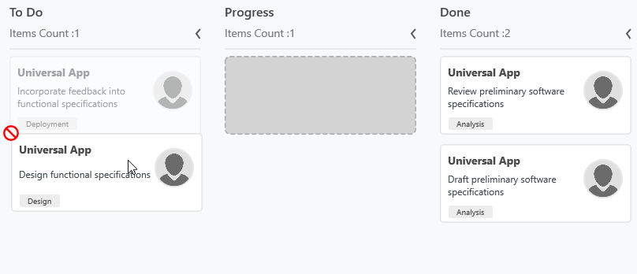
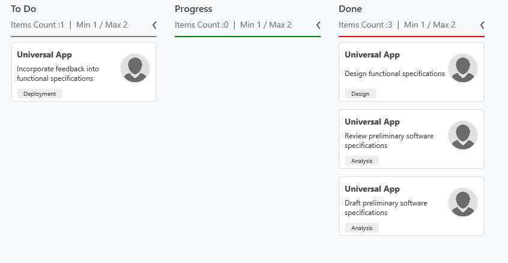

# Workflow Configuration

A Kanban [`Workflows`](https://help.syncfusion.com/cr/wpf/Syncfusion.UI.Xaml.Kanban.SfKanban.html#Syncfusion_UI_Xaml_Kanban_SfKanban_Workflows) is a set of categories and allowed transitions that an item moves through during its life cycle, typically representing processes within your organization.

* [`Category`](https://help.syncfusion.com/cr/wpf/Syncfusion.UI.Xaml.Kanban.KanbanWorkflow.html#Syncfusion_UI_Xaml_Kanban_KanbanWorkflow_Category) - It represents the state of an item at a particular point in a specific workflow.
* [`AllowedTransitions`](https://help.syncfusion.com/cr/wpf/Syncfusion.UI.Xaml.Kanban.KanbanWorkflow.html#Syncfusion_UI_Xaml_Kanban_KanbanWorkflow_AllowedTransitions) - It is a list of categories to which the card can be moved from the current category.

N> The snippets in this document use the `kanban:` prefix for the Syncfusion namespace. Make sure the following namespace mapping is declared on the root element: `xmlns:kanban="clr-namespace:Syncfusion.UI.Xaml.Kanban;assembly=Syncfusion.SfKanban.WPF"`.




<kanban:SfKanban x:Name="kanban"
                 ItemsSource="{Binding Tasks}"
                 AutoGenerateColumns="False"
                 ColumnMappingPath="Category">
    <kanban:SfKanban.Workflows>
        <kanban:KanbanWorkflow Category="Open">
            <kanban:KanbanWorkflow.AllowedTransitions>
                <x:String>In Progress</x:String>
            </kanban:KanbanWorkflow.AllowedTransitions>
        </kanban:KanbanWorkflow>
        <kanban:KanbanWorkflow Category="In Progress">
            <kanban:KanbanWorkflow.AllowedTransitions>
                <x:String>Review</x:String>
                <x:String>Done</x:String>
            </kanban:KanbanWorkflow.AllowedTransitions>
        </kanban:KanbanWorkflow>
    </kanban:SfKanban.Workflows>
    <kanban:KanbanColumn Title="Open" Categories="Open" />
    <kanban:KanbanColumn Title="In Progress" Categories="In Progress" />
    <kanban:KanbanColumn Title="Review" Categories="Review" />
    <kanban:KanbanColumn Title="Done" Categories="Done" />
</kanban:SfKanban>




using System.Collections.Generic;
using Syncfusion.UI.Xaml.Kanban;

SfKanban kanban = new SfKanban();
WorkflowCollection workflows = new WorkflowCollection();

workflows.Add(new KanbanWorkflow()
{
    Category = "Open",
    AllowedTransitions = new List<object>() { "In Progress" }
});

workflows.Add(new KanbanWorkflow()
{
    Category = "In Progress",
    AllowedTransitions = new List<object>() { "Review", "Done" }
});

kanban.Workflows = workflows;




N> In the XAML snippet, add `xmlns:x="http://schemas.microsoft.com/winfx/2006/xaml"` to the root element so the `x:String` reference resolves.

## Work In-Progress (WIP) Limit

The [`MinimumLimit`](https://help.syncfusion.com/cr/wpf/Syncfusion.UI.Xaml.Kanban.KanbanColumn.html#Syncfusion_UI_Xaml_Kanban_KanbanColumn_MinimumLimit) and [`MaximumLimit`](https://help.syncfusion.com/cr/wpf/Syncfusion.UI.Xaml.Kanban.KanbanColumn.html#Syncfusion_UI_Xaml_Kanban_KanbanColumn_MaximumLimit) properties are used to limit the minimum and maximum number of items in a Kanban column. This does not restrict moving the items from one column to another column. However, a violation of the limit is indicated by changing the color of the error bar.

The following properties of [`ErrorBarSettings`](https://help.syncfusion.com/cr/wpf/Syncfusion.UI.Xaml.Kanban.KanbanColumn.html#Syncfusion_UI_Xaml_Kanban_KanbanColumn_ErrorBarSettings) are used to customize the error bar:

* [`Color`](https://help.syncfusion.com/cr/wpf/Syncfusion.UI.Xaml.Kanban.ErrorBarSettings.html#Syncfusion_UI_Xaml_Kanban_ErrorBarSettings_Color) - Used to set the default color of the error bar.
* [`MinValidationColor`](https://help.syncfusion.com/cr/wpf/Syncfusion.UI.Xaml.Kanban.ErrorBarSettings.html#Syncfusion_UI_Xaml_Kanban_ErrorBarSettings_MinValidationColor) - Used to set the color of the error bar when the item count is less than `MinimumLimit`.
* [`MaxValidationColor`](https://help.syncfusion.com/cr/wpf/Syncfusion.UI.Xaml.Kanban.ErrorBarSettings.html#Syncfusion_UI_Xaml_Kanban_ErrorBarSettings_MaxValidationColor) - Used to set the color of the error bar when the item count is greater than `MaximumLimit`.
* [`Height`](https://help.syncfusion.com/cr/wpf/Syncfusion.UI.Xaml.Kanban.ErrorBarSettings.html#Syncfusion_UI_Xaml_Kanban_ErrorBarSettings_Height) - Used to set the height of the error bar.




<kanban:SfKanban x:Name="kanban"
                 ItemsSource="{Binding Tasks}"
                 AutoGenerateColumns="False"
                 ColumnMappingPath="Category">
    <kanban:KanbanColumn Title="Done"
                         Categories="Review,Done"
                         MinimumLimit="1"
                         MaximumLimit="2">
        <kanban:KanbanColumn.ErrorBarSettings>
            <kanban:ErrorBarSettings Color="Gray"
                                     MaxValidationColor="Red"
                                     MinValidationColor="Green" />
        </kanban:KanbanColumn.ErrorBarSettings>
    </kanban:KanbanColumn>
    <kanban:KanbanColumn Title="Open" Categories="Open" />
    <kanban:KanbanColumn Title="In Progress" Categories="In Progress" />
</kanban:SfKanban>




using Syncfusion.UI.Xaml.Kanban;
using System.Windows.Media;

KanbanColumn doneColumn = new KanbanColumn()
{
    Title = "Done",
    Categories = "Review,Done",
    MinimumLimit = 1,
    MaximumLimit = 2,
    ErrorBarSettings = new ErrorBarSettings()
    {
        Color = new SolidColorBrush(Colors.Gray),
        MinValidationColor = new SolidColorBrush(Colors.Green),
        MaxValidationColor = new SolidColorBrush(Colors.Red)
    }
};

kanban.Columns.Add(doneColumn);




N> The `Color`, `MinValidationColor`, and `MaxValidationColor` properties of `ErrorBarSettings` accept a `Brush` in C# (use `SolidColorBrush`) but a string color name (e.g., `"Gray"`) in XAML, which WPF automatically converts to a `SolidColorBrush`.

## See Also

* [SfKanban API Reference](https://help.syncfusion.com/cr/wpf/Syncfusion.UI.Xaml.Kanban.SfKanban.html)
* [KanbanWorkflow API Reference](https://help.syncfusion.com/cr/wpf/Syncfusion.UI.Xaml.Kanban.KanbanWorkflow.html)
* [KanbanColumn API Reference](https://help.syncfusion.com/cr/wpf/Syncfusion.UI.Xaml.Kanban.KanbanColumn.html)
* [ErrorBarSettings API Reference](https://help.syncfusion.com/cr/wpf/Syncfusion.UI.Xaml.Kanban.ErrorBarSettings.html)
* [Getting Started with WPF Kanban](Getting-started.md)
* [Cards in WPF Kanban](Cards.md)
* [Columns in WPF Kanban](Column.md)
* [Events in WPF Kanban](Events.md)