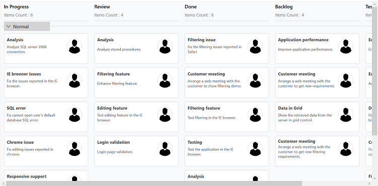

# Swim lanes in WPF Kanban (SfKanban) control

Swim lanes are horizontal categorizations; they allow you to categorize your current workflow by different projects, teams, users, or whatever you need. 

By default, it will be categorized based on the [`Assignee`](https://help.syncfusion.com/cr/wpf/Syncfusion.UI.Xaml.Kanban.KanbanModel.html#Syncfusion_UI_Xaml_Kanban_KanbanModel_Assignee) values in the [`KanbanModel`](https://help.syncfusion.com/cr/wpf/Syncfusion.UI.Xaml.Kanban.KanbanModel.html) class. You can also define category by mapping [`SwimlaneKey`](https://help.syncfusion.com/cr/wpf/Syncfusion.UI.Xaml.Kanban.SfKanban.html#Syncfusion_UI_Xaml_Kanban_SfKanban_SwimlaneKey) to appropriate property name in the defined data model.

The following code example demonstrates how to group the underlying data collection based on [`SwimlaneKey`](https://help.syncfusion.com/cr/wpf/Syncfusion.UI.Xaml.Kanban.SfKanban.html#Syncfusion_UI_Xaml_Kanban_SfKanban_SwimlaneKey).




<kanban:SfKanban SwimlaneKey="ColorKey" x:Name="Kanban" ItemsSource="{Binding Tasks}">

</kanban:SfKanban>



kanban.SwimlaneKey = "ColorKey";





N> If no value is assigned to the [`SwimlaneKey`](https://help.syncfusion.com/cr/wpf/Syncfusion.UI.Xaml.Kanban.SfKanban.html#Syncfusion_UI_Xaml_Kanban_SfKanban_SwimlaneKey) mapped property in a task, then it will be grouped under the Unassigned swim lane.

## Customization

SfKanban provides support to customize the header, which is displayed before the swim lane group using [`SwimlaneHeaderTemplate`](https://help.syncfusion.com/cr/wpf/Syncfusion.UI.Xaml.Kanban.SfKanban.html#Syncfusion_UI_Xaml_Kanban_SfKanban_SwimlaneHeaderTemplate). The following code example demonstrates how to customize the swim lane.



<kanban:SfKanban x:Name="Kanban" ItemsSource="{Binding Tasks}">
    <kanban:SfKanban.SwimlaneHeaderTemplate>
        <DataTemplate>
            <Grid>

                <Border BorderBrush="LightGray" BorderThickness="1" Width="{Binding ElementName=kanban, Path=ActualWidth}" Height="1">

                </Border>

                <Border BorderBrush="Black" CornerRadius="5,5,5,5" Width="150" Margin="10,2,10,0" HorizontalAlignment="Left" >

                    <StackPanel Background="LightGray" x:Name="SwimlaneHeaderPanel"   Orientation="Horizontal">

                        <Grid x:Name="CollapsedIcon" Background="Transparent"

                                Height="30" Width="30">

                            <Path x:Name="ExpandedPath" IsHitTestVisible="False"

                                    Data="M30.587915,0L31.995998,1.4199842 15.949964,17.351 0,1.4979873 1.4099131,0.078979151 15.949964,14.53102z" 

                                    Stretch="Uniform" Fill="#FF000000" Width="14" Height="14" Margin="0,0,0,0" RenderTransformOrigin="0.5,0.5">

                                <Path.RenderTransform>

                                    <TransformGroup>

                                        <TransformGroup.Children>

                                            <RotateTransform Angle="0" />

                                            <ScaleTransform ScaleX="1" ScaleY="1" />

                                        </TransformGroup.Children>

                                    </TransformGroup>

                                </Path.RenderTransform>

                            </Path>

                            <Path x:Name="CollapsedPath" Visibility="Collapsed" IsHitTestVisible="False"

                                    Data="M1.4200482,0L17.351001,16.046996 1.4980513,31.996001 0.078979631,30.585997 14.531046,16.046019 0,1.4089964z" 

                                    Stretch="Uniform" Fill="#FF000000" Width="14" Height="14" Margin="0,0,0,0" RenderTransformOrigin="0.5,0.5">

                                <Path.RenderTransform>

                                    <TransformGroup>

                                        <TransformGroup.Children>

                                            <RotateTransform Angle="0" />

                                            <ScaleTransform ScaleX="1" ScaleY="1" />

                                        </TransformGroup.Children>

                                    </TransformGroup>

                                </Path.RenderTransform>

                            </Path>

                        </Grid>

                        <TextBlock FontWeight="Medium" IsHitTestVisible="False" FontSize="15" FontStretch="Expanded" TextWrapping="NoWrap"
                                    
                                    VerticalAlignment="Center" Text="{Binding Title}" />

                    </StackPanel>

                </Border>                      

            </Grid>
        </DataTemplate>
    </kanban:SfKanban.SwimlaneHeaderTemplate>
</kanban:SfKanban>



