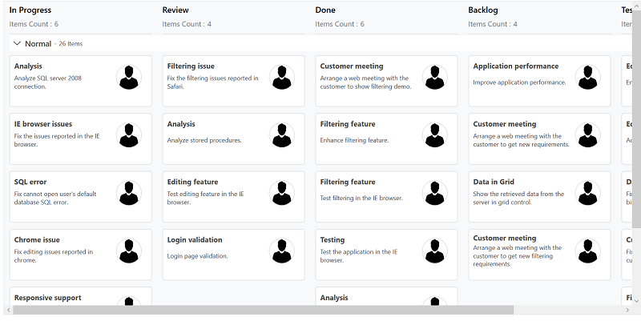
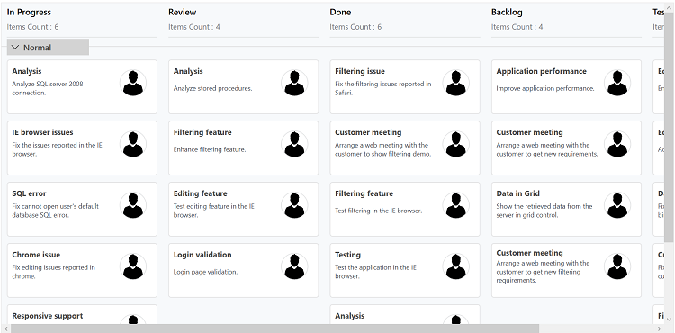

# Swimlane in WPF SfKanban

Swimlanes are horizontal categorizations; they allow you to categorize your workflow by different projects, teams, users, or any other grouping you need.

By default, the cards are categorized based on the [`Assignee`](https://help.syncfusion.com/cr/wpf/Syncfusion.UI.Xaml.Kanban.KanbanModel.html#Syncfusion_UI_Xaml_Kanban_KanbanModel_Assignee) values in the [`KanbanModel`](https://help.syncfusion.com/cr/wpf/Syncfusion.UI.Xaml.Kanban.KanbanModel.html) class. You can also define the category by mapping the [`SwimlaneKey`](https://help.syncfusion.com/cr/wpf/Syncfusion.UI.Xaml.Kanban.SfKanban.html#Syncfusion_UI_Xaml_Kanban_SfKanban_SwimlaneKey) to the appropriate property name in the defined data model.

N> The snippets in this document use the `kanban:` prefix for the Syncfusion namespace. Make sure the following namespace mapping is declared on the root element: `xmlns:kanban="clr-namespace:Syncfusion.UI.Xaml.Kanban;assembly=Syncfusion.SfKanban.WPF"`.

The following code example demonstrates how to group the underlying data collection based on the [`SwimlaneKey`](https://help.syncfusion.com/cr/wpf/Syncfusion.UI.Xaml.Kanban.SfKanban.html#Syncfusion_UI_Xaml_Kanban_SfKanban_SwimlaneKey).




<kanban:SfKanban x:Name="kanban"
                 SwimlaneKey="ColorKey"
                 ItemsSource="{Binding Tasks}"
                 AutoGenerateColumns="False"
                 ColumnMappingPath="Category">
    <kanban:KanbanColumn Title="To Do" Categories="Open" />
    <kanban:KanbanColumn Title="In Progress" Categories="In Progress" />
    <kanban:KanbanColumn Title="Done" Categories="Done" />
</kanban:SfKanban>




using Syncfusion.UI.Xaml.Kanban;

SfKanban kanban = new SfKanban();
kanban.SwimlaneKey = "ColorKey";
kanban.ItemsSource = new SwimlaneViewModel().Tasks;
kanban.Columns.Add(new KanbanColumn() { Title = "To Do", Categories = "Open" });
kanban.Columns.Add(new KanbanColumn() { Title = "In Progress", Categories = "In Progress" });
kanban.Columns.Add(new KanbanColumn() { Title = "Done", Categories = "Done" });




N> If no value is assigned to the [`SwimlaneKey`](https://help.syncfusion.com/cr/wpf/Syncfusion.UI.Xaml.Kanban.SfKanban.html#Syncfusion_UI_Xaml_Kanban_SfKanban_SwimlaneKey) mapped property in a task, it will be grouped under the `Unassigned` swimlane.

## Customizing the Swimlane Header

[`SfKanban`](https://help.syncfusion.com/cr/wpf/Syncfusion.UI.Xaml.Kanban.SfKanban.html) provides support to customize the header that is displayed before the swimlane group using the [`SwimlaneHeaderTemplate`](https://help.syncfusion.com/cr/wpf/Syncfusion.UI.Xaml.Kanban.SfKanban.html#Syncfusion_UI_Xaml_Kanban_SfKanban_SwimlaneHeaderTemplate) property. The following code example demonstrates how to customize the swimlane.




<kanban:SfKanban x:Name="kanban"
                 SwimlaneKey="ColorKey"
                 ItemsSource="{Binding Tasks}"
                 AutoGenerateColumns="False"
                 ColumnMappingPath="Category">
    <kanban:SfKanban.Columns>
        <kanban:KanbanColumn Title="To Do" Categories="Open" />
        <kanban:KanbanColumn Title="In Progress" Categories="In Progress" />
        <kanban:KanbanColumn Title="Done" Categories="Done" />
    </kanban:SfKanban.Columns>
    <kanban:SfKanban.SwimlaneHeaderTemplate>
        <DataTemplate>
            <Grid>
                <Border BorderBrush="LightGray" BorderThickness="1" Width="{Binding         ElementName=kanban, Path=ActualWidth}" Height="1">
                </Border>
                <Border BorderBrush="Black" CornerRadius="5,5,5,5" Width="150" Margin="10,2,10,0" HorizontalAlignment="Left" >
                    <StackPanel Background="LightGray" x:Name="SwimlaneHeaderPanel"   Orientation="Horizontal">
                        <Grid x:Name="CollapsedIcon" Background="Transparent"
                                Height="30" Width="30">
                            <Path x:Name="ExpandedPath" IsHitTestVisible="False"
                                    Data="M30.587915,0L31.995998,1.4199842 15.949964,17.351 0,1.4979873 1.4099131,0.078979151 15.949964,14.53102z" 
                                    Stretch="Uniform" Fill="#FF000000" Width="14" Height="14" Margin="0,0,0,0" RenderTransformOrigin="0.5,0.5">
                                <Path.RenderTransform>
                                    <TransformGroup>
                                        <TransformGroup.Children>
                                            <RotateTransform Angle="0" />
                                            <ScaleTransform ScaleX="1" ScaleY="1" />
                                        </TransformGroup.Children>
                                    </TransformGroup>
                                </Path.RenderTransform>
                            </Path>
                            <Path x:Name="CollapsedPath" Visibility="Collapsed" IsHitTestVisible="False"
                                    Data="M1.4200482,0L17.351001,16.046996 1.4980513,31.996001 0.078979631,30.585997 14.531046,16.046019 0,1.4089964z" 
                                    Stretch="Uniform" Fill="#FF000000" Width="14" Height="14" Margin="0,0,0,0" RenderTransformOrigin="0.5,0.5">
                                <Path.RenderTransform>
                                    <TransformGroup>
                                        <TransformGroup.Children>
                                            <RotateTransform Angle="0" />
                                            <ScaleTransform ScaleX="1" ScaleY="1" />
                                        </TransformGroup.Children>
                                    </TransformGroup>
                                </Path.RenderTransform>
                            </Path>
                        </Grid>
                        <TextBlock FontWeight="Medium" IsHitTestVisible="False" FontSize="15" FontStretch="Expanded" TextWrapping="NoWrap"                                   
                                    VerticalAlignment="Center" Text="{Binding Title}" />
                    </StackPanel>
                </Border>                      
            </Grid>
        </DataTemplate>
    </kanban:SfKanban.SwimlaneHeaderTemplate>
</kanban:SfKanban>




