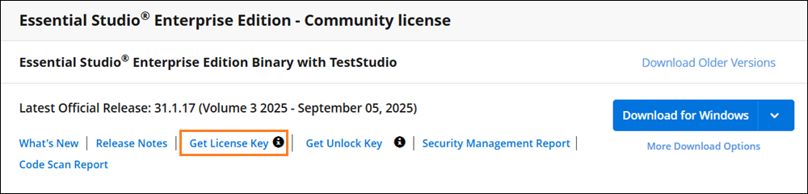

# How to get a license key in WPF

License keys can be generated from the [License & Downloads](https://www.syncfusion.com/Account/Login?ReturnUrl=%2faccount%2fdownloads) or [Trail & Downloads](https://www.syncfusion.com/Account/Login?ReturnUrl=%2faccount%2fmanage-trials%2fdownloads) section of the Syncfusion website. 

I> * Syncfusion license keys are **version and platform specific**, refer to the [KB](https://support.syncfusion.com/kb/article/7898/how-to-generate-license-key-for-licensed-products) to generate the license key for the required version and platform.
* Refer this [KB](https://support.syncfusion.com/kb/article/7865/which-version-license-key-should-i-use-in-my-application) to know about which version of the Syncfusion license key should be used in the application.

