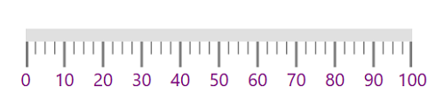
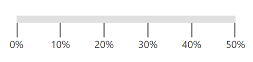

# Labels in WPF Linear Gauge (SfLinearGauge)

`Labels` of the linear scale provide a numeric value to the major ticks that will be specified according to the range of the scale.

## Label color customization

The foreground of the label is customized by setting the [`LabelStroke`](https://help.syncfusion.com/cr/wpf/Syncfusion.UI.Xaml.Gauges.LinearScale.html#Syncfusion_UI_Xaml_Gauges_LinearScale_LabelStroke) of the linear scale.





    <gauge:SfLinearGauge>

    <gauge:SfLinearGauge.MainScale>

    <gauge:LinearScale ScaleBarStroke="#E0E0E0" MajorTickStroke="Gray" MinorTickStroke="Gray" LabelStroke="Purple"
    ScaleBarSize="10" MinorTicksPerInterval="3" />

    </gauge:SfLinearGauge.MainScale>

    </gauge:SfLinearGauge>





           SfLinearGauge sfLinearGauge = new SfLinearGauge();

            LinearScale linearScale = new LinearScale();

            linearScale.ScaleBarStroke = new SolidColorBrush(Color.FromRgb(224, 224, 224));

            linearScale.MajorTickStroke = new SolidColorBrush(Colors.Gray);

            linearScale.MinorTickStroke = new SolidColorBrush(Colors.Gray);

            linearScale.LabelStroke = new SolidColorBrush(Colors.Purple);

            linearScale.ScaleBarSize = 10;

            linearScale.ScaleBarLength = 300;

            linearScale.MinorTicksPerInterval = 3;

            sfLinearGauge.MainScale = linearScale;





## Label font customization

The label font can be customized using the [`LabelSize`](https://help.syncfusion.com/cr/wpf/Syncfusion.UI.Xaml.Gauges.LinearScale.html#Syncfusion_UI_Xaml_Gauges_LinearScale_LabelSize), `FontFamily`, and `FontStyle` properties. The labels can be positioned far away from the ticks using the [`LabelOffset`](https://help.syncfusion.com/cr/wpf/Syncfusion.UI.Xaml.Gauges.LinearScale.html#Syncfusion_UI_Xaml_Gauges_LinearScale_LabelOffset) property.





    <gauge:SfLinearGauge>

    <gauge:SfLinearGauge.MainScale>

    <gauge:LinearScale FontFamily="Monotype Corsiva"  FontSize="15" FontStyle="Italic" LabelOffset="15"
    ScaleBarStroke="#E0E0E0" MajorTickStroke="Gray" MinorTickStroke="Gray" LabelStroke="#424242" LabelSize="20"
    ScaleBarSize="10" MinorTicksPerInterval="3">

    </gauge:LinearScale>

    </gauge:SfLinearGauge.MainScale>

    </gauge:SfLinearGauge>





            SfLinearGauge sfLinearGauge = new SfLinearGauge();

            LinearScale linearScale = new LinearScale();

            linearScale.ScaleBarStroke = new SolidColorBrush(Color.FromRgb(224, 224, 224));

            linearScale.MajorTickStroke = new SolidColorBrush(Colors.Gray);

            linearScale.MinorTickStroke = new SolidColorBrush(Colors.Gray);

            linearScale.LabelStroke = new SolidColorBrush(Color.FromRgb(66, 66, 66));

            linearScale.LabelSize = 20;

            linearScale.LabelOffset = 15;

            linearScale.FontFamily = new FontFamily("Monotype Corsiva");

            linearScale.FontStyle = FontStyles.Italic;

            linearScale.ScaleBarSize = 10;

            linearScale.MinorTicksPerInterval = 3;

            sfLinearGauge.MainScale = linearScale;





## Setting position for labels

The labels in the scale can be placed above or below the linear scale by choosing the following options available in the [`LabelPosition`](https://help.syncfusion.com/cr/wpf/Syncfusion.UI.Xaml.Gauges.LinearScale.html#Syncfusion_UI_Xaml_Gauges_LinearScale_LabelPosition) property. The default value of `LabelPosition` property is below.

1.	Above

2.	Below (Default)





    <gauge:SfLinearGauge>

    <gauge:SfLinearGauge.MainScale>

    <gauge:LinearScale LabelPosition="Above" ScaleBarStroke="#E0E0E0" MajorTickStroke="Gray"
    MinorTickStroke="Gray" LabelStroke="#424242"  ScaleBarSize="10" MinorTicksPerInterval="3" />

    </gauge:SfLinearGauge.MainScale>

    </gauge:SfLinearGauge>





            SfLinearGauge sfLinearGauge = new SfLinearGauge();

            LinearScale linearScale = new LinearScale();

            linearScale.ScaleBarStroke = new SolidColorBrush(Color.FromRgb(224, 224, 224));

            linearScale.MajorTickStroke = new SolidColorBrush(Colors.Gray);

            linearScale.MinorTickStroke = new SolidColorBrush(Colors.Gray);

            linearScale.LabelStroke = new SolidColorBrush(Color.FromRgb(66, 66, 66));

            linearScale.LabelPosition = LinearLabelsPosition.Above;

            linearScale.ScaleBarSize = 10;

            linearScale.MinorTicksPerInterval = 3;

            sfLinearGauge.MainScale = linearScale;





## Setting postfix and prefix for labels

You can postfix and prefix values to the scale labels using the [`LabelPostfix`](https://help.syncfusion.com/cr/wpf/Syncfusion.UI.Xaml.Gauges.LinearScale.html#Syncfusion_UI_Xaml_Gauges_LinearScale_LabelPostfix) and [`LabelPrefix`](https://help.syncfusion.com/cr/wpf/Syncfusion.UI.Xaml.Gauges.LinearScale.html#Syncfusion_UI_Xaml_Gauges_LinearScale_LabelPrefix) properties, respectively.

### Setting label postfix

The `LabelPostfix` property allows to postfix the values to scale labels.





    <gauge:SfLinearGauge>

    <gauge:SfLinearGauge.MainScale>

    <gauge:LinearScale Minimum="0" Maximum="50"  LabelPostfix="%" Interval="10" 
                       ScaleBarStroke="#E0E0E0" 
                       MajorTickStroke="Gray" MinorTickStroke="Gray" LabelStroke="#424242"
                       ScaleBarSize="10" MinorTicksPerInterval="0" />

    </gauge:SfLinearGauge.MainScale>

    </gauge:SfLinearGauge>





            SfLinearGauge sfLinearGauge = new SfLinearGauge();

            LinearScale linearScale = new LinearScale();

            linearScale.Minimum = 0;

            linearScale.Maximum = 50;

            linearScale.Interval = 10;

            linearScale.ScaleBarStroke = new SolidColorBrush(Color.FromRgb(224, 224, 224));

            linearScale.MajorTickStroke = new SolidColorBrush(Colors.Gray);

            linearScale.MinorTickStroke = new SolidColorBrush(Colors.Gray);

            linearScale.LabelStroke = new SolidColorBrush(Color.FromRgb(66, 66, 66));

            linearScale.LabelPostfix = "%";

            linearScale.ScaleBarSize = 10;

            linearScale.MinorTicksPerInterval = 0;

            sfLinearGauge.MainScale = linearScale;





### Setting label prefix

The `LabelPrefix` property allows to prefix the values to scale labels.





    <gauge:SfLinearGauge>

    <gauge:SfLinearGauge.MainScale>

    <gauge:LinearScale Minimum="0" Maximum="50"  LabelPrefix="$" Interval="10"  
                       ScaleBarStroke="#E0E0E0" MajorTickStroke="Gray" 
                       MinorTickStroke="Gray" LabelStroke="#424242" 
                       ScaleBarSize="10" MinorTicksPerInterval="0">
    </gauge:LinearScale>

    </gauge:SfLinearGauge.MainScale>

    </gauge:SfLinearGauge>





           SfLinearGauge sfLinearGauge = new SfLinearGauge();

            LinearScale linearScale = new LinearScale();

            linearScale.Minimum = 0;

            linearScale.Maximum = 50;

            linearScale.Interval = 10;

            linearScale.ScaleBarStroke = new SolidColorBrush(Color.FromRgb(224, 224, 224));

            linearScale.MajorTickStroke = new SolidColorBrush(Colors.Gray);

            linearScale.MinorTickStroke = new SolidColorBrush(Colors.Gray);

            linearScale.LabelStroke = new SolidColorBrush(Color.FromRgb(66, 66, 66));

            linearScale.LabelPrefix = "$";

            linearScale.ScaleBarSize = 10;

            linearScale.MinorTicksPerInterval = 0;

            sfLinearGauge.MainScale = linearScale;





## Labels visibility

Labels visibility can be customized using the [`LabelVisibility`](https://help.syncfusion.com/cr/wpf/Syncfusion.UI.Xaml.Gauges.LinearScale.html#Syncfusion_UI_Xaml_Gauges_LinearScale_LabelVisibility) property of linear scale.





    <gauge:SfLinearGauge>

    <gauge:SfLinearGauge.MainScale>

    <gauge:LinearScale TickPosition="Cross" LabelVisibility="Collapsed" 
                       MajorTickSize="20" MinorTickSize="9"
                       ScaleBarStroke="#E0E0E0" MajorTickStroke="Black" 
                       MinorTickStroke="Black" LabelStroke="#424242"
                       ScaleBarSize="40" MinorTicksPerInterval="3">
    </gauge:LinearScale>

    </gauge:SfLinearGauge.MainScale>

    </gauge:SfLinearGauge>





            SfLinearGauge sfLinearGauge = new SfLinearGauge();

            LinearScale linearScale = new LinearScale();

            linearScale.LabelVisibility = Visibility.Collapsed;

            linearScale.ScaleBarStroke = new SolidColorBrush(Color.FromRgb(224, 224, 224));

            linearScale.MajorTickStroke = new SolidColorBrush(Colors.Black);

            linearScale.MinorTickStroke = new SolidColorBrush(Colors.Black);

            linearScale.LabelStroke = new SolidColorBrush(Color.FromRgb(66, 66, 66));

            linearScale.MajorTickSize = 20;

            linearScale.MinorTickSize = 9;

            linearScale.TickPosition = LinearTicksPosition.Cross;

            linearScale.ScaleBarSize = 40;

            linearScale.MinorTicksPerInterval = 3;

            sfLinearGauge.MainScale = linearScale;





